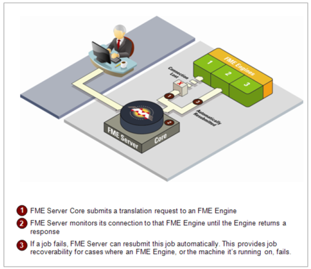
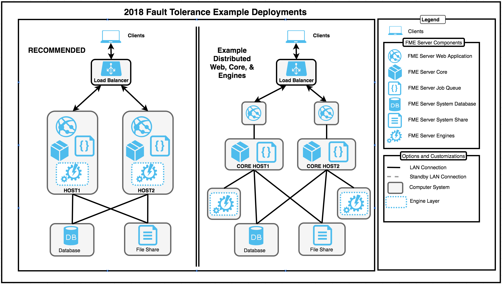
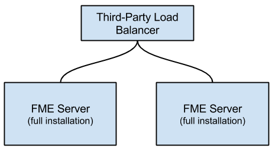

# Planning for Fault Tolerance #

Fault tolerance, or “high availability”, is critical to any successful business operation. To ensure that requests are processed in the event of failure, FME Server supports configuring fault tolerance throughout the multiple levels of an integrated system. FME Server provides fault tolerance in the following ways:

1. **Recovery**: Restarting components and jobs when crashes occur. FME Server provides component and job recovery automatically - no additional planning is needed.
2. **Redundancy**: Ensuring there is no single point of failure. New in FME Server 2018 is the fault tolerance architecture.  When two FME Server systems are configured together, fault tolerance is achieved automatically.  

## A Note on Fault Tolerance in FME Server 2018.0 ##

FME Server 2018 has a new and improved fault tolerance capability.  In 2018.0 this feature is a tech preview.  It is recommended that if you require fault tolerance capability that you work with FME Server 2018.1.  We no longer support Active-Passive FME Server environments.  The new fault tolerance requires a minimum of two systems with FME Server installed on both systems, using the same FME Server System Share and same FME Server System Database. There is also a requirement for a load balancer that monitors the health and distributes web requests between all of the FME Server environments. All the FME Server hosts are active at the same time.  

## Recovery ##

###Component Recovery###

FME Server comes out-of-the-box with component recovery. This means that, even on a single system, FME Server monitors and restarts components that fail, including the FME Engines and the FME Server Core. This is achieved through the FME Server Process Monitor. The ability for FME Server to monitor its own components ensures reliable uptime and dependability.

###Job Recovery###

FME Server also includes the ability to restart a job when a crash occurs. As a result, jobs that experience temporary issues, such as a network hiccup, are re-submitted and run again.

After FME Server submits a translation request to an FME Engine, it monitors the connection to that engine until a response is returned.

FME Server can resubmit a failed job if:

- The connection to the engine is lost.
- The engine crashes.

FME Server continues to re-submit a translation up to a specified number of attempts. To prevent FME Server from indefinitely retrying a job that fails, the default setting is to resubmit a failed job up to three times. This setting is configurable and can be turned off entirely.

---

<!--Ms Analyst-->

<table style="border-spacing: 0px">
<tr>
<td style="vertical-align:middle;background-color:darkorange;border: 2px solid darkorange">
<i class="fa fa-exclamation-triangle fa-lg fa-pull-left fa-fw" style="color:white;padding-right: 12px;vertical-align:text-top"></i>
Ms Analyst says...
</td>
</tr>

<tr>
<td style="border: 1px solid darkorange">

WARNING! A failed translation request may cause an FME Engine to shut down improperly. If no maximum limit is imposed, the translation is resent indefinitely, which may cause repeated FME Engine failures.
 
Re-submitted transactions may also cause data duplication, such as when writing to database formats or when writing mid-translation with the FeatureWriter.
 
If a job is resubmitted because of a failure, and then succeeds the first job log file is overwritten and this will permanently delete why the job failed the first run.  This is vary rare but in these cases you may need to set job resubmission to zero.

</td>
</tr>
</table>

---
<!--SM  Add new material-->
## Redundancy ##

The goal of a fault tolerance environment is to remove single points of failure so that a component can fail, but not take the entire system offline. This is achieved by having multiple systems with FME Server installed on each and pointing to the same FME Server System Database and FME Server System Share.

The new fault tolerant architecture, at the simplest implementation duplicates most of the FME Server components on separate servers. Additional systems are configured similarly and provide the same functionality. A third-party load balancer directs incoming traffic to either of the available systems. There is no stickiness required for the client sessions. Requests are directed to any of the systems.  

The following image shows 2 deployment examples.  The Recommended approach and a fully distributed deployment.  By following the recommended approach you will gain the benefits of fault tolerance with the minimum number of systems.  
 
<!--add in new image for basic-->

<!---->
<!--add in new image environment with distributed engines-->
<!---->
 
**Basic Architecture Requirements**
- Load Balancer System
- FME Server Components (minimum two systems)
- Fault Tolerant Database
- Fault Tolerant File System

**Benefits**
- Simple to manage
- Fewer systems required.
- Can increase number of engines available on each system
- Easy to add additional systems to increase capacity

 

**Distributed Architecture Requirements**
- Load Balancer System
- FME Server Web (minimum two systems)
- FME Server Core (minimum two systems)
- FME Server Engine (minimum two systems)
- Fault Tolerant Database
- Fault Tolerant File System

**Benefits**
- Allows for use of own Web Servlet and thus security updates without disrupting other systems
- Allows engines to deployed easily with 3rd party Software
- Finer control for scaling each system's capabilities (memory, cpu, disk space)

 

### Load Balancer System ###

The customer must provide their own load balancer (LB) and this can be configured to point to FME Server and perform regular health checks (if supported).  The LB can also use timeouts on requests to redirect the requests to another FME Server system.
<!--  Need doc reference -->

### FME Server Components ###

It is recommended to install the FME Server Web Application, FME Server Core, & FME Server Engines (optional) on a single system and repeat this for a second system (see image above 'RECOMMENDED').  This provides you with the basic fault tolerant environment.  The LB would then be directed to point to these 2 systems.

Further, similar additional systems can be added to the environment to expand the high availability.  Additionally, systems with just the FME Server Engines can also be registered with the FME Server Cores to increase the engines available and distributed the processing across more systems.

The FME Server cores become aware of each other and will handled requests.  There will be One Job Manager and if this fails, the other Job Manager on the other system will take over and handle job requests.  There should be minimum down time when a core goes done.  Allow a few moments (*1-2 minutes*) depending on the LB configuration.

Schedules will continue to operate.

### Fault Tolerant Database ###

The customer is in charge of making the Database fault tolerant.

### Fault Tolerant File System

The customer is in charge of making the File System fault tolerant.

## Tracking Core Failures ##

The failed system can then be investigated while the second active system provides continued operation of FME Server. Once the new failed system is recovered and started, it will join the environment seamlessly.

The types of failures that typically cause faults are hardware and operating system crashes, in which the system goes down completely.

Log files must be reviewed on the affected system to understand why the FME Server core failed.  When the core's availability is affected, the outcome is usually an unusable system.

---

<!--sister intuitive Section-->

<table style="border-spacing: 0px">
<tr>
<td style="vertical-align:middle;background-color:darkorange;border: 2px solid darkorange">
<i class="fa fa-info-circle fa-lg fa-pull-left fa-fw" style="color:white;padding-right: 12px;vertical-align:text-top"></i>
Sister Intuitive says...
</td>
</tr>

<tr>
<td style="border: 1px solid darkorange">

In the past, clients of Notification Service publishers did not failover but in 2018.1 this will also occur. 
</td>
</tr>
</table>

---
