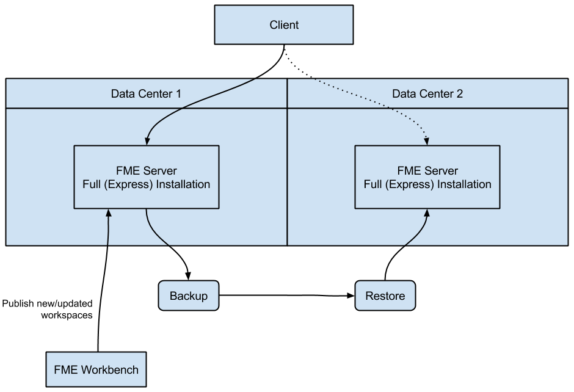

# Planning for Disaster Recovery #

Disaster recovery is primarily concerned with recovering FME Server operations and data in the event of a major failure of a data center. The time frame for disaster recovery is typically longer than failover recovery. Disaster recovery may range from minutes, hours, or even days, while failover recovery is typically in seconds or minutes.

Disaster recovery can be incorporated into any of the failover architectures. Alternatively, if you are primarily concerned with disaster recovery, and less concerned - or even not at all concerned - about the fast recovery provided by failover, you may want to implement a different architecture.

The general concept of disaster recovery is that if one data center fails, the second data center takes over, and the FME Server Core located there becomes the ‘Active’ core.

This example of disaster recovery is an adaptation of an Active-Active architecture, but without the third-party load balancer between systems. Instead, FME Server clients must be manually redirected to the Core host server of the second data center in the event of a disaster. Each data center houses full (“Express”) installations of FME Server, essentially configured to provide similar functionality. To ensure synchronicity of the FME Server system data between data centers, Backup & Restore operations are performed regularly. (Otherwise, workspaces must be published twice - to the FME Server Core hosts on each data center).

Keep in mind that when planning for disaster recovery, all clients of FME Server, including web browsers, the FME Server Console, and the FME Server REST API, must connect to the 'Active' FME Server Core host.