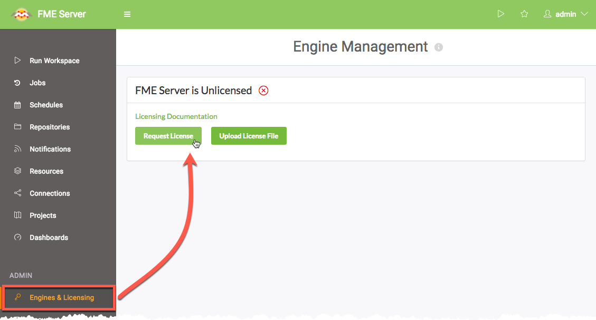
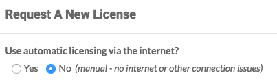

# Licensing #

FME Server 2016 introduced a new licensing mechanism that no longer relies on third-party software to serve licenses. FME Engine licenses are now served directly through the FME Server Core and are saved to the FME Server System Share - this introduces a variety of benefits including easier management, especially when configuring a Distributed/Custom FME Server installation.

## Request and Install a License ##
### Online Mode ###

The fastest and easiest method for licensing FME Server is to use the online method. FME Server requires only basic user information (Name, Email) and the serial number provided by your account manager. Requests are sent over HTTP/HTTPS to retrieve the license file from our backend databases.

You can request a license in the *Engines & Licensing* tab of FME Server:

 
By default, license files are installed to *C:\ProgramData\Safe Software\FME Server\licenses*.

<!--Person X Says Section-->

<table style="border-spacing: 0px">
<tr>
<td style="vertical-align:middle;background-color:darkorange;border: 2px solid darkorange">
<i class="fa fa-quote-left fa-lg fa-pull-left fa-fw" style="color:white;padding-right: 12px;vertical-align:text-top"></i>
Chef Bimm says...
</td>
</tr>

<tr>
<td style="border: 1px solid darkorange">

If you change the machine FME Server is installed to, you do not have to contact Safe Support or your account manager - simply request the license again after FME Server is installed to the new machine!

</td>
</tr>
</table>

### Offline Mode ###

If the machine hosting the installation of FME Server is disconnected from the internet, or if firewall rules prevent your machine from communicating with our backend database, then there is an offline method for retrieving your FME Server license file.

In the Request License form, select 'No' to instead have a JSON file downloaded to your local file system. This file can then be forwarded to codes@safe.com where an automatic process (running FME in the background) will return a valid license file to you after a few minutes. 

This file can then be drag-and-dropped onto the Engines & Licensing page to license FME Server.

## Extending an Evaluation License ##

If you requested a 7-day evaluation license, you should have an e-mail from codes@safe.com that allows you to extend the license to 60 days. Any user can request an FME Server evaluation license without the need for a serial number.
