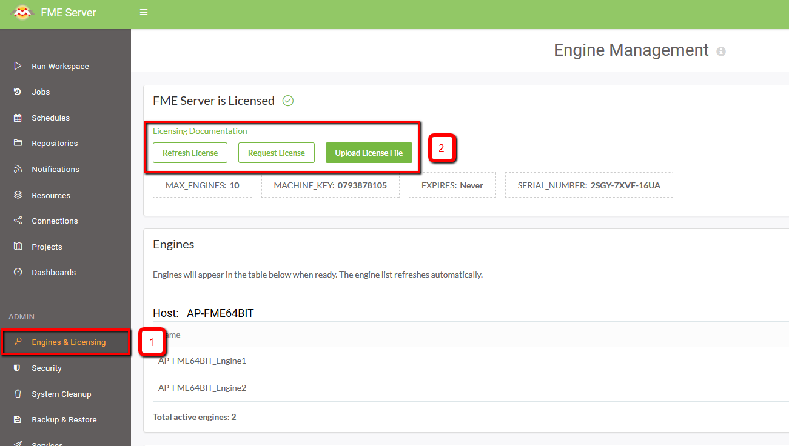

# Licensing #

### FME Server 2015 vs FME Server 2017 ###

<table style="border: 0px">

<tr>
<td style="font-weight: bold">FME 2015 had:</td>
<td style="font-weight: bold">FME 2017 now has:</td>
<td style="font-weight: bold">Fault Tolerant?</td>
</tr>

<tr>
<td style="">Express Install</td>
<td style="">Express and N-Tier Install</td>
<td style="">No</td>
</tr>

<tr>
<td style="">Basic High Availability</td>
<td style="">Active-Passive</td>
<td style="">Yes</td>
</tr>

<tr>
<td style="">Advanced High Availability (3 server redundant)</td>
<td style="">Active-Passive with N-Tier</td>
<td style="">Yes</td>
</tr>

<tr>
<td style="">Active-Active</td>
<td style="">Active-Active</td>
<td style="">Yes</td>
</tr>

<tr>
<td style="">Disaster Recovery</td>
<td style="">Disaster Recovery</td>
<td style="">Yes</td>
</tr>

</table>

### Request and Install a License ###

By default, license files are installed to *C:\ProgramData\Safe Software\FME Server\licenses*.

You can request a license in the *Engines & Licensing* tab of FME Server:

  
### Extending an Evaluation License ###

If you installed a 7-day evaluation license, you should have an e-mail from codes@safe.com that allows you to extend the license to 60 days. 