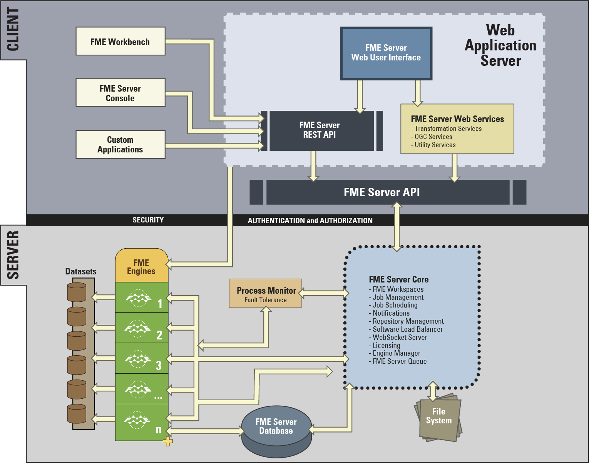

# FME Server Architecture #

FME Server has a number of components, some of which are considered part of the FME Server Core and others that are considered Clients of FME Server.

FME Server Clients include:

- Web Services (for example, the Job Submitter Service).
- Web Clients of FME Server such as the web interface.
- Non-Web Clients of FME Server, which include the FME Server Console, FME Workbench, and any custom application that uses the FME Server REST API.

Important components that are part of the FME Server include:

- Process Monitor
- Repository Management
- FME Server Database
- FME Server Queue
- File System
- FME Engines
- Scheduling Manager
- FME Server Notifications
- WebSocket Server

## FME Server Architecture Diagram ##

## FME Server Components ##

The main components of FME Server to be aware of are:

- FME Engines: To carry out data transformation processing
- Server Core: To handle scheduling and notifications, and manage load balancing
- Job Queue: To queue jobs
- System Database: To store metadata related to workspaces, jobs, and configuration settings for FME Server operation
- File System: To store workspaces files, log files, and data shares
- Web Services: To handle networking capabilities

### FME Engines ###

FME Engines process job requests by running FME Workspaces. This is the same core engine, carrying out the same processing, that is used by FME Desktop. An FME Server installation can possess multiple engines.

Each FME Engine processes a single request at a time, and FME Server processing can be scaled by adding FME Engines to the same computer or to separate computers within a distributed FME Server environment.

### Server Core ###

The FME Server Core manages and distributes job requests (queuing, request routing, scheduling), the repository contents (workspaces, custom formats, custom transformers, data), and notification requests.

The FME Server Core contains a Software Load Balancer (SLB) that distributes jobs to available FME Engines.

### FME Server Queue ###

The Queue is a new component (as of 2018) that is to provide a queuing mechanism for job submissions.  When combined with a second FME Server system it will become fault tolerant automatically.   The FME Server Queue is installed on the same system as the FME Server Core.

### FME Server Database ###

The System Database is a critical component to the FME Server Core and must exist in order for the Core to properly function.  The System Database is not required to be installed on the same system as the Core and can be hosted on an enterprise database on the local network.  FME Server can be reconfigured during or after installation to use another database system. Its often worth testing with a default database installation and then adding a custom database after to confirm FME Server is working as expected. 

### File System ###

The File System is where FME Server stores published workspaces and is the home of the Resources folders.  Log files for the FME Server are stored here along with the completed job logs.  This is often referred to as the FME Server System Share.

### Web Services ###

Much of the FME Server networking capabilities are handled using what we call "Services." Services are software whose interface provides communication between server and clients.

FME Server has a number of services:

- Data Download
- Data Upload
- Data Streaming
- Job Submitter
- KML Network Link
- Token Security
- REST
- Notification

Some services (for example, Data Download) are “transformation” services that carry out data transformation, whereas others (for example, Token) are non-transforming "utility" services.

The Web Application Server is required in order to run the FME Server web interface, FME Server Web Services, and any other web clients. The web interface is included with FME Server and can be run in a browser.  The Web Application Server is installed on the same system as the FME Server Core.
Custom web clients can be developed on top of the FME Server REST API.
