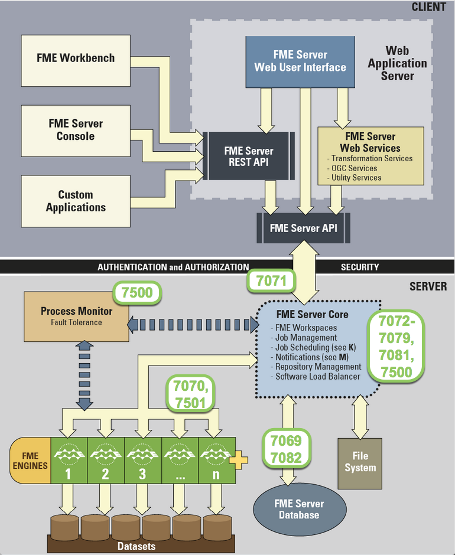

# Firewalls and Ports #

### Configuring Firewall Settings ###

The FME Server Web Services and other clients use the FME Server API to communicate with the FME Server Core over TCP/IP. Requests are sent to the FME Server Core over port 7071. Result messages are returned to clients over a randomly assigned port created by the FME Server Core. Therefore, be sure to configure any firewall settings on the &lt;webHost&gt; with a rule to allow for full communication with the &lt;coreHost&gt; machines.

When specific ports are desired, the port should be made available and not blocked by firewall settings.

Note: An Inbound Rule "Allow All" is created for &lt;FMEServerInstall&gt;\Server\fme\fme.exe on Windows machines when FME Server is installed.

### Ports ###

**Ports 25, 7125, and 465** are for the SMTP Publisher.

**Ports 7069 and 7082** are for FME Server Database communications.

**Ports 7070 and 7501** manage FME Engine processes.

**Port 7071** uses the REST API to send requests to the FME Server Core.

**Ports 7072 - 7076** manage Notification Services.

**Ports 7077 and 7081** are for Configuration, Backup & Restore requests, and System Cleanup tasks.

**Port 7078** handles WebSocket Server requests.

**Port 7079** handles FME Server Resource requests.

**Port 7500** manages FME Server Core processes.

---

<!--Miss Vector Says Section-->

<table style="border-spacing: 0px">
<tr>
<td style="vertical-align:middle;background-color:darkorange;border: 2px solid darkorange">
<i class="fa fa-quote-left fa-lg fa-pull-left fa-fw" style="color:white;padding-right: 12px;vertical-align:text-top"></i>
Miss Vector says...
</td>
</tr>

<tr>
<td style="border: 1px solid darkorange">

For an up-to-date and complete list of ports used by FME Server, and more detailed descriptions, please see <a href="http://docs.safe.com/fme/html/FME_Server_Documentation/Content/ReferenceManual/FME-Server-Ports.htm">FME Server Ports documentation</a>.

</td>
</tr>
</table>
