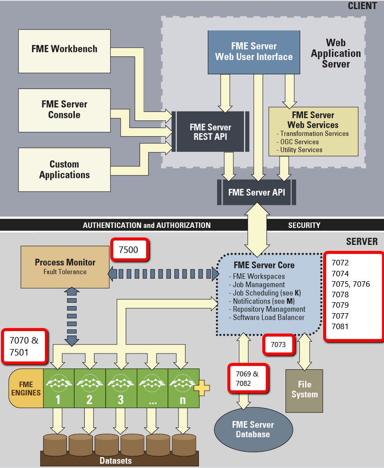

# Firewalls and Ports #

### Configuring Firewall Settings ###

The FME Server Web Services and other clients communicate with the FME Server Core over TCP/IP. Requests are sent to the FME Server Core over port 7071. Result messages are returned to clients over a randomly assigned port created by the FME Server Core. Therefore, be sure to configure any firewall settings on the <webHost\> with a rule to allow for full communication with the <coreHost\> machines.

When specific ports are desired, the port should be made available and not blocked by firewall settings.

### Ports ###

**Port 7500** manages FME Server Core processes.

**Ports 7070 and 7501** manage FME Engine processes.

**Ports 7072-7076** manage Notification Services.

**Ports 25, 7125, and 465** are for the SMTP Publisher.

**Port 7078** handles WebSocket Server requests.

**Port 7079** is for Resources requests.

Database ports are **ports 7069 and 7082**.

Configuration, backup & restore requests, and system cleanup are managed on **ports 7077 and 7081**.

---

<!--Miss Vector Says Section-->

<table style="border-spacing: 0px">
<tr>
<td style="vertical-align:middle;background-color:darkorange;border: 2px solid darkorange">
<i class="fa fa-quote-left fa-lg fa-pull-left fa-fw" style="color:white;padding-right: 12px;vertical-align:text-top"></i>
Miss Vector says...
</td>
</tr>

<tr>
<td style="border: 1px solid darkorange">

For a complete list of ports used by FME Server, check out http://fme.ly/FMEServerPorts

</td>
</tr>
</table>

---

