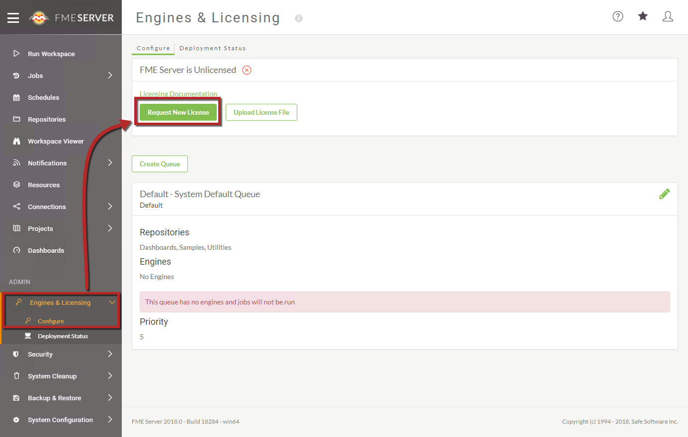

# Verify the Installation #

There are a number of standard tasks to confirm that FME Server is installed and running correctly.

## Confirm the FME Services are running ##

The first task is to ensure the FME Services are running.

To do so, open the Windows "Services" Desktop App (or the equivalent for your platform) and confirm that the four "FME Server" Services are running. These are:

- FME Server Application Server
- FME Server Core
- FME Server Database
- FME Server Engines

On a Windows machine these services should start automatically after installation and reboot of the computer.

## Confirm that Web Services are Active ##

To confirm that the Web Application Server is running correctly, attempt to open the FME Server Web Interface in a web browser:

<pre>
http://&lt;host&gt;/fmeserver
</pre>

If you are using a non-standard port, enter the port number after the host name:

<pre>
http://&lt;host&gt;:&lt;port&gt;/fmeserver
</pre>

...for example:

<pre>
http://localhost:8080/fmeserver
</pre>

If you see a login form, it means that the Web Application Server is running, the web applications have been deployed, and you specified the correct port when accessing the Web Interface.

## Confirm that FME Server is available ##

To confirm that FME Server is running, log in to the Web Interface with the username and password admin/admin.

If you are able to log in, it confirms that FME Server is installed and running.

If you cannot access the web interface, the page shows a Server error, or you can confirm that FME Server is not running, then there might have been a problem with installation contact [Support](https://www.safe.com/support/).

## Licensing FME Sever ##

### Online Mode ###

Online mode is the fastest and easiest method for licensing FME Server.

Licenses are requested in the *Engines & Licensing* tab of FME Server:

This option opens the Request a New License dialog. This dialog requires basic user information (such as your name and email address) and the serial number provided by your account manager. Requests are sent over HTTP/HTTPS to retrieve the license file from Safe Software's back-end databases.

By default, license files are installed to *C:\ProgramData\Safe Software\FME Server\licenses*.

<!--Person X Says Section-->

<table style="border-spacing: 0px">
<tr>
<td style="vertical-align:middle;background-color:darkorange;border: 2px solid darkorange">
<i class="fa fa-quote-left fa-lg fa-pull-left fa-fw" style="color:white;padding-right: 12px;vertical-align:text-top"></i>
FME Lizard says...
</td>
</tr>

<tr>
<td style="border: 1px solid darkorange">

If you change the machine FME Server is installed to, you do not have to contact Safe Support or your account manager. Simply request the license again after FME Server is installed to the new machine!

</td>
</tr>
</table>

---

### Offline Mode ###

If the machine hosting the installation of FME Server is disconnected from the internet, or if firewall rules prevent your machine from communicating with Safe Software's back-end database, then there is an offline method for retrieving an FME Server license file.

Click the option for Request New License.

In the Request A New License dialog select 'No' to the question of "Use automatic licensing via the internet?" After entering your user information and serial number, click OK to download a JSON file to your local file system. Forward this file to Safe Software (codes@safe.com) where an automatic process (running FME in the background!) will return a valid license file to you after a few minutes.

This license file can then be drag-and-dropped onto the Engines & Licensing page to license FME Server.

## Testing the Engines ##

A final check of the system involves testing the FME Engines. To do so carry out the following steps:

- Log in with the admin account.
- Click Run Workspace on the main menu.
- On the Run a Workspace page, specify:
	- **Repository:** Samples
	- **Workspace:** austinApartments.fmw
	- **Service:** Job Submitter
- Click the Run button.

If you see a success message, your install was a success and you were able to use your FME Engine.
