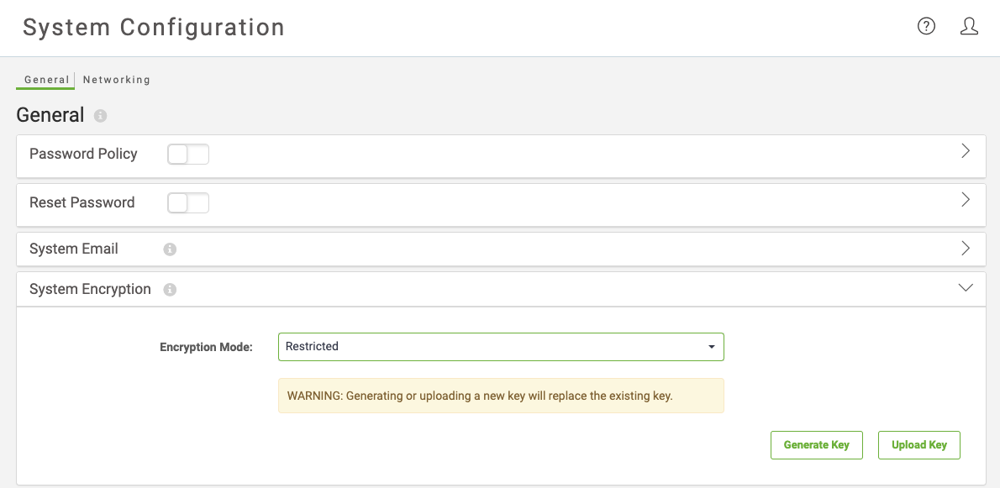

# FME Server Encryption #

By default FME Server encrypts sensitive data in the FME Server Database, as well as passwords of FME Server configuration backups. You can choose to use your own encryption on the database and additionally encrypt the password in the configuration used to access the database.

## Encrypting FME Server ##

FME Server encrypts all data in the FME Server Database, as well as passwords and tokens of FME Server configuration backups. By default, this encryption is managed using an encryption key that is common to any FME Server installation. You may wish to enhance encryption security by generating your own custom encryption keys, which you can apply on a rotating basis.

### Using Custom Encryption Keys ###

When using custom encryption keys, keep in mind the following:

- Do not lose track of any custom keys you generate. Data that is encrypted under a lost key **cannot** be accessed.
- When performing a Backup & Restore of an FME Server configuration, you must restore to an FME Server that uses the same custom encryption key as the backup.

### Enabling Encryption ###

Enable custom encryption using the System Encryption option under System Configuration in the FME Server web interface.

Only members of the **fmesuperuser** role can enable this feature.

When enabling custom encryption do allow time for the process to complete.

You can stop using custom encryption in the future by setting the encryption mode back to **Secure (Default)**.

### Encrypting the FME Server Database Password ###

By default, the password that is stored in configuration file fmeCommonConfig.txt for the FME Server Database is not encrypted. To encrypt the FME Server Database password in fmeCommonConfig.txt, follow the steps outlined in the **[Administrator's Guide.](https://docs.safe.com/fme/2019.0/html/FME_Server_Documentation/AdminGuide/Encrypt-FME-Server-Database-Password.htm)**