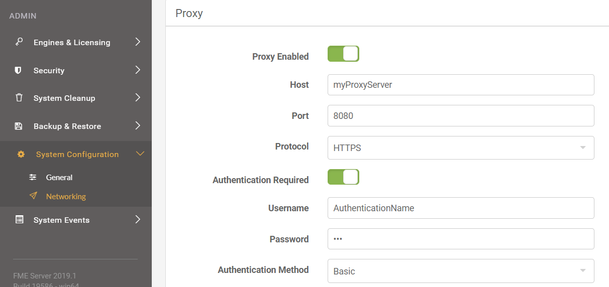

If your organization requires FME Server to sit behind a proxy there are several variations that you can take.

# Outgoing: Forward Proxy #

### FME Server 2019.1 ###

Starting in 2019.1 FME Server can now configure a proxy for both the FME Server Core and FME Engines through the Web UI by navigating to the System Configuration --> Networking --> Proxy and enter your proxy information. If you need exceptions and custom proxy maps please refer to the [proxy documentation.](https://docs.safe.com/fme/2019.0/html/FME_Server_Documentation/AdminGuide/Using_FME_Server_with_Proxy_Server.htm)

### FME Server 2019.0 ###

Configuration of an outgoing proxy for the engines and s3 connector you can follow the [proxy documentation.](https://docs.safe.com/fme/2019.0/html/FME_Server_Documentation/AdminGuide/Using_FME_Server_with_Proxy_Server.htm)

### Custom Proxy Maps 2019.0 and 2019.1 ###

If you require the custom proxy maps or exception in either the 2019.0 or 20191.1  versions you will have to follow the [proxy documentation.](https://docs.safe.com/fme/2019.0/html/FME_Server_Documentation/AdminGuide/Using_FME_Server_with_Proxy_Server.htm)
 and choose a method which is appropriate for your organization.

# Inbound: Reverse Proxy #

FME Server 2019 is designed to use a third-party load balancer in a fault tolerant installation. Even if you choose not to install a fault tolerant setup FME Server can use a load balancer as a reverse proxy. As an example, you can use [Nginx example](https://knowledge.safe.com/articles/55695/configure-fme-server-for-ssl-using-nginx-as-a-reve.html) and follow our [recommended configuration](https://docs.safe.com/fme/2019.0/html/FME_Server_Documentation/AdminGuide/Set-Up-Load-Balancer.htm).
