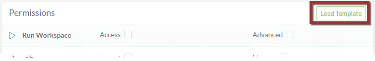
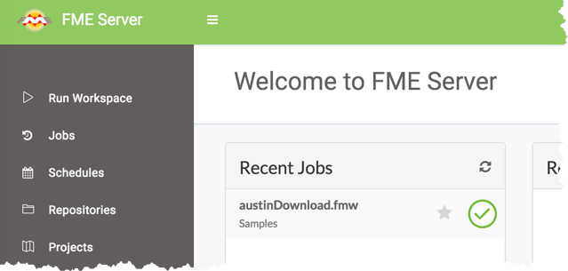

<!--Exercise Section-->

<table style="border-spacing: 0px;border-collapse: collapse;font-family:serif">
<tr>
<td width=25% style="vertical-align:middle;background-color:darkorange;border: 2px solid darkorange">
<i class="fa fa-cogs fa-lg fa-pull-left fa-fw" style="color:white;padding-right: 12px;vertical-align:text-top"></i>
Exercise 1
</td>
<td style="border: 2px solid darkorange;background-color:darkorange;color:white">
Creating a New User and Limiting Their Actions
</td>
</tr>

<tr>
<td style="border: 1px solid darkorange; font-weight: bold">Data</td>
<td style="border: 1px solid darkorange">N/A</td>
</tr>

<tr>
<td style="border: 1px solid darkorange; font-weight: bold">Overall Goal</td>
<td style="border: 1px solid darkorange">Create a new user with limited privileges in the FME Server Web User Interface</td>
</tr>

<tr>
<td style="border: 1px solid darkorange; font-weight: bold">Demonstrates</td>
<td style="border: 1px solid darkorange">Setting security options in FME Server</td>
</tr>

</table>

---

Your company has recently hired a new analyst who will be accessing FME Server. The new employee doesn't quite fit into the current FME Server Roles you have in place so you need to create a new role for them.

 **1) Connect to FME Server** 
 Open the FME Server Web User Interface, either through the Web User Interface option on the Windows Start Menu or directly in your web browser (http://localhost/fmeserver), and log in using the username and password *admin*. 

Select the *Security* page, under the Admin heading on the left sidebar, to see a list of your current users.

 **2) Create a New User**
 Let's create a new FME Server user account for the new analyst. Click **New** to add a new user:

When prompted, create a new user with the following parameters:

- **User Name:** NewUser
- **Full Name:** NewUser
- **Password:** NewUser1

 **3) Configure Permissions**
 Now that we have the credentials for our new user account specified, let's set the permissions for what features and items in FME Server they have access to.

By selecting the **Load Template** button, you have the option to copy permissions from an existing role.

Select *fmeguest* from the Load Template options. This can help speed up security configurations. Notice that Run Workspace and Jobs have been now granted Access.

Configure permissions to match the following:

- **Run Workspace:** Access
- **Jobs:** Access
- **Schedules:** Create
- **Repositories:** Create
- **Projects:** Create

Notice how by selecting Create, the Access privilege is automatically granted.

Select **OK** at the bottom to create the user.

 **4) Test the New User Account**
 It's important to verify the options we set have been honored.

Either logout of the admin account or open a new private browsing window, and login using the credentials for the new user account we just created.

Notice how this user only sees a limited set of menu options: Run Workspace, Jobs, Schedules, Repositories, and Projects.

---

<!--Exercise Congratulations Section--> 

<table style="border-spacing: 0px">
<tr>
<td style="vertical-align:middle;background-color:darkorange;border: 2px solid darkorange">
<i class="fa fa-thumbs-o-up fa-lg fa-pull-left fa-fw" style="color:white;padding-right: 12px;vertical-align:text-top"></i>
CONGRATULATIONS
</td>
</tr>

<tr>
<td style="border: 1px solid darkorange">

By completing this exercise you have learned how to:
 
<ul><li>Create a new user on an FME Server installation</li>
<li>Set permissions from an existing FME Server role</li>
<li>Test a newly created account to ensure it works correctly</li></ul>

</td>
</tr>
</table>

---
