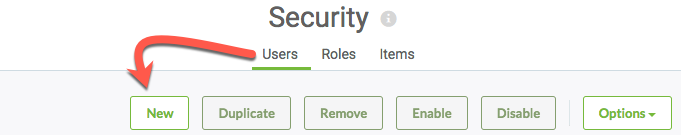
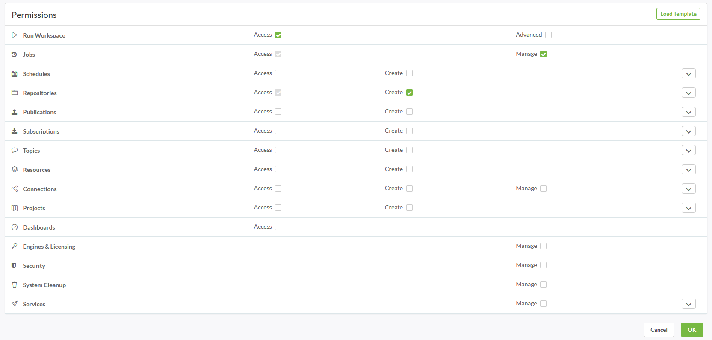
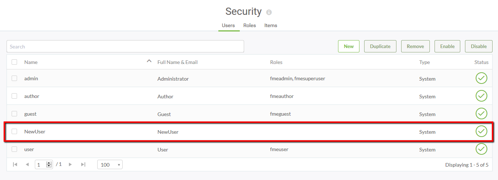
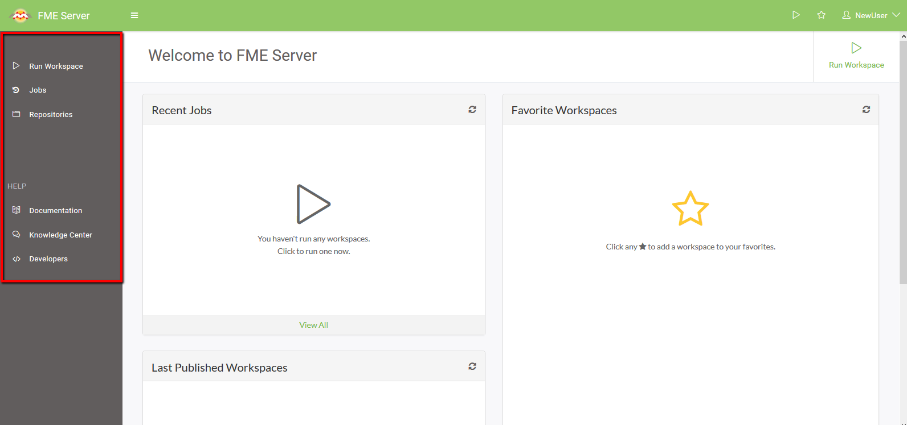

<!--Exercise Section-->

<table style="border-spacing: 0px;border-collapse: collapse;font-family:serif">
<tr>
<td width=25% style="vertical-align:middle;background-color:darkorange;border: 2px solid darkorange">
<i class="fa fa-cogs fa-lg fa-pull-left fa-fw" style="color:white;padding-right: 12px;vertical-align:text-top"></i>
Exercise 1
</td>
<td style="border: 2px solid darkorange;background-color:darkorange;color:white">
Creating a New User and Limiting Their Actions
</td>
</tr>

<tr>
<td style="border: 1px solid darkorange; font-weight: bold">Data</td>
<td style="border: 1px solid darkorange">N/A</td>
</tr>

<tr>
<td style="border: 1px solid darkorange; font-weight: bold">Overall Goal</td>
<td style="border: 1px solid darkorange">Create a new user with limited privileges in the FME Server Web User Interface</td>
</tr>

<tr>
<td style="border: 1px solid darkorange; font-weight: bold">Demonstrates</td>
<td style="border: 1px solid darkorange">Setting security options in FME Server</td>
</tr>

</table>

---

Your company has recently hired a new analyst who will be accessing FME Server. The new employee doesn't quite fit into the current FME Server Roles you have in place so you need to create a new role for them.

**1) Connect to FME Server** 
Open the FME Server Web User Interface, either through the Web User Interface option on the Windows Start Menu or directly in your web browser (http://localhost/fmeserver), and log in using the username and password *admin*. 

Select the *Security* page, under the Admin heading on the left sidebar, to see a list of your current users.

**2) Create a New User**
Let's create a new FME Server user account for the new analyst. Click **New** to add a new user:

When prompted, create a new user with the following parameters:

- **User Name:** NewUser
- **Full Name:** NewUser
- **Password:** NewUser1

4) In the *Permissions* section you can decide whether the new user will be able to Access, Create or Manage one or more FME services. You also have the option to copy permissions from a role by selecting the **Load Template** button.

In the following image, the *NewUser* user has been given Access to Run Workspace, Access and Manage to Jobs, and Access and Create to Repositories.

5) Click **OK** to create the user.

6) Back on the *Users* page you will new see your new user.

7) Log out of your admin account and sign in with your *NewUser* account. Your homepage should only have limited options on the side bar which reflect the *NewUser* permissions.

---

<!--Exercise Congratulations Section--> 

<table style="border-spacing: 0px">
<tr>
<td style="vertical-align:middle;background-color:darkorange;border: 2px solid darkorange">
<i class="fa fa-thumbs-o-up fa-lg fa-pull-left fa-fw" style="color:white;padding-right: 12px;vertical-align:text-top"></i>
CONGRATULATIONS
</td>
</tr>

<tr>
<td style="border: 1px solid darkorange">

You have now added a new user and personalized permissions!

</td>
</tr>
</table>

---
