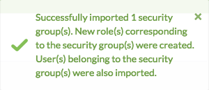

<!--Exercise Section-->

<table style="border-spacing: 0px;border-collapse: collapse;font-family:serif">
<tr>
<td width=25% style="vertical-align:middle;background-color:darkorange;border: 2px solid darkorange">
<i class="fa fa-cogs fa-lg fa-pull-left fa-fw" style="color:white;padding-right: 12px;vertical-align:text-top"></i>
Exercise 2
</td>
<td style="border: 2px solid darkorange;background-color:darkorange;color:white">
Configuring FME Server for Active Directory (LDAP)
</td>
</tr>

<tr>
<td style="border: 1px solid darkorange; font-weight: bold">Data</td>
<td style="border: 1px solid darkorange">N/A</td>
</tr>

<tr>
<td style="border: 1px solid darkorange; font-weight: bold">Overall Goal</td>
<td style="border: 1px solid darkorange">Connect FME Server to an existing Active Directory service</td>
</tr>

<tr>
<td style="border: 1px solid darkorange; font-weight: bold">Demonstrates</td>
<td style="border: 1px solid darkorange">Configuring Active Directory in FME Server, Importing Users and Groups</td>
</tr>

</table>

---

While FME Server provides a means to control access to its components and items within by creating Users and Roles, your company has instructed you to connect FME Server to an existing Active Directory service. After this connection is completed, you will import existing users and groups and configure permissions.

 **1) Connect to FME Server** 
 Open the FME Server Web User Interface, either through the Web User Interface option on the Windows Start Menu or directly in your web browser (http://localhost/fmeserver), and log in using the username and password *admin*. 

Click *Security*, under the Admin heading on the left sidebar, and then select **Active Directory**.

 **2) Create Connection to Active Directory** 
 By creating a new connection, you can incorporate your organization’s Active Directory users and groups into your FME Server security configuration.

To get started, select **New** to open the Create New Server Connection page.

Enter the following information:

- **Name:** FMEUC Active Directory
- **Host:** dc.fmeuc.com
- **Port:** 389
- **Domain Search User:** DC\Administrator
- **Domain Search Password:** *<distributed_during_course>*

Click **OK** to save the new Active Directory connection. You will be returned to the Active Directory page. Wait for the Status to change from Yellow to Green, indicating that the connection was successful.

 **3) Import Groups** 
 Now that the connection is established, select the **Import Groups** icon to add users from the Active Directory connection. Note that Active Directory *Groups* are added to FME Server as *Roles*.

On the Browse Groups page, navigate to and select **FMEUC Users**, then click *Import*.

A notification will appear in the top right of the web browser window to indicate that the group was successfully imported, along with all users belonging to that security group.

 **4) Configure Role Permissions** 
 After the Active Directory group is imported to FME Server, you must configure the permissions of the new Role.

Select Security &gt; **Roles** under the Admin heading on the left sidebar of the FME Server Web User Interface. Click on the **FMEUC Users** Role that was just created to open the Edit Permissions page.

To verify that the logins will work, give the Role some basic permissions allowing its users to login to the FME Server Web User Interface and run a job. Select the following permissions:

- **Run Workspace:** Access
- **Repositories &gt; Samples:** Can Run (under the *Summary*)

 **5) Test the New User Account**
 Test that the import and assigning permissions was successful by logging in to FME Server with a user from the imported Active Directory group.

Either logout of the admin account or open a new private browsing window, and login using the credentials below:

- **Username:** mvector
- **Password:** fmeuc2017

---

<!--Exercise Congratulations Section--> 

<table style="border-spacing: 0px">
<tr>
<td style="vertical-align:middle;background-color:darkorange;border: 2px solid darkorange">
<i class="fa fa-thumbs-o-up fa-lg fa-pull-left fa-fw" style="color:white;padding-right: 12px;vertical-align:text-top"></i>
CONGRATULATIONS!
</td>
</tr>

<tr>
<td style="border: 1px solid darkorange">

By completing this exercise you have learned how to:
 
<ul><li>Connect FME Server to an existing Active Directory configuration</li>
<li>Import Users and Groups from Active Directory</li></ul>

</td>
</tr>
</table>
