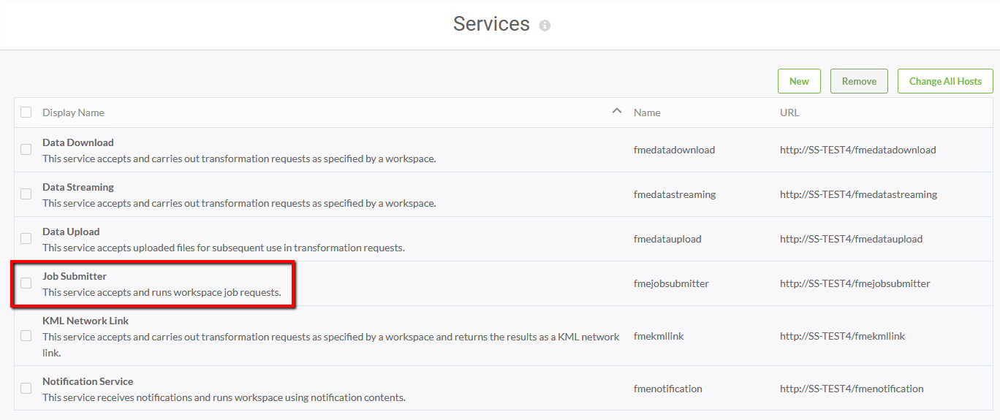

<!--Exercise Section-->

<table style="border-spacing: 0px;border-collapse: collapse;font-family:serif">
<tr>
<td width=25% style="vertical-align:middle;background-color:darkorange;border: 2px solid darkorange">
<i class="fa fa-cogs fa-lg fa-pull-left fa-fw" style="color:white;padding-right: 12px;vertical-align:text-top"></i>
Exercise 3
</td>
<td style="border: 2px solid darkorange;background-color:darkorange;color:white">
Configuring FME Server for HTTPS
</td>
</tr>

<tr>
<td style="border: 1px solid darkorange; font-weight: bold">Data</td>
<td style="border: 1px solid darkorange">N/A</td>
</tr>

<tr>
<td style="border: 1px solid darkorange; font-weight: bold">Overall Goal</td>
<td style="border: 1px solid darkorange">Change access to the FME Server Web User Interface to HTTPS</td>
</tr>

<tr>
<td style="border: 1px solid darkorange; font-weight: bold">Demonstrates</td>
<td style="border: 1px solid darkorange">Creating a self-signed certificate and importing into the FME Server keystore</td>
</tr>

</table>

---

Your company is expanding rapidly and hiring many new employees. Now, instead of having everyone able to access to FME Server, you have set up logins so only trusted personnel have access. You also want to set up extra precautions to keep the login information secure.

HTTPS ensures that communication between the client and the server is encrypted, so that if it is intercepted, the third party cannot easily view or use the information. For FME Server, you can use HTTPS to ensure that sensitive login information is not exposed.

### Enable SSL on the Web Application Server ###

For any HTTPS (SSL) page, a certificate is required. For development and testing purposes, self-signed certificates are supported. For production use, we recommend that you use SSL certificates from a verified SSL certificate authority (CA).

1) Create a Keystore File 

First, you must generate a keystore that contains a certificate chain using the Java Keytool from the Java Developer Kit (JDK).

Open a command prompt and run as administrator.

2) Navigate to the Java bin directory (*C:\Program Files\FMEServer\Utilities\jre\bin\\*)

3) Run the following command to create a new keystone file:

		keytool -genkey -alias tomcat -keyalg RSA -keystore tomcat.keystore
 
4) Set a password for the new keystore and specify the server domain name (for example, *fmeserver.example.org*) as your first and last name.

5) Enter yes when prompted if inputs are correct.

6) When prompted for the password for the alias &lt;tomcat&gt;, press RETURN.

7) A new keystore is created in *C:\Program Files\FMEServer\Utilities\jre\bin\\*.

8) Copy the new keystore file to the tomcat directory in the FME Server installation: *C:\Program Files\FMEServer\Utilities\tomcat\\*.

  
9) Working with the Certificate 

**Using a self-signed certificate:**

The new keystore must be imported into the FME Server keystore for trusted certificates with the following command:

	keytool -importkeystore -srckeystore tomcat.keystore -destkeystore "C:\Program Files\FMEServer\Utilities\jre\lib\security\cacerts"

10) You will be prompted to enter two passwords. One for the destination keystore. The password for the destination keystore is **changeit**. And one password for the source keystore. The password for the source keystore is the password that was specified in step 4 above.

  
**Configure Tomcat** 

In the next steps, we modify three configuration files of Apache Tomcat. All three files are located in the FME Server installation directory: *C:\Program Files\FMEServer\Utilities\tomcat\conf\\* .

It is a good idea to make copies of any files you will be changing and hold them in a separate directory until you have verified that the edits are working successfully.

11) Configure *server.xml*

Open the *server.xml* file in a text editor in administrator mode.

12) Locate the *SSLEngine* setting in the *&lt;Listener&gt;* element, including *className="org.apache.catalina.core.AprLifecycleListener"* and change the *“on”* value to *“off”*.

13) Locate the *&lt;Connector&gt;* element that contains *protocol="org.apache.coyote.http11.Http11NioProtocol"* and replace it with the following:

		<Connector protocol="org.apache.coyote.http11.Http11NioProtocol"
		port="443" minSpareThreads="5"
		enableLookups="true" disableUploadTimeout="true"
		acceptCount="100" maxThreads="200"
		scheme="https" secure="true" SSLEnabled="true"
		keystoreFile="<FMEServerDir>\Utilities\tomcat\tomcat.keystore"
		keystorePass="<your_password>"
		clientAuth="false" sslEnabledProtocols="TLSv1,TLSv1.1,TLSv1.2"
		sslImplementationName="org.apache.tomcat.util.net.jsse.JSSEImplementation"
		ciphers="TLS_ECDHE_RSA_WITH_AES_128_CBC_SHA256,TLS_ECDHE_RSA_WITH_AES_128_CBC_SHA,
		TLS_ECDHE_RSA_WITH_AES_256_CBC_SHA384,TLS_ECDHE_RSA_WITH_AES_256_CBC_SHA,
		TLS_RSA_WITH_AES_128_GCM_SHA256,TLS_RSA_WITH_AES_256_GCM_SHA384,
		TLS_RSA_WITH_AES_128_CBC_SHA256,TLS_RSA_WITH_AES_256_CBC_SHA256,
		TLS_RSA_WITH_AES_128_CBC_SHA,TLS_RSA_WITH_AES_256_CBC_SHA,
		SSL_RSA_WITH_3DES_EDE_CBC_SHA"
		URIEncoding="UTF8" />
 
		<Connector port="80" protocol="HTTP/1.1"
		redirectPort="443"/>
		
14) Make sure to exchange *&lt;FMEServerDir&gt;* and *&lt;your_password&gt;* with the install directory of FME Server and the password of the keystore that was specified in step 4.

15) Save and close the *server.xml* file.

16) Configure *web.xml*

Open the *web.xml* file in a text editor in administrator mode.

17) Add the following code block to the end of the file, just before the closing *&lt;/web-app&gt;* element:

		<security-constraint>
		<web-resource-collection>
		<web-resource-name>HTTPSOnly</web-resource-name>
		<url-pattern>/*</url-pattern>
		</web-resource-collection>
		<user-data-constraint>
		<transport-guarantee>CONFIDENTIAL</transport-guarantee>
		</user-data-constraint>
		</security-constraint>

18) Save and close the *web.xml* file.

19) Configure *context.xml*

Open the *context.xml* file in a text editor in administrator mode.

20) Add the following to the end of the file, just before the closing *&lt;/context&gt;* element:

		<Valve className="org.apache.catalina.authenticator.SSLAuthenticator"
		disableProxyCaching="false" />

21) Save and close the *context.xml* file.

22) Now that we have made our changes, we want to verify that HTTPS was configured correctly for FME Server.

Restart the FME Server Application service.

23) Open a browser and navigate to *https://localhost/*. 

You should see the FME Server login page in a secured format.

Note: If a self-signed certificate is used for testing, your browser may report the page as not secure:

For self-signed certificates, click the **Advanced** button and add an exception for *https://localhost/*

24) Modify Service URLs to Use HTTPS 

To enable SSL for a service, open the FME Server Web User Interface, and select *Services*. 

25) On the *Services* page, click the desired service. For this exercise, let's select *Job Submitter*.

26) The *Editing Service* page opens. In the *URL Pattern* field, change *HTTP* to *HTTPS*.

27) Click **OK**.

28) Check on the *Services* page that your update worked.

---

<!--Exercise Congratulations Section--> 

<table style="border-spacing: 0px">
<tr>
<td style="vertical-align:middle;background-color:darkorange;border: 2px solid darkorange">
<i class="fa fa-thumbs-o-up fa-lg fa-pull-left fa-fw" style="color:white;padding-right: 12px;vertical-align:text-top"></i>
CONGRATULATIONS!
</td>
</tr>

<tr>
<td style="border: 1px solid darkorange">

By completing this exercise you have learned how to:
 
<ul><li>Create a self-signed certificate</li>
<li>Import a certificate in the FME Server Java keystore</li>
<li>Change FME Server Web Services to use HTTPS URLs</li></ul>

</td>
</tr>
</table>
