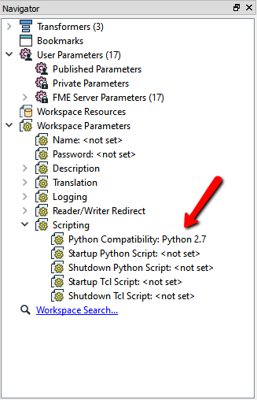
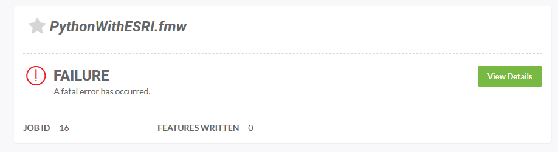

# Exercise - Using Python with FME Server #

**1) Start FME Workbench**

Open FME Workbench and create a  new Blank Workspace.

**2) Create a Python Workspace** 

We need a python job to upload to FME Server.

Add a **Creator** transformer and a **PythonCaller** transformer and attach the **Creator** to the **PythonCaller**. Next, right click the **PythonCaller** and select **Connect Logger**.

**3) Python Compatability**

For FME 2017 worskpaces, the Python Interpreter is determined by the setting of the Python Compatibility workspace parameter found in the Navigator panel.

Workspace Parameters &gt; Scripting &gt; Python Compatibility

Double click **Python Compatibility** to change the python interpreter. Select **Esri ArcGIS Desktop (Python 2.7)**.

**4) Run the Workspace**

Test that your translation runs successfully by clicking the **Run** button.

Now that we have a working python job, we can publish the workspace to FME Server.

**5) Publish to FME Server** 

Publish the workspace to FME Server from the file menu in FME Workbench. Click **Publish to FME Server**:

**6) Run the Workspace on FME Server**

On the Web User Interface, go to the *Run Workspace* page.

Select the Repository and Workspace that we just uploaded the python workspace to. Click **Run** to test the workspace runs on FME Server.

**7) A Fatal Error has Occured**

Running the python workspace has failed. Click **View Details** and then **View Log** to check for the error message.

The ArcGIS Python 2.7 interpreter could not be found. Even though the workspace ran successfully on FME Desktop, the workspace is not running on FME Server.

