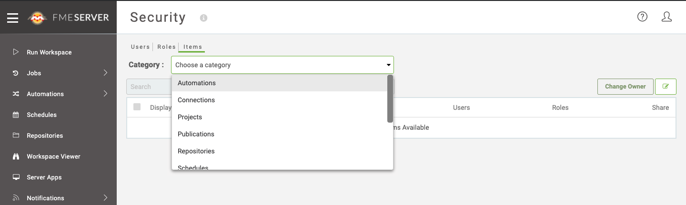
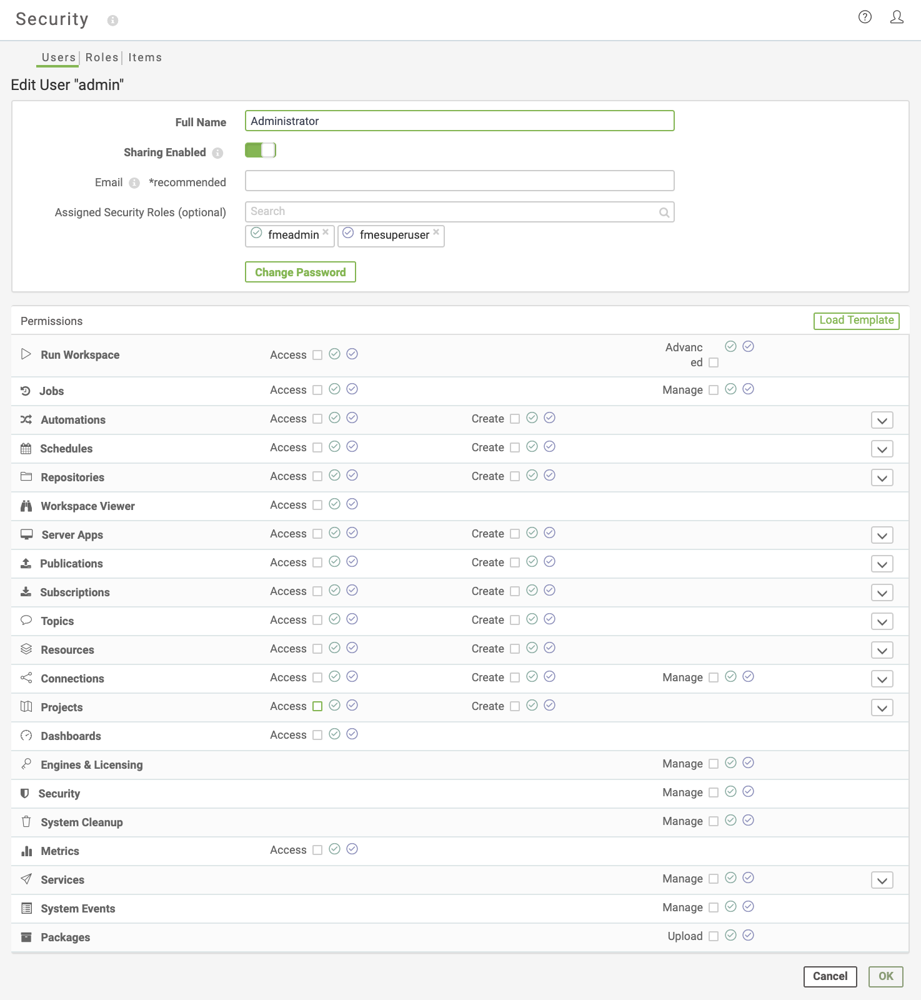

# Security Policies #

Security policies can be applied to each item, role or user. While permissions can be set on each individual item in FME Server, the access to features and functionality in the FME Server web interface are managed by the *Access* or *Manage* privileges.

### Run Workspace ###

Run Workspace controls the ability to - you guessed it - run a workspace on FME Server. The *Advanced* option allows a user to access advanced job directives and the direct URL to run a workspace.

### Jobs ###

Access to the Jobs page allows the user to view the jobs *they* have run, or cancel any of their jobs that are currently running or in the queue. The *Manage* option allows them to view the *full job history* (all users) on FME Server and the ability to cancel any job, or remove any job from the history.

### Automations ###

Automations is a new feature in FME Server 2019.0. Create permissions for Automations allows the user to create automated workflows that respond to schedules or triggers, in a range of supported protocols. A user granted Create permission also requires Create permissions for: Publications, Subscriptions, Schedules and Topics, and Access permissions for Repositories.

### Schedules ###

Schedules are one of the core functions FME Server provides. Access to each schedule can be controlled.

### Repositories ###

Repositories are a place to store and categorize workspaces. Each role or user can be given different permissions for every repository - download, read, publish, run, remove. Access permission is not necessary to run a workspace - only run permission on the applicable repository is required.

### Version Control ###

Version Control is implemented in FME Server 2018.0 or greater. It allows users to version the workspaces they have published to FME Server, either during publishing or by using the FME Server web interface. A user can be granted Access or Manage permissions.

### Server Apps ###

Server Apps is a new feature in FME Server 2019.1 and allows a user to create FME Server Web Applications. These allow users to run a workspace and provide required inputs through a simple web page.  A user can be granted Access or Create permissions.

### Workspace Viewer ###

Workspace Viewer is implemented in FME Server 2018.0 or greater. It allows a user to view published workspaces through the FME Server web interface.  A user can be granted access to use this feature.

### Publications ###

Publications are a subset of the FME Server Notification System. Different permissions - read, write (edit), remove - can be assigned for each publication.

### Subscriptions ###

Subscriptions are a subset of the FME Server Notification System. Different permissions - read, write (edit), remove - can be assigned for each subscription.

### Topics ###

Topics are related to Notifications (Publications and Subscription). Different capabilities – read, write, publish, remove – can be assigned for each topic created.

### Resources ###

Resources are files and datasets stored on FME Server. Different permissions – access, list, write, upload, remove – can be assigned to each resource.

### Connections ###

Connections are predefined logins to either web services or databases. Each role or user can be given permission to manage the different connections stored in FME Server. With this permission, the user can create new definitions, and manage connections in the FME Server web interface.

### Projects ###

Projects are created to manage a set of FME Server resources, for example workspaces, schedules, publications, and subscriptions. Different permissions - Can View, Can Edit, Full Access - can be assigned to a user or role for each project.

### Dashboards ###

Dashboards offer an easy way to view FME Server health using the FME Server web interface.

### Engines & Licensing ###

The Engines & Licensing page concerns licensing FME Server, managing the number of active FME Server Engines, and the number of connected hosts.

### Security ###

Granting the permission for Security allows the role or user to create, enable, disable, and remove users and roles, as well as configuring for Active Directory.

### System Cleanup ###

System Cleanup tasks are defined in the FME Server web interface and help to manage temporary files and log files among other items.

### Metrics ###

Metrics is a new feature in FME Server 2019.1. This feature provides information about FME Server jobs and queues in a Prometheus/OpenMetric format and is available through the REST API. A user can be granted access to use this feature.

### Services ###

Services are key items of functionality on FME Server. They are the different methods by which a workspace can be run and output data delivered. Each role or user can be allowed – or not – to use a particular service.

### System Events ###

System Events is a new feature in FME Server 2019.0. FME Server publishes messages about significant events on FME Server. A user can be granted Manage permission.

### Packages ###

Packages is a new feature in FME 2019.0. The FME Package is a new mechanism to distribute FME Engine components: transformers, readers/writers and web connections. FME Server users can publish packages with their workspaces. A user can be granted Upload permission.

