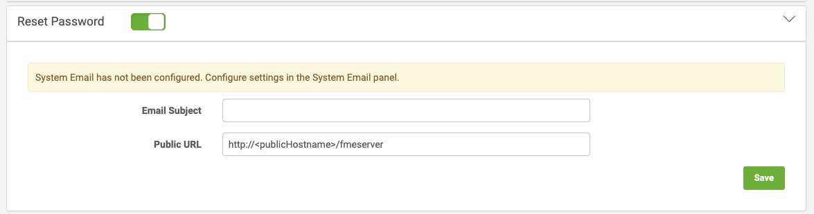

# Reset Password #

Since 2018.0, FME Server allows users to reset their password if they are unable to log in, provided the following statements are true:

- Reset Password is enabled (see below).
- A 'System Email' account has been configured.
- The user has provided their correct email address associated with their account.
- The user is not an Active Directory user.

Password Recovery makes it easier on the FME Server Administrator(s) if users a prone to forgetting their password. On the log in screen for FME Server, if 'Reset Password' is enabled users will see the option for 'Forgot your password?'. Users will then need to enter their username and if the user account is valid, an email will be sent out to the email address associated with it.

If your FME Server is configured for Active Directory, then your users cannot use this feature to reset their domain password.  In this case, users should seek out their IT Admins for password management or recovery.

## Enable Reset Password ##

Reset Password is enabled through System Configuration &gt; General &gt; Reset Password. Only members of the **fmesuperuser** role can enable this feature.

You will need to configure an email account that will be used to send Reset Password emails from.

In FME Server *2018.0 - 2019.0* this account is configured within the Reset Password dialog.

In FME Server *2019.1+* Reset Password will use the System Email account, which has combined usage with System Events.

You will need to configure an Email Subject that will be sent when a user forgets their password.

A valid Public URL must also be configured. This will be used to create a link that will allow people to reset their password so it must resolve to the correct FME Server address.

---

<!--Tip Section--> 

<table style="border-spacing: 0px">
<tr>
<td style="vertical-align:middle;background-color:darkorange;border: 2px solid darkorange">
<i class="fa fa-info-circle fa-lg fa-pull-left fa-fw" style="color:white;padding-right: 12px;vertical-align:text-top"></i>
TIP
</td>
</tr>

<tr>
<td style="border: 1px solid darkorange">

When using email accounts outside of your normal inbox client we recommend creating and using an application password. This reduces the likelihood the email account will get access suspended due to security concerns.

</td>
</tr>
</table>

---

