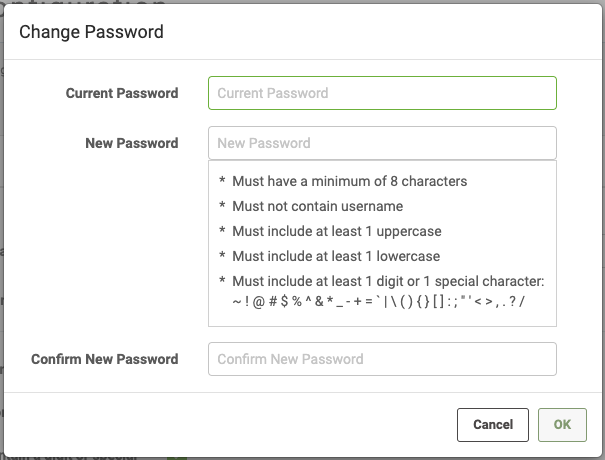

# Password Management #

## Password Policy ##

In FME Server 2019.0, a Password Policy can now be configured.
This adds restrictions for password creation including:

- Minimum character limit.
- Must not contain username.
- Must contain uppercase letter.
- Must contain lowercase letter.
- Must contain a digit or special character.

Once this has been enabled, new users or existing users who change their password must adhere to the new password policy. The password policy restrictions will be visible to a user when they are creating or changing their password.

## Changing User Passwords ##

A user can change their own user password by opening their User Settings, accessed at the top right of the FME Server Web Interface. They can then select 'Change Password'.

An Administrator user can also change user passwords if they are unable to log in to their account. They can do this by editing the user account under Security > Users.