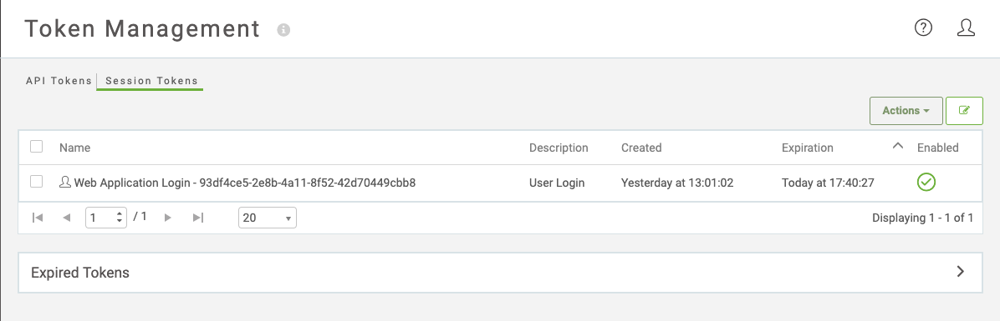

# Token Management #

FME Server now provides advanced Token Management compared to previous builds.

## Managing Tokens ##

Users are only able to manage their own tokens in FME Server, not any other users regardless of permissions.

To view your existing tokens, or create a new ones, access the Token Management page by clicking on User Settings and choosing Manage Tokens.

There are two types of tokens in FME Server: API Tokens and Session Tokens.

## API Tokens ##

When you create an FME Server App or want a third party application to run a workspace, you likely do not want to be passing the username and password in the URL or headers of a request. This is when you would create an *API Token*.

By default when you create an FME Server App, a token will get created with the necessary permissions to execute that workspace.

You can also create your own token and manually assign it permissions from the Token Management page.

If you want to give that token additional access to FME Server, you can edit the token and change the permissions. You can assign the token 'All Permissions', which means that it will inherit the same permissions as the user that created it.

You can create, enable, disable, duplicate or remove active API Tokens.

Expired tokens are also listed, in case you need to enable, duplicate or remove them.

<table style="border-spacing: 0px">
<tr>
<td style="vertical-align:middle;background-color:darkorange;border: 2px solid darkorange">
<i class="fa fa-exclamation-triangle fa-lg fa-pull-left fa-fw" style="color:white;padding-right: 12px;vertical-align:text-top"></i>
WARNING
</td>
</tr>

<tr>
<td style="border: 1px solid darkorange">

The only time that a token value is available is when it's created.
 Make sure to keep the token value (and name) safe if you will need to refer to it later.

</td>
</tr>
</table>

## Sessions Tokens ##

When you sign in to FME Server, you are granted a token allowing you to use the Web Interface for 30 minutes. This token is automatically extended if you remain logged in for more than 25 minutes, otherwise you will be required to log in again. This is know as a *session token*.

The current browser Session Token will be highlighted in the active tokens table by a small user icon next to the token name.

Active Session Tokens can be enabled, disabled or removed. If you disable or remove the current Session Token you will be prompted to log in to FME Server again.

Expired tokens are also listed for visibility and can be removed.

