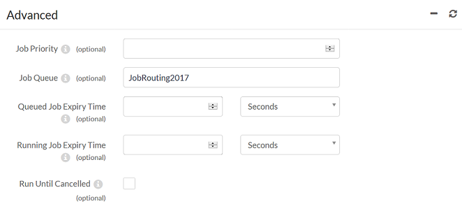
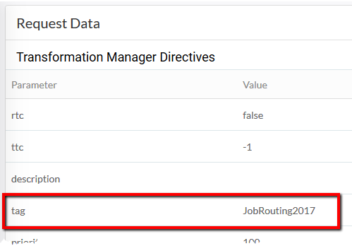
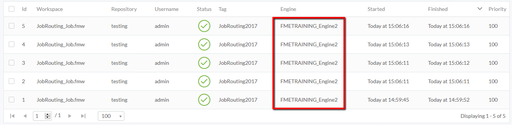

<!--Exercise Section-->

<table style="border-spacing: 0px;border-collapse: collapse;font-family:serif">
<tr>
<td width=25% style="vertical-align:middle;background-color:darkorange;border: 2px solid darkorange">
<i class="fa fa-cogs fa-lg fa-pull-left fa-fw" style="color:white;padding-right: 12px;vertical-align:text-top"></i>
Exercise 1
</td>
<td style="border: 2px solid darkorange;background-color:darkorange;color:white">
Job Routing
</td>
</tr>

<tr>
<td style="border: 1px solid darkorange; font-weight: bold">Data</td>
<td style="border: 1px solid darkorange">N/A</td>
</tr>

<tr>
<td style="border: 1px solid darkorange; font-weight: bold">Overall Goal</td>
<td style="border: 1px solid darkorange">Send a job through a specific engine</td>
</tr>

<tr>
<td style="border: 1px solid darkorange; font-weight: bold">Demonstrates</td>
<td style="border: 1px solid darkorange">Creating a job routing tag for an engine and sending a job through that particular engine</td>
</tr>

<tr>
<td style="border: 1px solid darkorange; font-weight: bold">Start Workspace</td>
<td style="border: 1px solid darkorange">None</td>
</tr>

<tr>
<td style="border: 1px solid darkorange; font-weight: bold">End Workspace</td>
<td style="border: 1px solid darkorange">C:\FMEData2017\Workspaces\ServerAdmin\JobRouting-Ex1-Complete.fmw</td>
</tr>

</table>

---

Your GIS department is all onboard with FME Server and translating jobs with the Web User Interface, but jobs are always being queued, even the quick translations. You are wondering if there is a way to set aside one of the FME Server engines for quick translations only so that you and your fellow technical analysts do not have to wait too long for your smaller jobs to complete. With Job Routing you can allocate specific engines to specific tasks.

---

<!--Miss Vector says...--> 

<table style="border-spacing: 0px">
<tr>
<td style="vertical-align:middle;background-color:darkorange;border: 2px solid darkorange">
<i class="fa fa-quote-left fa-lg fa-pull-left fa-fw" style="color:white;padding-right: 12px;vertical-align:text-top"></i>
Miss Vector says...
</td>
</tr>

<tr>
<td style="border: 1px solid darkorange">

If you have completed the Configure for HTTPS exercise, remember that the URL to connect to FME Server is now https://localhost:8443 and NOT http://localhost!

</td>
</tr>
</table>

 **1) Create a Job Routing Tag**
 A job routing tag is how you assign a job to a specific FME Engine. Tags are not automatically assigned to engines so we will first have to create a tag before assigning it.

To configure a Job Routing Tag, we must go to the FME Server REST API V3 interactive page where you can try each method live.

Login to the FME Server Web User Interface either through the Web User Interface option on the Windows Start Menu or directly in your web browser, and log in using the username and password *admin*.

On the left sidebar, click **Developers &gt; REST API** to open the FME Server REST API V3 page.

This opens the FME Server REST API on the *Overview* page. Select **API** from the menu options to display the various REST API calls that FME Server supports.

Click on **transformations: Transformation Manager** to expand this section. Scroll down to the **POST /transformations/jobroutes/tags** REST API endpoint and select to expand this method.

This is where we will specify the tag we want to create.

 **2) Name Your Tag**
 Under Parameters, fill in **name** with the unique name of the tag you want to create, for example *JobRouting2017*, and **engines** with the name of one of your engines, for example *FMETRAINING_Engine2*, found on the Engines & Licensing tab of FME Server. This is the engine that will be associated with the tag and that we will route a job through.

You also have the option to specify a description of the tag, and the repository assignments for the tag.

---

<!--Sister Intuitive says...--> 

<table style="border-spacing: 0px">
<tr>
<td style="vertical-align:middle;background-color:darkorange;border: 2px solid darkorange">
<i class="fa fa-quote-left fa-lg fa-pull-left fa-fw" style="color:white;padding-right: 12px;vertical-align:text-top"></i>
Sister Intuitive says...
</td>
</tr>

<tr>
<td style="border: 1px solid darkorange">

Parameters documented in boldface are required while parameters in normal font are optional.

</td>
</tr>
</table>

---

 **3) Generate a Token**
 The FME Server REST API uses token-based authentication. In order to invoke this command to create a new Job Routing Tag on FME Server, we need to obtain a valid token.

Click the button **Try it out!** located at the bottom of the form. You will be prompted for a Username and Password to acquire a Token. This must be provided with every request, and can be specified in a header or querystring or form parameter.

In this case, your Username and Password are the username and password of your FME Server Administrator’s account.

Click **Lookup Existing Token**. If no token is found, or if an existing token has expired, select *Generate Token*. Close the Token dialog box.

Click **Try it out!** once more to execute the REST API call now that your token is registered.

A Response Code value of *201* means you have successfully created your tag! Now you can use the tag to route jobs through the specified engine.

 **4) Create a Workspace**
 Now we will create a workspace in FME Workbench so that we have a job to test our Job Routing Tag with. For this exercise we do not need a complicated workspace, just a job that will run.

Open FME Workbench and create a new Blank Workspace.

Add a **Creator** transformer and connect it to a **Logger** transformer.

 **5) Test the Workspace**
 Test that the translation completes successfully by clicking the Run button in the toolbar of FME Workbench:

The Translation Log indicates running this workspace was successful, and now we have a job that we can route.

 **6) Publish to FME Server**
 Publish the workspace to FME Server by selecting **Publish to FME Server** from the File menu in FME Workbench:

When prompted in the Publish to FME Server Wizard, publish the workspace to:

- **Repository Name:** testing
- **Workspace Name:** JobRouting_Job.fmw
- **Service:** Job Submitter

 **7) Connect to FME Server**
 Open the FME Server Web User Interface, either through the Web User Interface option on the Windows Start Menu or directly in your web browser, and log in using the username and password *admin*.

 **8) Run the Workspace with Job Routing**
 Once you have a published to FME Server, you can run the **JobRouting_Job** workspace and utilize the Job Routing option.

Click *Run Workspace* on the left sidebar.

On Run Workspace page, fill out the parameters as follows:

- **Repository:** testing
- **Workspace:** JobRouting_Job
- **Service:** Job Submitter 

Next, expand the **Advanced** options on the Run Workspace page. There is the *Job Routing Tag* parameter which can be used to associate the selected job with a specific FME Engine. Enter *JobRouting2017* (the name of the tag created in Step 2):

Click *Run*.

 **10) Verify Job Routing Configuration**
 You want to make sure the job was routed to the correct engine and not just the first available engine.

In the left sidebar of the FME Server Web User Interface select **Jobs &gt; Completed**.

Select the workspace that just ran to open the Job Details page.

Scroll down to view the *Request Data* section you can see your tag name that the job was routed through: 

Go back to **Jobs &gt; Completed** to verify that the job was always sent to the correct engine. When testing, you may consider submitting the job multiple times for an added verification step, and piece of mind, but this isn't necessary of course!

---

<!--Exercise Congratulations Section--> 

<table style="border-spacing: 0px">
<tr>
<td style="vertical-align:middle;background-color:darkorange;border: 2px solid darkorange">
<i class="fa fa-thumbs-o-up fa-lg fa-pull-left fa-fw" style="color:white;padding-right: 12px;vertical-align:text-top"></i>
CONGRATULATIONS!
</td>
</tr>

<tr>
<td style="border: 1px solid darkorange">

By completing this exercise you have learned how to:
 
<ul><li>Create a Job Routing Tag</li>
<li>Successfully route a job through a specific engine</li>
</ul>

</td>
</tr>
</table>
