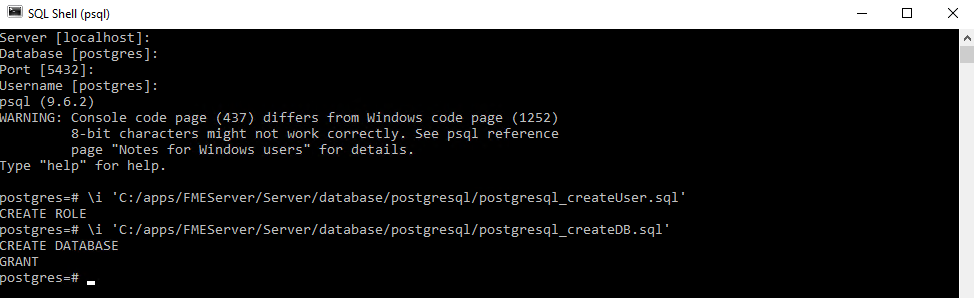
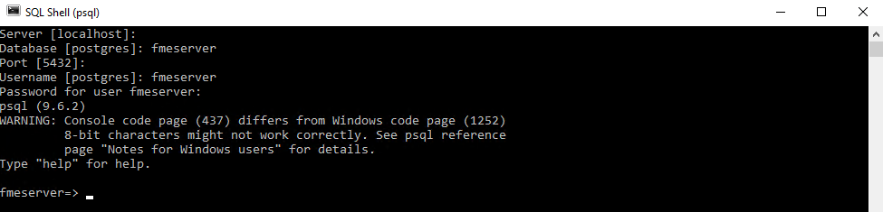
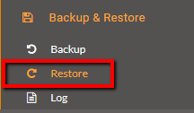

<!--Exercise Section-->

<table style="border-spacing: 0px;border-collapse: collapse;font-family:serif">
<tr>
<td width=25% style="vertical-align:middle;background-color:darkorange;border: 2px solid darkorange">
<i class="fa fa-cogs fa-lg fa-pull-left fa-fw" style="color:white;padding-right: 12px;vertical-align:text-top"></i>
Exercise 2
</td>
<td style="border: 2px solid darkorange;background-color:darkorange;color:white">
Switching to a PostgreSQL Database with Windows System
</td>
</tr>

<tr>
<td style="border: 1px solid darkorange; font-weight: bold">Data</td>
<td style="border: 1px solid darkorange">N/A</td>
</tr>

<tr>
<td style="border: 1px solid darkorange; font-weight: bold">Overall Goal</td>
<td style="border: 1px solid darkorange">Change your current database configuration to a PostgreSQL database</td>
</tr>

<tr>
<td style="border: 1px solid darkorange; font-weight: bold">Demonstrates</td>
<td style="border: 1px solid darkorange">Backing up your FME Server configurations, configuring a PostgreSQL database, and restoring the old FME Server configurations</td>
</tr>

</table>

---

Your company has an Express Installation of FME Server already installed but your Database Administrator has just informed you that you that the company will be switching its database providers from the default FME Database to a PostgreSQL database to allow for more control over database security.

---

<!--Miss Vector says...--> 

<table style="border-spacing: 0px">
<tr>
<td style="vertical-align:middle;background-color:darkorange;border: 2px solid darkorange">
<i class="fa fa-quote-left fa-lg fa-pull-left fa-fw" style="color:white;padding-right: 12px;vertical-align:text-top"></i>
Miss Vector says...
</td>
</tr>

<tr>
<td style="border: 1px solid darkorange">

If you completed the Configure for HTTPS exercise in chapter 3, remember: 
  the URL to connect to FME Server is https://localhost:8443 NOT http://localhost!

</td>
</tr>
</table>

---

## 1. Backup your FME Server configuration ##

Backing up your current FME Server instance is important before altering your current FME Server so that once you have reinstalled your new database, you can restore your past FME Server configurations all at once instead of having to go through the process of manually changing the configurations settings afterwards.

Open the FME Server Web User Interface, either through the Web User Interface option on the Windows Start Menu or directly in your web browser (http://localhost/), and log in using the username and password *admin*.

You can save your current configuration settings by going to **Backup & Restore** in the table of contents:

… and then downloading the configuration files onto the computer. 

Set the *Configure Backup* parameters as:

- **Filename:** Backup2017
- **Backup To:** Download

Next step is to configure the new database server. Run the necessary database configuration scripts and post-configuration scripts for your new PostgreSQL database as follows.

## 2. Database Configuration ##

**Using the Command Prompt:**

Go to the directory where your postgreSQL files are stored (*C:\apps\FMEServer\Server\database\postgresql\\*).

Open psql and log on as a user with the appropriate privileges. 

Create an FME Server database user as follows:
 
From the SQL prompt, run the *postgresql\_createUser.sql* script by entering the following command:
		
	\i 'C:/apps/FMEServer/Server/database/postgresql/postgresql_createUser.sql'

By default, the provided SQL script creates an FME Server database user named *fmeserver* with the password *fmeserver*.

Create an FME Server database as follows:
 
From the SQL prompt, run the *postgresql\_createDB.sql* script by entering the following command:

	\i 'C:/apps/FMEServer/Server/database/postgresql/postgresql_createDB.sql'

By default, the provided SQL creates an FME Server database name *fmeserver* and grants all privileges on the database to the user *fmeserver*.

  
Quit psql and log on as the FME Server database user. (Username and password *fmeserver*)

 
 
Create the FME Server database schema as follows:
 
From the SQL prompt, run the *postgresql\_createSchema.sql* script by entering the following command:

	\i ‘C:/apps/FMEServer/Server/database/postgresql/postgresql_createSchema.sql'
	
By default, the provided SQL script creates all FME Server related tables, indexes, views, and triggers.

## 3. Post-Configuration ##

Ensure that FME Server is running in the Windows Services desktop app. 
 **Start &gt; apps &gt; Services** and scroll until you come to the FME Server services.
 
On the machine on which the FME Server database server is installed, open *C:\Program Files\PostgreSQL\9.6\data\pg_hba.conf* in a text editor in administrator mode.
 
Change the following lines:

	host	all		all		127.0.0.1/32	md5
	host	all		all		::1/128		md5

To:

	host	all		all 	0.0.0.0/0	md5
	host	all		all		::/0	md5

Save and close the *pg_hba.conf* file.

Restart the FME Server Database service. 
 **Start &gt; apps &gt; Services**. Right-click FME Server Database and click **Restart**

On the machine on which the FME Server Core is installed (primary and failover), open *C:\apps\FMEServer\Utilities\\*, and run *runPostInstall.bat* by right-clicking the file and selecting *Run as administrator*.

## 4. Configure the Database Connection ##

Open the *fmeCommonConfig.txt* file, located in your *C:\apps\FMEServer\Server\\* directory in a text editor in administrator mode.

Under the heading *FME SERVER SETTINGS START*, locate the section titled *Database Connection* and update the parameters for the database you want to use for your repository. In this case we will update the section for a postgreSQL database:

	DB_TYPE=postgresql
	DB_DRIVER=org.postgresql.Driver
	DB_JDBC_URL=jdbc:postgresql://localhost:7082/fmeserver
	DB_USERNAME=fmeserver
	DB_PASSWORD=fmeserver
	DB_CONNECT_EXPIRY=60
	DB_SQLSTMTS_PATH=C:/Apps/FMEServer/Server/database

Save and close the *fmeCommonConfig.txt* file.

## 5. Restore Your FME Server Configuration ##

Since we did a backup of the last FME Server instance, we can now restore that same FME Server instance which contains all of the previous FME Server configuration settings.

Login to the FME Server Web User Interface (*http:/localhost*)and on the table of contents click **Backup & Restore &gt; Restore**.

Upload your saved backup configuration file from the beginning of this exercise. Grab the **Backup2017** file from where you downloaded it and drag and drop it into the *Drop file to upload* area:

---

<!--Exercise Congratulations Section--> 

<table style="border-spacing: 0px">
<tr>
<td style="vertical-align:middle;background-color:darkorange;border: 2px solid darkorange">
<i class="fa fa-thumbs-o-up fa-lg fa-pull-left fa-fw" style="color:white;padding-right: 12px;vertical-align:text-top"></i>
CONGRATULATIONS!
</td>
</tr>

<tr>
<td style="border: 1px solid darkorange">

You have successfully changed your FME Server Database provider!

</td>
</tr>
</table>

---

