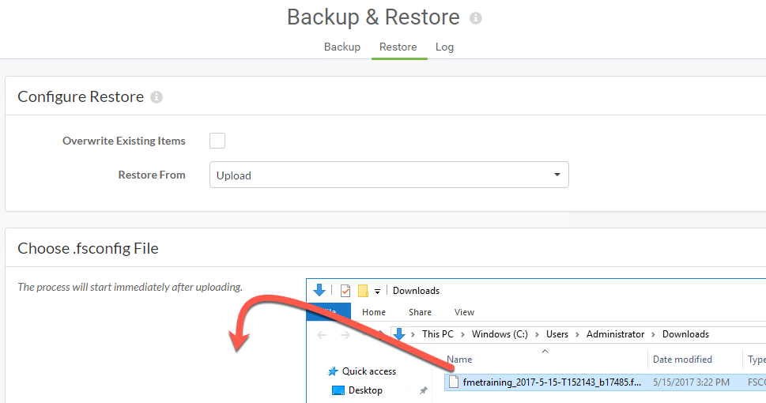

<!--Exercise Section-->

<table style="border-spacing: 0px;border-collapse: collapse;font-family:serif">
<tr>
<td width=25% style="vertical-align:middle;background-color:darkorange;border: 2px solid darkorange">
<i class="fa fa-cogs fa-lg fa-pull-left fa-fw" style="color:white;padding-right: 12px;vertical-align:text-top"></i>
Exercise 2
</td>
<td style="border: 2px solid darkorange;background-color:darkorange;color:white">
Changing the FME Server Database Provider
</td>
</tr>

<tr>
<td style="border: 1px solid darkorange; font-weight: bold">Data</td>
<td style="border: 1px solid darkorange">C:\FMEData2017\Resources\ServerAdmin\pg_hba.conf</td>
</tr>

<tr>
<td style="border: 1px solid darkorange; font-weight: bold">Overall Goal</td>
<td style="border: 1px solid darkorange">Change the database provider for FME Server</td>
</tr>

<tr>
<td style="border: 1px solid darkorange; font-weight: bold">Demonstrates</td>
<td style="border: 1px solid darkorange">Configuring a new PostgreSQL database</td>
</tr>

</table>

---

Your company has an Express Installation of FME Server already installed but your Database Administrator has just informed you that you that the company will be switching its database providers from the default FME Database to a PostgreSQL database to allow for more control over database security.

---

<!--Miss Vector says...--> 

<table style="border-spacing: 0px">
<tr>
<td style="vertical-align:middle;background-color:darkorange;border: 2px solid darkorange">
<i class="fa fa-quote-left fa-lg fa-pull-left fa-fw" style="color:white;padding-right: 12px;vertical-align:text-top"></i>
Miss Vector says...
</td>
</tr>

<tr>
<td style="border: 1px solid darkorange">

If you have completed the Configuring for HTTPS exercise, remember that the URL to connect to FME Server is now https://localhost:8443/fmeserver and NOT http://localhost/fmeserver!

</td>
</tr>
</table>

 **1) Backup FME Server**
 Backing up your current FME Server instance is an important step before performing any post-installation configurations. Once you have changed the database provider, you can restore FME Server configurations all at once instead of having to go through the process of manually changing any settings, republishing workspaces, etc.

Note: If you have *already created an FME Server backup* you can use this existing .fsconfig file and continue to Step 2.

Open the FME Server Web User Interface, either through the Web User Interface option on the Windows Start Menu or directly in your web browser, and log in using the username and password *admin*.

Find **Backup & Restore** in left sidebar, under the Admin heading in the FME Server Web User Interface, and click to open this page.

Select *Download* to save a backup file of FME Server - this can be thought of as a "snapshot". It will take a short time to run processes in the background to compile the FME Server backup, and once this is complete it will automatically save to your local downloads folder.

 **2) Initial Database Configuration**
 For the purposes of this exercise a separate PostgreSQL database has been installed to the Training Machines, running on port 5432. 

The next step is to configure this database for FME Server. From the Windows Start Menu, select **PostgreSQL &gt; SQL Shell** to open the psql command prompt. Login using the username and password *postgres* - this is the root user for the database.

First, create a new user to assign ownership of the FME Server database. From the psql prompt, run the *postgresql\_createUser.sql* script by entering the following command:
		
	\i 'C:/apps/FMEServer/Server/database/postgresql/postgresql_createUser.sql'
	
This SQL script creates a new user *fmeserver* with password *fmeserver*.

Next, create the FME Server database by running the *postgresql\_createDB.sql* script in the psql command prompt:

	\i 'C:/apps/FMEServer/Server/database/postgresql/postgresql_createDB.sql'

This SQL script creates the FME Server database and grants all privileges on the database to the user *fmeserver*.

 **3) Create the FME Server Database Schema**
 Exit the psql command prompt to end the current session. Open a new session (Windows Start Menu &gt; PostgreSQL &gt; SQL Shell) and now login to the database *fmeserver* as the FME Server database user - using the username and password *fmeserver*.

From the command prompt, run the *postgresql\_createSchema.sql* script by entering the following command:

	\i 'C:/apps/FMEServer/Server/database/postgresql/postgresql_createSchema.sql'
	
This SQL script creates all FME Server related tables, indexes, views, and triggers.

 **4) (PostgreSQL Only) Allow Connections**
 Navigate to *C:\Program Files\PostgreSQL\9.6\data\pg_hba.conf* and open this file in a text editor in administrator mode.

Change the following lines:

	host	all		all		127.0.0.1/32	md5
	host	all		all		::1/128		md5

to:

	host	all		all 	0.0.0.0/0	md5
	host	all		all		::/0	md5

Save and close the *pg_hba.conf* file.

In order for these changes to take effect, restart the PostgreSQL Database service. Open the Services application by using the *Windows Start Menu* and typing in *Services*. In the Services application, right-click **postgresql-x64-9.6** and select *Restart*.

 **5) Configure the Database Connection**
 Open the *fmeCommonConfig.txt* file, located in the *C:\apps\FMEServer\Server\\* directory, using a text editor in administrator mode.

Under the heading *FME SERVER SETTINGS START*, locate the section titled *Database Connection* and update the **DB_JDBC_URL** parameter for the PostgreSQL database:

	DB_JDBC_URL=jdbc:postgresql://localhost:5432/fmeserver

Save and close the *fmeCommonConfig.txt* file, and then **Restart FME Server**.

 **6) Post-Configuration Script**
 Finally, open *C:\apps\FMEServer\Utilities\\*, and invoke **runPostInstall.bat** by right-clicking the file and selecting *Run as administrator*.

This script will take a couple of minutes to create the default FME Server Publisher and Subscriber protocols, add FME Server cleanup tasks, and add the "Samples" repository.

 **7) Restore Your FME Server Configuration**
 Since a backup of FME Server was created in Step 1, we can now restore that same FME Server instance which contains all of the previous FME Server configuration settings.

Login to the FME Server Web User Interface and select **Backup & Restore &gt; Restore** from the left sidebar.

Upload your saved backup configuration file from the beginning of this exercise. Navigate to *C:\Users\Administrator\Downloads\\* and locate the FME Server backup file (Hint: It has *.fsconfig* extension!). Drag-and-drop this file onto the FME Server Restore page:

The FME Server Web User Interface will report if the restore is successful. If it is not, the log file is easily accessible from this page if further investigation is needed.

---

<!--Exercise Congratulations Section--> 

<table style="border-spacing: 0px">
<tr>
<td style="vertical-align:middle;background-color:darkorange;border: 2px solid darkorange">
<i class="fa fa-thumbs-o-up fa-lg fa-pull-left fa-fw" style="color:white;padding-right: 12px;vertical-align:text-top"></i>
CONGRATULATIONS!
</td>
</tr>

<tr>
<td style="border: 1px solid darkorange">

By completing this exercise you have learned how to:
 
<ul><li>Change the database provider for FME Server</li></ul>

</td>
</tr>
</table>
