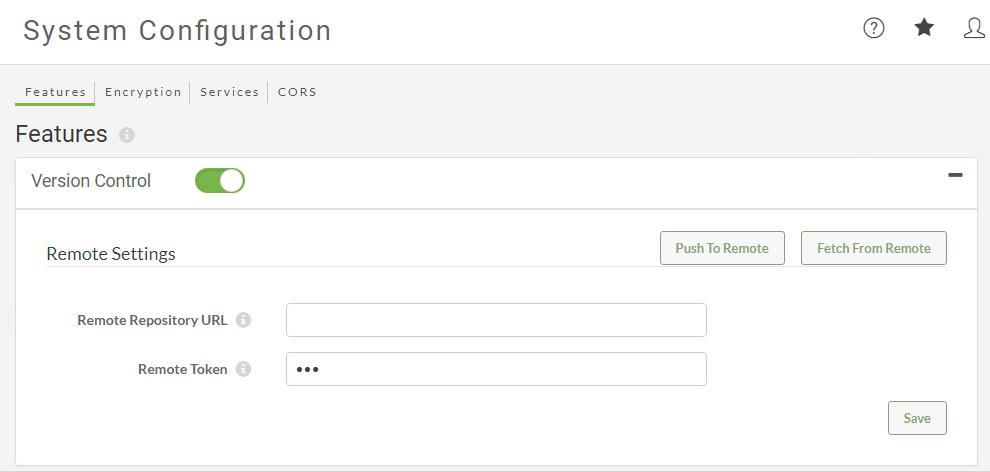

# Workspace Versioning in FME Server #

Workspace Versioning has been added to FME Server 2018.0.

Version control allows you to access previous versions of your repositories files. Optionally, when you configure version control with a remote Git repository, you can access previous versions of files from all members of your team who commit to the same repository.

Note that version control does not, by itself, enable you to update your local working copy of repositories files. Instead, version control allows you to download previous versions. Once downloaded, you can update your working copy by republishing to FME Server.

You can enable Version Control in FME Server via the System Configurations page.  

Once turned on users that publish workspaces to FME Server from FME Desktop will have the capability to *Commit* an FME Workspace and a new version of the workspace file will be saved on your local FME Server system.  

When you turn Version Control on it is not configure by default with Github.  Instead, all commits are stored in a repository on the local FME Server system.  You do not need to configure a remote Github repository to use Version Control.

Backup and Restore does not include version history.  If workspace version history is important to you please configure a remote Github repository.

### Using FME Workbench to Version ###

When publishing a workspace to FME Server with Version Control enabled the user will see a **Commit** button on the publishing wizard dialog.

### Using FME Server to Version ###

It is also possible to create a version of an existing workspace that has been published to FME Server. This is good for those times when a workspace exists and has been tested on the FME Server Environment and a user wants to create a version of that workspace.

### Using FME Server with a Remote Git Repository ###

For more information on using FME Server with a remote repository please review the FME Server Admin Documentation here: [Version Control](http://docs.safe.com/fme/2018.0/html/FME_Server_Documentation/Content/WebUI/Version-Control.htm)
