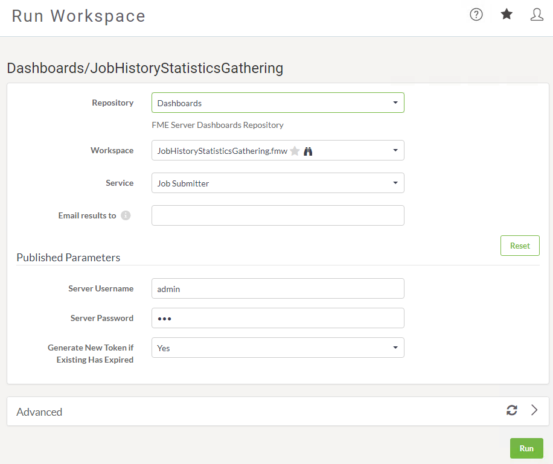
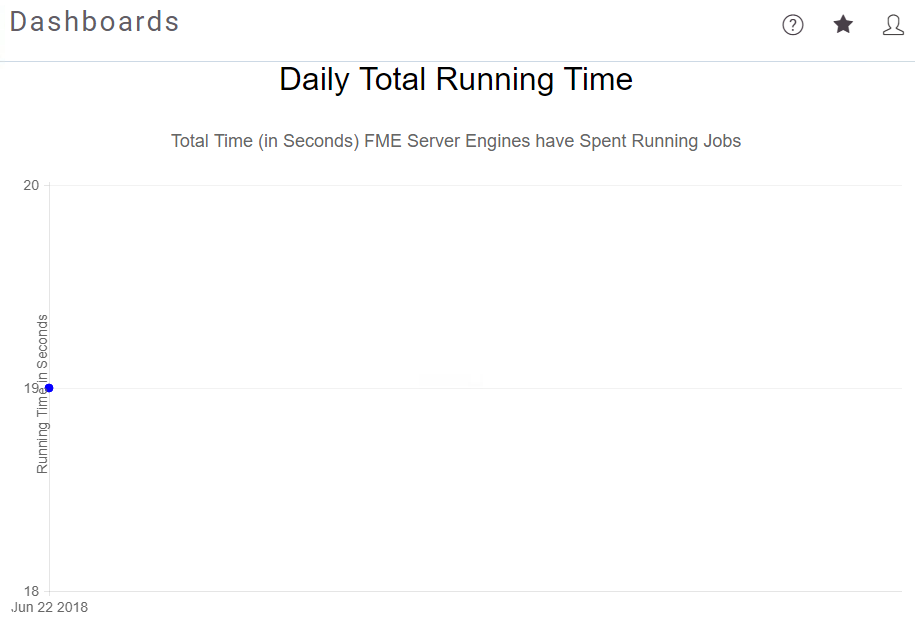

<!--Exercise Section-->

<table style="border-spacing: 0px;border-collapse: collapse;font-family:serif">
<tr>
<td width=25% style="vertical-align:middle;background-color:darkorange;border: 2px solid darkorange">
<i class="fa fa-cogs fa-lg fa-pull-left fa-fw" style="color:white;padding-right: 12px;vertical-align:text-top"></i>
Exercise 1
</td>
<td style="border: 2px solid darkorange;background-color:darkorange;color:white">
Configuring Dashboards
</td>
</tr>

<tr>
<td style="border: 1px solid darkorange; font-weight: bold">Data</td>
<td style="border: 1px solid darkorange">C:\FMEData2018\Resources\ServerAdmin\DropboxWebConnection.xml</td>
</tr>

<tr>
<td style="border: 1px solid darkorange; font-weight: bold">Overall Goal</td>
<td style="border: 1px solid darkorange">Monitor FME Server health with a dashboard</td>
</tr>

<tr>
<td style="border: 1px solid darkorange; font-weight: bold">Demonstrates</td>
<td style="border: 1px solid darkorange">How to add and troubleshoot FME Server Dashboards</td>
</tr>

<tr>
<td style="border: 1px solid darkorange; font-weight: bold">Start Workspace</td>
<td style="border: 1px solid darkorange">C:\FMEData2018\Workspaces\ServerAdmin\JobHistoryStatisticsGathering.fmw</td>
</tr>

<tr>
<td style="border: 1px solid darkorange; font-weight: bold">End Workspace</td>
<td style="border: 1px solid darkorange">None</td>
</tr>

</table>

---

As your role as FME Server Administrator, you are responsible for managing and maintaining the health of your company's FME Server. To easily monitor the health FME Server has default dashboards that can be enabled. 

---

 **1)Update workspaces**

---

<!--Warning Section--> 

<table style="border-spacing: 0px">
<tr>
<td style="vertical-align:middle;background-color:darkorange;border: 2px solid darkorange">
<i class="fa fa-exclamation-triangle fa-lg fa-pull-left fa-fw" style="color:white;padding-right: 12px;vertical-align:text-top"></i>
WARNING
</td>
</tr>

<tr>
<td style="border: 1px solid darkorange">

Only complete step 1 if you have finished the Configuring for HTTPS exercise. If you did not complete this exercise, move on to step 2.

</td>
</tr>
</table>

---

 It is a known issue that when you configure FME Server with a self-signed certificate that Dashboards will fail. To fix this we will need to republish the dashboard workspaces that have a parameter changed in the HTTPCallers. For more detailed information about this issue, see the [FME Server Dashboards Troubleshooting](https://knowledge.safe.com/articles/55053/fme-server-troubleshooting-fme-server-dashboards.html) article. 

 In FME Desktop, open the JobHistoryStatisticGathering.fmw workspace and publish it to FME Server. Ensure that the Repository is set to Dashboards. A warning message will appear, click Yes to overwrite the existing workspace. This is the controller workspace, now that it is updated we can run our other dashboards. 

 **2) Login to FME Server**
 Open the FME Server web interface, either through the Web Interface option on the Windows Start Menu or directly in your web browser, and log in using the username and password *admin*.

 **3) Run dashboard workspaces**
 We first need to enable dashboards before they will appear on the Dashboards page. FME Server comes with five default dashboards which are triggered by running a workspace. 

 On the side menu bar click on Run Workspace. On the Run Workspace page, select Dashboards as the repository. Then select JobHistoryStatisticsGathering.fmw as the workspace. In the parameters set the username and password to *admin* and click Run. 

 When the workspace has finished running, go back to the Run Workspace page, and run another dashboard. On the Run Workspace page, select the DailyTotalRunningTime.fmw and then click Run. 

 Run one more workspace so that we will have some data to look at. On the Run Workspace page, change the Repository to Samples and select austinApartments.fmw and click Run. 

 **4) View a dashboard**
 On the side menu bar click on Dashboards. This is the Dashboard page where any dashboards that have been run can be viewed. 

 Select the DailyTotalRunningTime to view the dashboard. Since we've only ran the austinApartments.fmw workspace once, our dashboard doesn't tell us much, but overtime dashboards become a valuable resource for the server administrator. 

---

<!--Advanced Exercise Section-->

<table style="border-spacing: 0px">
<tr>
<td style="vertical-align:middle;background-color:darkorange;border: 2px solid darkorange">
<i class="fa fa-cogs fa-lg fa-pull-left fa-fw" style="color:white;padding-right: 12px;vertical-align:text-top"></i>
Advanced Exercise
</td>
</tr>

<tr>
<td style="border: 1px solid darkorange">

As an advanced exercise, set up a schedule to run all of the dashboards once daily, so that when you start your day, you will have an up to date snapshot of how your server is performing. 

</td>
</tr>
</table>

---

<!--Exercise Congratulations Section--> 

<table style="border-spacing: 0px">
<tr>
<td style="vertical-align:middle;background-color:darkorange;border: 2px solid darkorange">
<i class="fa fa-thumbs-o-up fa-lg fa-pull-left fa-fw" style="color:white;padding-right: 12px;vertical-align:text-top"></i>
CONGRATULATIONS
</td>
</tr>

<tr>
<td style="border: 1px solid darkorange">

By completing this exercise you have learned how to:
 
<ul><li>Set up an existing dashboard</li>
<li>View a dashboard in FME Server</li>
<li>Update the dashboards for self-signed certificates</li></ul>

</td>
</tr>
</table>

