<!--Exercise Section-->

<table style="border-spacing: 0px;border-collapse: collapse;font-family:serif">
<tr>
<td width=25% style="vertical-align:middle;background-color:darkorange;border: 2px solid darkorange">
<i class="fa fa-cogs fa-lg fa-pull-left fa-fw" style="color:white;padding-right: 12px;vertical-align:text-top"></i>
Exercise 1
</td>
<td style="border: 2px solid darkorange;background-color:darkorange;color:white">
Adding a Web Connection
</td>
</tr>

<tr>
<td style="border: 1px solid darkorange; font-weight: bold">Data</td>
<td style="border: 1px solid darkorange">N/A</td>
</tr>

<tr>
<td style="border: 1px solid darkorange; font-weight: bold">Overall Goal</td>
<td style="border: 1px solid darkorange">Authenticate a web connection for FME Server</td>
</tr>

<tr>
<td style="border: 1px solid darkorange; font-weight: bold">Demonstrates</td>
<td style="border: 1px solid darkorange">How to add and authenticate a web connection for Dropbox</td>
</tr>

<tr>
<td style="border: 1px solid darkorange; font-weight: bold">Start Workspace</td>
<td style="border: 1px solid darkorange">None</td>
</tr>

<tr>
<td style="border: 1px solid darkorange; font-weight: bold">End Workspace</td>
<td style="border: 1px solid darkorange"></td>
</tr>

</table>

---

Your GIS department is working with several other organizations on one big project. It is a lot to organize, so whenever there are additional files to be shared, each organization drops the file into the shared Dropbox for easy access for all organization members. You want to use FME Server to access the Dropbox. To do this you must first create a Dropbox web connection.

There are many web services that have already been created and are accessible to you or you can create your own if a web service you want to utilize is not currently offered by FME. The Dropbox web service, for instance, has already been created. Therefore, instead of creating a new web service, we will use the already created one for this exercise.

**1) Create a workspace**

The first step in adding a web connection is to create a workspace to run. Open FME Workbench and create a new Blank Workspace.

The **HTTPCaller** transformer accesses a URL via HTTP or HTTPS, performing a GET, PUT, POST, DELETE, HEAD, PATCH or OPTIONS operation. Since we are accessing Dropbox through the web, we will utilize an **HTTPCaller** for this workspace.

Add a **Creator** transformer, and an **HTTPCaller** transformer to the workspace. Join the **Creator** to the **HTTPCaller**. Right-click **HTTPCaller** and select *Connect Loggers*.

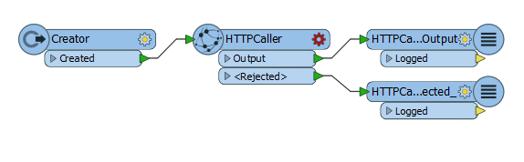

**2) HTTPCaller Parameters**

You'll notice the **HTTPCaller** has a red cog wheel meaning it has required parameters to be filled in.

Click the red cog on the **HTTPCaller** transformer to open the parameters.

Fill in the *HTTPCaller parameters* dialog box as follows:

- **Request URL:** https://dropbox.com

		The Request URL identifies what URL will be accessed by the transformer.
- **HTTP Method:** GET

		The HTTP Method identifies the HTTP method which will be used to access the server. In our case we will be GETting information from the server.
- Check the box **Use Authentication**.
- Click the drop down arrow for **Authentication Method** and select *Web Connection*.
- Click the drop down arrow for **Web Connection** and select *Add Web Connection...*

The *Edit Web Connection* dialog box opens.

Fill in the *Edit Web Connection* dialog box as follows:

- **Web Service:** Dropbox
- **Connection Name:** DropboxWebConnection

Click *Authenticate...*

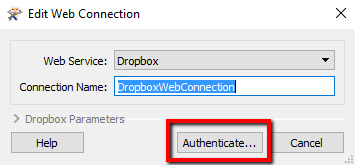

The *Web Service Authentication* dialog box opens.

Enter the following:

- Email: fmeserver2017@gmail.com
- Password: fme_server

		Note: The above email and password are used solely for this exercise. This is where you would add your own web service account login information.

... and then click **Sign in**

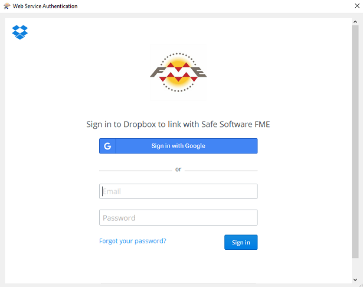

Click **Allow** to allow FME to access the Dropbox account.

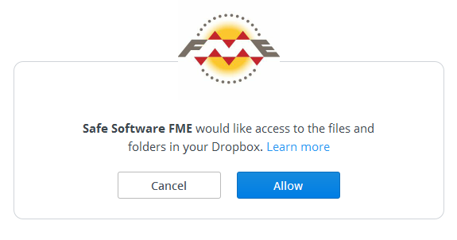

Your *HTTPCaller Parameters* dialog box should now look like the following:

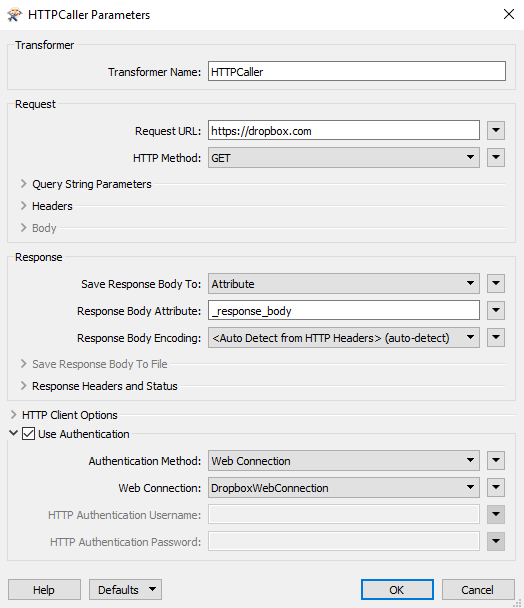

Click **OK** to close the dialog box.

**3) Run the Workspace**

It is good to run the workspace in FME Desktop before uploading it to FME Server. If the workspace does not run in FME Desktop than it will not run in FME Server.

Click the Run button to make sure you have properly configured the workspace.

Translation was successful and we are now ready to publish the workspace to FME Server.

**4) Publish to FME Server**

Publish the workspace to FME Server from the file menu in FME Workbench:

When prompted, publish the workspace to:

- **Repository Name:** testing
- **Workspace Name:** DropboxWebConnection

At *Upload Connections*, make sure there is a check mark beside your connection and click **Add Service...**.

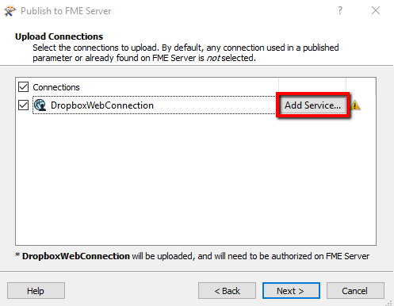

The *Add Dropbox Service to FME Server* dialog box opens.

Fill out the parameters as follows:

- **Client Id:** efsdwkfh71l7da1
- **Client Secret:** e4ycoikcun58uoz
- **Redirect Uri:** https://localhost

The Client Id and Client Secret are how you connect your client to the web service. They are generated when you create a new API app for a web service. REST API Documentation pages such as this one for [Dropbox](https://www.dropbox.com/developers) explain in more detail about web service app creation.

Note: The Client Id and Client Secret above are meant for this exercise only, and you should generate your own Id and Secret codes when applying your own web connections.

The Redirect Uri is where you will be redirected after authorization has been completed.

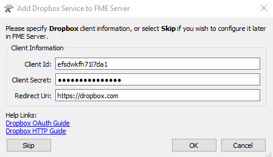

Click **OK**.

Click **Next**

Make sure **Job Submitter** has a check mark beside it. Click **Publish**.

**5) Login to FME Server**

Open the FME Server Web User Interface, either through the Web User Interface option on the Windows Start Menu or directly in your web browser (http://localhost/fmeserver), and log in using the username and password *admin*.

**6) Authorize Web Connection**

Go to **Connections &gt; Web Connections**

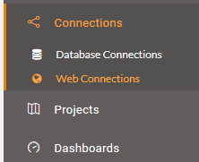

Click **DropboxWebConnection** in your list of Web Connections.

On the *Edit* page, click the **Authorize** button:

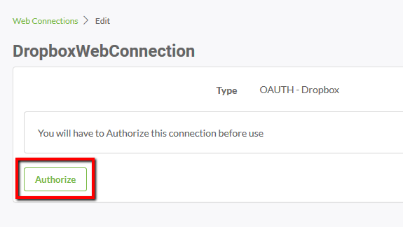

A window opens with the login screen for Dropbox. Sign in with: 

- **Email:** fmeserver2017@gmail.com 
- **Password:** fme_server

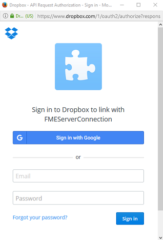

You will be prompted to allow access to your Dropbox web service. Click **Allow**.

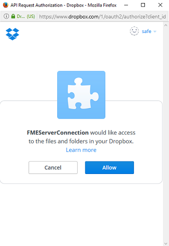

You have now successfully authorized a Dropbox web connection to FME Server for you to use in the future!

---

<!--Exercise Congratulations Section--> 

<table style="border-spacing: 0px">
<tr>
<td style="vertical-align:middle;background-color:darkorange;border: 2px solid darkorange">
<i class="fa fa-thumbs-o-up fa-lg fa-pull-left fa-fw" style="color:white;padding-right: 12px;vertical-align:text-top"></i>
CONGRATULATIONS!
</td>
</tr>

<tr>
<td style="border: 1px solid darkorange">

By completing this exercise you have learned how to:
 
<ul><li>Access a web service</li>
<li>Publish a web connection to FME Server</li>
<li>Authorize a web connection on FME Server</li>
</ul>

</td>
</tr>
</table>

---