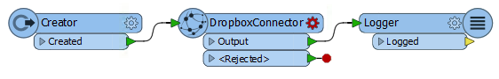

<!--Exercise Section-->

<table style="border-spacing: 0px;border-collapse: collapse;font-family:serif">
<tr>
<td width=25% style="vertical-align:middle;background-color:darkorange;border: 2px solid darkorange">
<i class="fa fa-cogs fa-lg fa-pull-left fa-fw" style="color:white;padding-right: 12px;vertical-align:text-top"></i>
Exercise 2
</td>
<td style="border: 2px solid darkorange;background-color:darkorange;color:white">
Adding a Web Connection
</td>
</tr>

<tr>
<td style="border: 1px solid darkorange; font-weight: bold">Data</td>
<td style="border: 1px solid darkorange">C:\FMEData2018\Resources\ServerAdmin\DropboxWebConnection.xml</td>
</tr>

<tr>
<td style="border: 1px solid darkorange; font-weight: bold">Overall Goal</td>
<td style="border: 1px solid darkorange">Authenticate a web connection for FME Server</td>
</tr>

<tr>
<td style="border: 1px solid darkorange; font-weight: bold">Demonstrates</td>
<td style="border: 1px solid darkorange">How to add and authenticate a web connection for Dropbox</td>
</tr>

<tr>
<td style="border: 1px solid darkorange; font-weight: bold">Start Workspace</td>
<td style="border: 1px solid darkorange">None</td>
</tr>

<tr>
<td style="border: 1px solid darkorange; font-weight: bold">End Workspace</td>
<td style="border: 1px solid darkorange">C:\FMEData2018\Workspaces\ServerAdmin\Customization-Ex2-WebConnections-Complete.fmw</td>
</tr>

</table>

---

Your GIS department is working with several other organizations on one big project. It is a lot to organize, so whenever there are additional files to be shared, each organization drops the file into the shared Dropbox for easy access for all organization members. Your task is to configure FME Server to access the Dropbox.

---

 **1) Create a Workspace**
 You must first create a Dropbox web connection. The first step in creating this web connection is to have a workspace to run! Open FME Workbench and create a new Blank Workspace.

The **DropboxConnector** transformer can access a Dropbox account and perform Delete, Download, List, and Upload actions.

Add a **Creator** transformer and a **DropboxConnector** transformer to the workspace. Join the Creator to the DropboxConnector. Add a **Logger** transformer connected to the Output port of the DropboxConnector.

 **2) Configure DropboxConnector and Create Web Connection**
 Select DropboxConnector and open the parameters dialog or view them via the Parameter Editor pane.

Change the *Dropbox Action* to **List**.

Then select the drop-down for *Dropbox Connection* and select **Add Web Connection...**. The Dropbox Connection dialog box opens.

Set the *Connection Name* to **DropboxWebConnection** and click **Authenticate...**.

This opens a new window with a direct, secure connection to Dropbox. Fill in the *Web Service Authentication* credentials as follows:

- **Email:** fmedropbox@gmail.com
- **Password:** *&lt;distributed_during_course&gt;*

...and then click **Sign in**.

Note: The above email and password should be used solely for this exercise. You can use *your own Dropbox account*, but for this course, we have provided an account to use.

Click **Allow** to allow FME to access the Dropbox account.

Your *DropboxConnector* parameters should now look like the following:

Click **OK** to apply the changes.

 **3) Run the Workspace**
 It is a best practice to first run the workspace in FME Desktop before uploading it to FME Server. If the workspace does not run in FME Desktop, then it will not run in FME Server!

Click **Run** to make sure the translation is successful. Now we are ready to publish the workspace to FME Server.

 **4) Publish to FME Server**
 Select *Publish to FME Server* under the File Menu. Use the Publish to FME Server Wizard to place the workspace in the **Training** repository. 

On the *Upload Connections* step, make the DropboxWebConnection is selected and click **Next**. We will authorize our web connection using the FME Server web interface.

Make sure that the workspace is registered with the **Job Submitter** FME Server Service. Click **Publish**.

 **5) Login to FME Server**
 Open the FME Server web interface, either through the Web Interface option on the Windows Start Menu or directly in your web browser, and log in using the username and password *admin*.

---

<!--Miss Vector says...-->

<table style="border-spacing: 0px">
<tr>
<td style="vertical-align:middle;background-color:darkorange;border: 2px solid darkorange">
<i class="fa fa-quote-left fa-lg fa-pull-left fa-fw" style="color:white;padding-right: 12px;vertical-align:text-top"></i>
Miss Vector says...
</td>
</tr>

<tr>
<td style="border: 1px solid darkorange">

If you have completed the Configure for HTTPS exercise, remember that the URL to connect to FME Server is now https://localhost:8443/fmeserver and NOT http://localhost/fmeserver!

</td>
</tr>
</table>

---

 **6) Configure the Dropbox Web Service**
 From the left sidebar go to **Connections &gt; Web Connections**.

Click **Manage Web Services** on the Web Connections page.

Select **Dropbox**. The *Editing Web Service "Dropbox"* page opens.

Fill in the *Client Information* parameters as follows:

- **Client Id:** lxx2amcu6xfs11r
- **Client Secret:** *&lt;distributed_during_course&gt;*
- **Redirect Uri:** https://localhost:8443/fmeoauth
<!--**SM: We need to figure out how to store the credentials for this and email**-->
The Client Id and Client Secret are how you connect your client to the web service. They are generated when you create a new API app for a web service. REST API Documentation pages such as this one for [Dropbox](https://www.dropbox.com/developers) explains in more detail about web service app creation.

Click **OK** to save these updates.

 **7) Authorize Web Connection**
 Go back to **Connections &gt; Web Connections**

Select *DropboxWebConnection* in your list of Web Connections.

On the *Edit* page, click the **Authorize** button:

A window opens with the login screen for Dropbox. Sign in with:
<!--**SM create new email account**-->
- **Email:** fmedropbox@gmail.com
- **Password:** *&lt;distributed_during_course&gt;*

The window closes, and a message pops up:

You have now successfully authorized a Dropbox web connection in FME Server for you to use in your workspaces!

---

<!--Exercise Congratulations Section-->

<table style="border-spacing: 0px">
<tr>
<td style="vertical-align:middle;background-color:darkorange;border: 2px solid darkorange">
<i class="fa fa-thumbs-o-up fa-lg fa-pull-left fa-fw" style="color:white;padding-right: 12px;vertical-align:text-top"></i>
CONGRATULATIONS!
</td>
</tr>

<tr>
<td style="border: 1px solid darkorange">

By completing this exercise you have learned how to:
 
<ul><li>Access a web service</li>
<li>Publish a web connection to FME Server</li>
<li>Configure a web service in FME Server</li>
<li>Authorize a web connection on FME Server</li>
</ul>

</td>
</tr>
</table>
