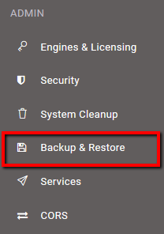
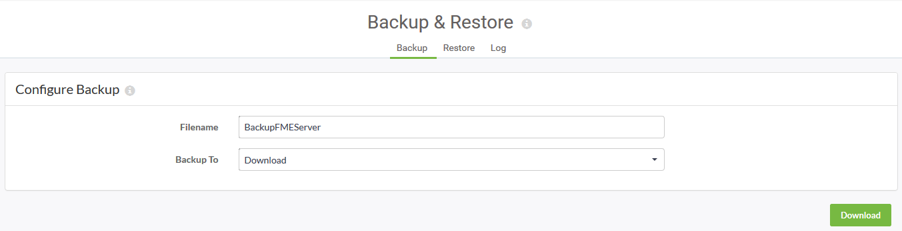

# Exercise: Backup and Migration #

Your organization has decided to upgrade FME Server to the just released new version. You want to make sure all the configurations, settings, and resources you have made to your current FME Server transfer over to the new FME Server. By backing up your current FME Server and then migrating the configurations and settings to the new version you will save lots of time not making all those changes manually.

**1) Connect to FME Server**
 
Open the FME Server Web User Interface, either through the Web User Interface option on the Windows Start Menu or directly in your web browser (http://localhost/fmeserver), and log in using the username and password *admin*.

**2) Backup FME Server**
 
When migrating FME Server, you need to back up your current FME Server configurations.

On the Web User Interface, click **Backup & Restore**.

On the *Backup* page, enter a file name (such as BackupFMEServer) and select the *Backup To* method to be **Download**.

Click the **Download** button to download and save the file to your computer.

**4) Configuration Files**

It is also a good idea to manually back up any FME Server configuration files you have altered to a location outside of your FME Server installation directory for reference later on. Certain configurations are not included in the primary backup procedure and you will need to configure the old files with the new files.

In this training course, we have altered *server.xml*, *web.xml*, *context.xml*, and created a tomcat.keystore file in *Configuring FME Server for HTTPS* exercise, and *pg_hba.conf*, *fmeCommonConfig.txt* in the *Switching to a PostgreSQL Database* exercise. 

Copy these files to where you saved your **BackupFMEServer** configuration.