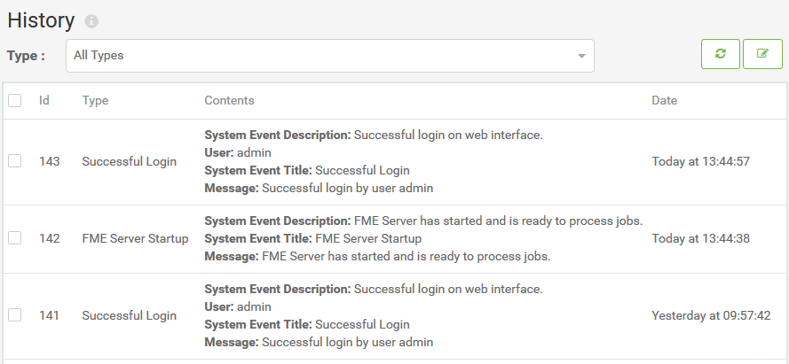
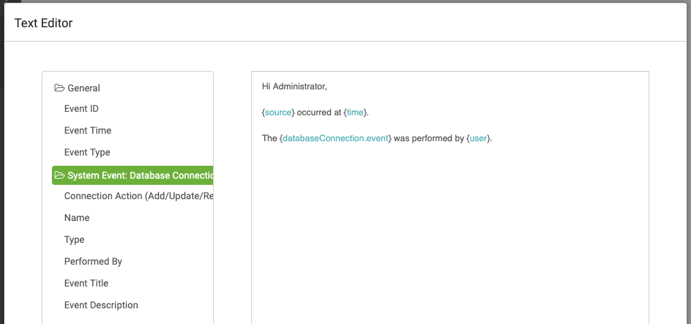
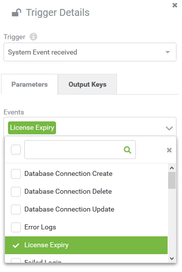

# System Events #

FME Server publishes messages about significant events on FME Server as a System Event.

The available System Events in FME Server 2019.1 are:

- Database Web Connection create/update/delete
- Error or Warning in the fmeserver.log file
- FME Server start up
- Login success/fail
- License expiry
- Project import/export
- Repository create/delete
- Repository item create/update/delete/download
- System backup/update
- User create/update/delete

## Configuring System Events ##

By default, all System Events are enabled. You can disabled (or enable) System Events under System Events &gt; Configurations on the main menu. Select an event type use the Actions dropdown menu to disable or enable it.

You can also click on an individual System Event, which will take you to a page where you can enable or disable and event and turn on email notifications. 

## Monitoring System Events ##

### History ###

The History page (System Events &gt; History) allows an administrator to view all enabled System Events that have occurred:

This page shows the type, contents and datetime for all occurrences of enabled System Events.

### Email Notifications ###

When you select a System Event from the configuration page, you have the option to enable Send Email Notifications. This will send an email every time the System Event occurs.

Enabling email notifications allows you to configure:

- Who will receive the notification
- The email subject
- The email format (Text/HTML)
- The email body

Composing the email body is easier in FME Server 2019+ with the new Text Editor. This allows administrators to add in details about the system event such as:

- The event ID
- The event time
- The event type

Depending on what the System Event is, you may see different event details available in the text editor.

### System Events and Automations ###

System Events are also available to administrators as a Trigger in Automations:

This allows flexibility for configuring a response to System Events by connecting any of the available Actions to a System Event Trigger.

