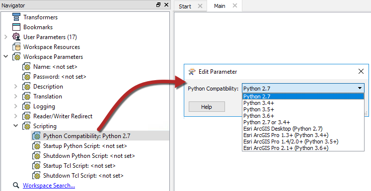

# Using Python with FME Server #

If you run workspaces from FME Server that reference Python, the FME Engines must know which Python interpreter to use. For workspaces built with FME Desktop 2016 or later, the interpreter is determined by the setting of the *Python Compatibility* workspace parameter. For workspaces built with previous versions of FME Desktop, the interpreter is determined by the *Preferred Python Interpreter* setting.

### Changing the Python Interpreter ###

For workspaces built with the FME Desktop 2016 or later, the Python interpreter you want the FME Engines to use must be specified in the workspace, according to the *Python Compatibility* workspace parameter.  

To use a custom Python interpreter, regardless of workspace version, additional configurations are required.  Review [Using Python with FME Server](http://docs.safe.com/fme/2018.0/html/FME_Server_Documentation/Content/AdminGuide/Using-Python-with-FME_Server.htm) for more information.

<!--Tip Section-->

<table style="border-spacing: 0px">
<tr>
<td style="vertical-align:middle;background-color:darkorange;border: 2px solid darkorange">
<i class="fa fa-info-circle fa-lg fa-pull-left fa-fw" style="color:white;padding-right: 12px;vertical-align:text-top"></i>
TIP: Python 2.7 Deprecation
</td>
</tr>

<tr>
<td style="border: 1px solid darkorange">

In FME Desktop and FME Server 2018.1 and greater Python 2.7 will be deprecated.
 Please review the article, <a href="https://knowledge.safe.com/articles/71635/python-27-deprecation.html">Python 2.7 Deprecation</a>, for more information..

</td>
</tr>
</table>
