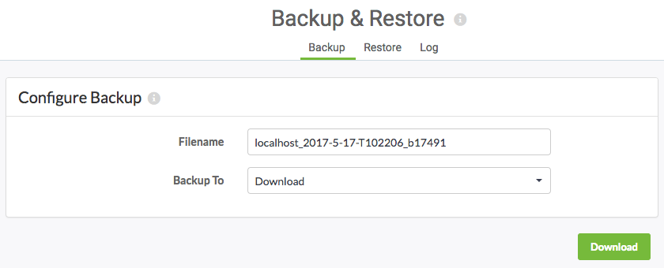
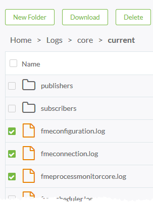

<!--Exercise Section-->

<table style="border-spacing: 0px;border-collapse: collapse;font-family:serif">
<tr>
<td width=25% style="vertical-align:middle;background-color:darkorange;border: 2px solid darkorange">
<i class="fa fa-cogs fa-lg fa-pull-left fa-fw" style="color:white;padding-right: 12px;vertical-align:text-top"></i>
Exercise 1
</td>
<td style="border: 2px solid darkorange;background-color:darkorange;color:white">
Backup and Migration
</td>
</tr>

<tr>
<td style="border: 1px solid darkorange; font-weight: bold">Data</td>
<td style="border: 1px solid darkorange">N/A</td>
</tr>

<tr>
<td style="border: 1px solid darkorange; font-weight: bold">Overall Goal</td>
<td style="border: 1px solid darkorange">Perform Backup and Restore operations for an FME Server installation</td>
</tr>

<tr>
<td style="border: 1px solid darkorange; font-weight: bold">Demonstrates</td>
<td style="border: 1px solid darkorange">Backing up and restoring automatic and manual FME Server configurations</td>
</tr>

</table>

---

Your organization has decided to upgrade FME Server to the latest version just released. You want to make sure all the configurations, settings, and resources you have made to your current FME Server will be transfered over to the new FME Server installation. By backing up your current FME Server and then migrating the configurations and settings to the new version you will save lots of time!

---

<!--Miss Vector says...--> 

<table style="border-spacing: 0px">
<tr>
<td style="vertical-align:middle;background-color:darkorange;border: 2px solid darkorange">
<i class="fa fa-quote-left fa-lg fa-pull-left fa-fw" style="color:white;padding-right: 12px;vertical-align:text-top"></i>
Miss Vector says...
</td>
</tr>

<tr>
<td style="border: 1px solid darkorange">

If you have completed the Configure for HTTPS exercise, remember that the URL to connect to FME Server is now https://localhost:8443/fmeserver and NOT http://localhost/fmeserver!

</td>
</tr>
</table>

 **1) Connect to FME Server**
 
Open the FME Server web interface, either through the Web Interface option on the Windows Start Menu or directly in your web browser, and log in using the username and password *admin*.

 **2) Backup FME Server**
 
When migrating FME Server, you need to back up your current FME Server configurations.

On the left sidebar, click **Backup & Restore**.

On the *Backup* page, make sure the default parameter is set:

- **Backup To:** Download

Click the **Download** button to start the FME Server backup process and save the file to your computer.

 **3) Backup Configuration Files**
 It is also a best practice to manually back up any FME Server configuration files you have altered to a safe location outside of the FME Server installation directory. Certain configurations are not included in the primary backup procedure and you may want to reference the changes made to these files.

In this training course, if you have completed all exercises up until this point, we have modified *server.xml*, *web.xml*, *context.xml*, *cacerts*, and created a *tomcat.keystore* file in the Configuring FME Server for HTTPS exercise. 

So if we were trying to migrate our current FME Server configurations, these are the files that we would want to have copies of for reference later on when restoring FME Server configurations.

Save these files with your backup configuration file to easily find during a restore.

 **4) Backup Log Files**
 Like configuration files, FME Server Log Files are not automatically backed up.

FME Server log files can be found on the *Resources* page of the web interface in the *Logs* folder.

For this exercise, we will backup only a couple of the log files. Go to **Resources &gt; Logs &gt; core &gt; current** and place a checkmark in the boxes beside *fmeconfiguration.log*, *fmeconnection.log*, and *fmeprocessmonitorcore.log*.

Click **Download** and save these log files in the same location where you saved your **BackupFMEServer** configuration and your configuration files.

Log files from FME Server can be backed up but *cannot be restored* to a new instance of FME Server. However, it is still a good idea to backup log files in case you need to reference them later on. If you do not backup your log files, they will disappear when you uninstall FME Server.

---

<!--Person X Says Section-->

<table style="border-spacing: 0px">
<tr>
<td style="vertical-align:middle;background-color:darkorange;border: 2px solid darkorange">
<i class="fa fa-quote-left fa-lg fa-pull-left fa-fw" style="color:white;padding-right: 12px;vertical-align:text-top"></i>
Dr. Workbench says...
</td>
</tr>

<tr>
<td style="border: 1px solid darkorange">

If you want to backup the entire logs folder, you can find it on your file system inside the resources folder of the FME Server System Share.

</td>
</tr>
</table>

---

 **5) Verify Backup, Install FME Server, Restore Configurations**
 At this point, during a regular migration workflow, this is when you verify the backup and install your new FME Server. For the purposes of this exercise, we will end the exercise here.

It is vitally important that you verify the FME Server backup first, by installing a new instance of FME Server, *before* you uninstall FME Server. Once you uninstall there isn't an easy way to backtrack unless you regularly perform backups of your entire file system.

When restoring the configuration files that are manually backed up, it is strongly suggested to go through each configuration file instead of simply copying the old configuration file into the new FME Server directory - file structures and parameters may have changed between releases!

---

<!--Exercise Congratulations Section--> 

<table style="border-spacing: 0px">
<tr>
<td style="vertical-align:middle;background-color:darkorange;border: 2px solid darkorange">
<i class="fa fa-thumbs-o-up fa-lg fa-pull-left fa-fw" style="color:white;padding-right: 12px;vertical-align:text-top"></i>
CONGRATULATIONS!
</td>
</tr>

<tr>
<td style="border: 1px solid darkorange">

By completing this exercise you have learned how to:
 
<ul><li>Backup your FME Server instance</li>
<li>Backup additional Configuration Files</li>
<li>Backup Log Files</li></ul>

</td>
</tr>
</table>
