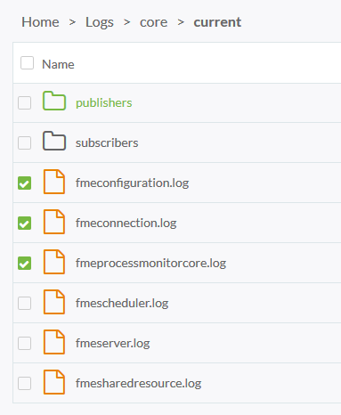
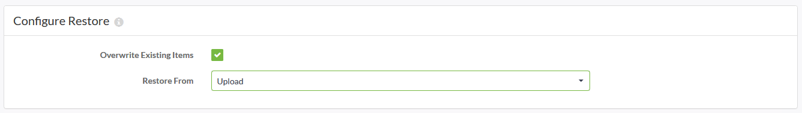
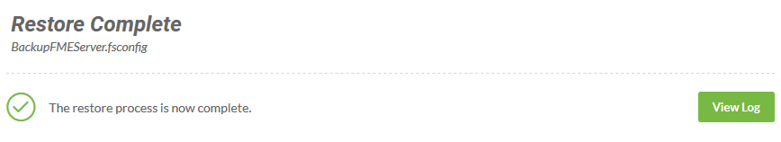

<!--Exercise Section-->

<table style="border-spacing: 0px;border-collapse: collapse;font-family:serif">
<tr>
<td width=25% style="vertical-align:middle;background-color:darkorange;border: 2px solid darkorange">
<i class="fa fa-cogs fa-lg fa-pull-left fa-fw" style="color:white;padding-right: 12px;vertical-align:text-top"></i>
Exercise 1
</td>
<td style="border: 2px solid darkorange;background-color:darkorange;color:white">
Backup and Migration
</td>
</tr>

<tr>
<td style="border: 1px solid darkorange; font-weight: bold">Data</td>
<td style="border: 1px solid darkorange">N/A</td>
</tr>

<tr>
<td style="border: 1px solid darkorange; font-weight: bold">Overall Goal</td>
<td style="border: 1px solid darkorange">Backup current FME Server configurations and restore them to a new FME Server installation</td>
</tr>

<tr>
<td style="border: 1px solid darkorange; font-weight: bold">Demonstrates</td>
<td style="border: 1px solid darkorange">Backing up and restoring automatic and manual FME Server configurations</td>
</tr>

</table>

---

Your organization has decided to upgrade FME Server to the just released new version. You want to make sure all the configurations, settings, and resources you have made to your current FME Server transfer over to the new FME Server. By backing up your current FME Server and then migrating the configurations and settings to the new version you will save lots of time.

---

<!--Miss Vector says...--> 

<table style="border-spacing: 0px">
<tr>
<td style="vertical-align:middle;background-color:darkorange;border: 2px solid darkorange">
<i class="fa fa-quote-left fa-lg fa-pull-left fa-fw" style="color:white;padding-right: 12px;vertical-align:text-top"></i>
Miss Vector says...
</td>
</tr>

<tr>
<td style="border: 1px solid darkorange">

If you completed the Configure for HTTPS exercise in chapter 3, remember: 
  the URL to connect to FME Server is https://localhost:8443 NOT http://localhost!

</td>
</tr>
</table>

---

**1) Connect to FME Server**
 
Open the FME Server Web User Interface, either through the Web User Interface option on the Windows Start Menu or directly in your web browser (http://localhost/), and log in using the username and password *admin*.

**2) Backup FME Server**
 
When migrating FME Server, you need to back up your current FME Server configurations.

On the left sidebar, click **Backup & Restore**.

On the *Backup* page, fill out the parameters as follows:

- **Filename:** BackupFMEServer
- **Backup To:** Download

Click the **Download** button to download and save the file to your computer.

**3) Configuration Files**

It is also a good idea to manually back up any FME Server configuration files you have altered to a location outside of your FME Server installation directory for reference later on. Certain configurations are not included in the primary backup procedure and you will need to configure the old files with the new files.

In this training course, we have altered *server.xml*, *web.xml*, *context.xml*, *cacerts*, and created a *tomcat.keystore* file in the *Configuring FME Server for HTTPS* exercise, and *pg_hba.conf*, and *fmeCommonConfig.txt* in the *Switching to a PostgreSQL Database* exercise. 

So if we were trying to migrate our current FME Server configurations, these are the files that we would want to have copies of for reference later on when restoring FME Server configurations.

Save these files with your backup configuration file to easily find during a restore.

**4) Log Files**

Like configuration files, Log Files are not automatically backed up with FME Server.

 FME Server log files can be found on the *Resources* page of the Web User Interface in the *Logs* folder.

For this exercise we will backup only a couple of the log files. Go to **Resources &gt; Logs &gt; core &gt; current** and place a checkmark in the boxes beside *fmeconfiguration.log*, *fmeconnection.log*, and *fmeprocessmonitorcore.log*.

Click **Download** and save these log files in the same location where you saved your **BackupFMEServer** configuration and your configuration files.

Log files from a previous FME Server instance can be backed up but cannot be restored to a new instance of FME Server. However, it is still a good idea to backup log files in case you need to reference them later on. If you do not backup your log files, they disappear when you install your new FME Server.

**5) Switch to your New FME Server**

This is when you would install your new FME Server. For the purposes of this exercise, we will instead go over how you would verify proper migration of your old FME Server configurations.

**6) Restoring the BackupFMEServer Configuration**

To upload the **BackupFMEServer** configuration file, login to the FME Server Web User Interface. (http://localhost/ with username and password *admin*)

Go to **Backup & Restore &gt; Restore**.

Set the *Configure Restore* parameters as follows:

- Check the box for **Overwrite Existing Items** 
- **Restore From:** Upload.

In general, when the **Overwrite Existing Items** box is checked, items on the current instance of FME Server are overwritten by items in the backed up configuration of the same name. If not checked, only items from the backed up configuration that do not exist on the current instance are imported; nothing is overwritten.

Drag and drop your **BackupFMEServer** configuration file on to the upload area.

Once the **BackupFMEServer** configurations are restored, you will see this message:

... indicating a successful restore of your old *BackupFMEServer.fsconfig* file.

**7) Restoring the Configuration Files**

After restoring your *BackupFMEServer.fsconfig* file, the next step is to go through the old configuration files that you manually saved, and the new FME Server instance's configuration files, altering them as needed.

For example, if you configured your FME Server for HTTPS, the *keystore*, *cacerts*, *server.xml*, *web.xml*, and *context.xml* files would need to be altered. The best practice is to go through each file and alter the sections that you have changed.

For instance, in the *web.xml* file we added:

		<security-constraint>
		<web-resource-collection>
		<web-resource-name>HTTPSOnly</web-resource-name>
		<url-pattern>/*</url-pattern>
		</web-resource-collection>
		<user-data-constraint>
		<transport-guarantee>CONFIDENTIAL</transport-guarantee>
		</user-data-constraint>
		</security-constraint>

just before the closing &lt;/web-app&gt; element.

You would then have both files open in a text editor and can edit the new *web.xml* file to be configured to allow for encrypted web connections.

Remember, it is strongly suggested to go through each configuration file instead of simply copying the old configuration file into the new FME Server directory; file structures may change between releases!

---

<!--Exercise Congratulations Section--> 

<table style="border-spacing: 0px">
<tr>
<td style="vertical-align:middle;background-color:darkorange;border: 2px solid darkorange">
<i class="fa fa-thumbs-o-up fa-lg fa-pull-left fa-fw" style="color:white;padding-right: 12px;vertical-align:text-top"></i>
CONGRATULATIONS!
</td>
</tr>

<tr>
<td style="border: 1px solid darkorange">

By completing this exercise you have learned how to:
 
<ul><li>Backup your FME Server instance</li>
<li>Backup additional configuration files</li>
<li>Backup log files</li>
<li>Restore .fsconfig files</li>
<li>Restore backup configuration files</li></ul>

</td>
</tr>
</table>

---