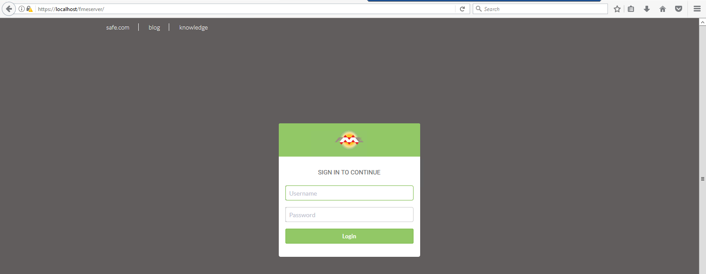

# Exercise: Backup and Migration #

Your organization has decided to upgrade FME Server to the just released new version. You want to make sure all the configurations, settings, and resources you have made to your current FME Server transfer over to the new FME Server. By backing up your current FME Server and then migrating the configurations and settings to the new version you will save lots of time not making all those changes manually.

**1) Connect to FME Server**
 
Open the FME Server Web User Interface, either through the Web User Interface option on the Windows Start Menu or directly in your web browser (http://localhost/fmeserver), and log in using the username and password *admin*.

**2) Backup FME Server**
 
When migrating FME Server, you need to back up your current FME Server configurations.

On the Web User Interface, click **Backup & Restore**.

On the *Backup* page, enter a file name (such as BackupFMEServer) and select the *Backup To* method to be **Download**.

Click the **Download** button to download and save the file to your computer.

**3) Configuration Files**

It is also a good idea to manually back up any FME Server configuration files you have altered to a location outside of your FME Server installation directory for reference later on. Certain configurations are not included in the primary backup procedure and you will need to configure the old files with the new files.

In this training course, we have altered *server.xml*, *web.xml*, *context.xml*, and created a tomcat.keystore file in *Configuring FME Server for HTTPS* exercise, and *pg_hba.conf*, and *fmeCommonConfig.txt* in the *Switching to a PostgreSQL Database* exercise. 

Copy these files to where you saved your **BackupFMEServer** configuration.

**4) Log Files**

Like configuration files, Log Files are not automatically migrated with FME Server.

If you want to migrate your log files to your new FME Server, you will need to manually backup and restore them. FME Server log files can be found on the *Resources* page of the Web User Interface in the *Logs* folder.

For this exercise we will migrate only a couple of the log files. Go to **Resources &gt; Logs &gt; core &gt; current** and place a checkmark in the boxes beside *fmeconfiguration.log*, *fmeconnection.log*, and *fmeprocessmonitorcore.log*.

Download and save these log files to where you saved your **BackupFMEServer** configuration and your configuration files.

**5) Switch to your new FME Server**

This is the step where you would install your new FME Server. 

**6) Restoring the BackupFMEServer Configuration**

First we will upload the **BackupFMEServer** configuration file.

On the Web User Interface, go to the **Backup & Restore &gt; Restore**.

Set the *Configure Restore* parameters as follows:

- Check the box for **Overwrite Existing Items** 
- **Restore From**: Upload.

In general, when the **Overwrite Existing Items** box is checked, items on the current instance of FME Server are overwritten by items in the backed up configuration of the same name. If not checked, only items from the backed up configuration that do not exist on the current instance are imported; nothing is overwritten.

Drag and drop your **BackupFMEServer** configuration file on to the upload area.

Once the **BackupFMEServer** configurations are restored, you will see this message:

**7) Restoring the Configuration Files**

For the *Configuring for HTTPS* exercise, we created a keystore file (tomcat.keystore). This file needs to be placed into *C:\Program Files\FMEServer\Utilities\tomcat\\* and *C:\Program Files\FMEServer\Utilities\jre\bin\\*.

You will also have to import the keystore again through the command prompt with:

	keytool -importkeystore -srckeystore tomcat.keystore -destkeystore "C:\Program Files\FMEServer\Utilities\jre\lib\security\cacerts"

Remember, password #1 is **changeit** and password #2 is the password you specified when creating the keystore.

We also altered the *server.xml*, *web.xml*, and *context.xml* files. Go to *C:\Program Files\FMEServer\Utilities\tomcat\conf\\* and open up *server.xml* in a text editor.

Remember, we changed the *"on"* value to *"off"* for the *&lt;Listener&gt;* element that included *className="org.apache.catalina.core.AprLifecycleListener"*

and we added

		<Connector protocol="org.apache.coyote.http11.Http11NioProtocol"
		port="443" minSpareThreads="5"
		enableLookups="true" disableUploadTimeout="true"
		acceptCount="100" maxThreads="200"
		scheme="https" secure="true" SSLEnabled="true"
		keystoreFile="<FMEServerDir>\Utilities\tomcat\tomcat.keystore"
		keystorePass="<your_password>"
		clientAuth="false" sslEnabledProtocols="TLSv1,TLSv1.1,TLSv1.2"
		sslImplementationName="org.apache.tomcat.util.net.jsse.JSSEImplementation"
		ciphers="TLS_ECDHE_RSA_WITH_AES_128_CBC_SHA256,TLS_ECDHE_RSA_WITH_AES_128_CBC_SHA,
		TLS_ECDHE_RSA_WITH_AES_256_CBC_SHA384,TLS_ECDHE_RSA_WITH_AES_256_CBC_SHA,
		TLS_RSA_WITH_AES_128_GCM_SHA256,TLS_RSA_WITH_AES_256_GCM_SHA384,
		TLS_RSA_WITH_AES_128_CBC_SHA256,TLS_RSA_WITH_AES_256_CBC_SHA256,
		TLS_RSA_WITH_AES_128_CBC_SHA,TLS_RSA_WITH_AES_256_CBC_SHA,
		SSL_RSA_WITH_3DES_EDE_CBC_SHA"
		URIEncoding="UTF8" />
 
		<Connector port="80" protocol="HTTP/1.1"
		redirectPort="443"/>

at the *&lt;Connector&gt;* element that contains *protocol="org.apache.coyote.http11.Http11NioProtocol"*. Change the new *server.xml* file to match the old *server.xml*.

Don't forget that we also changed the &lt;FMEServerDir&gt; and &lt;your_password&gt;.

Save and close the new *server.xml* file.

Open the *web.xml* file in a text editor and change it to match the old *web.xml*.

Remember, we added

		<security-constraint>
		<web-resource-collection>
		<web-resource-name>HTTPSOnly</web-resource-name>
		<url-pattern>/*</url-pattern>
		</web-resource-collection>
		<user-data-constraint>
		<transport-guarantee>CONFIDENTIAL</transport-guarantee>
		</user-data-constraint>
		</security-constraint>

just before the closing &lt;/web-app&gt; element.

Save and close the new *web.xml* file.

Open the *context.xml* file in a text editor and change it to match the old *context.xml*.

Remember, we added

		<Valve className="org.apache.catalina.authenticator.SSLAuthenticator"
		disableProxyCaching="false" />

just before the closing &lt;/context&gt; element.

Restart the FME Server Application service.

Open a web browser and go to *http://localhost/* to check that you have successfully transferred the HTTPS configuration of your old FME Server instance.

You should see the FME Server login screen in a secured format.

For the *Switching to a PostgreSQL Database* exercise, we altered the *pg_hba.conf*, and *fmeCommonConfig.txt* files.