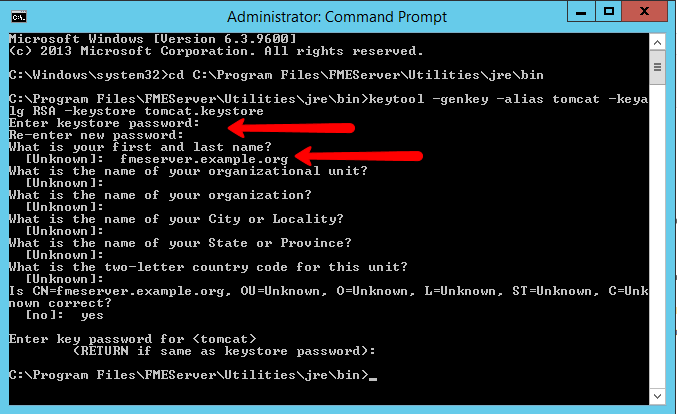

# Exercise - Configuring for HTTPS #

Your company is expanding rapidly and hiring many new employees. Now, instead of having everyone able to access to FME Server, you have set up logins so only trusted personnel have access. You also want to set up extra precautions to keep the login information secure.

HTTPS ensures that communication between the client and the server is encrypted, so that if it is intercepted, the third party cannot easily view or use the information. For FME Server, you can use HTTPS to ensure that sensitive login information is not exposed.

## To enable SSL support: ##

### 1. Enable SSL on the Web Application Server ###

For any HTTPS (SSL) page, a certificate is required. For development and testing purposes, self-signed certificates are supported. For production use, we recommend that you use SSL certificates from a verified SSL certificate authority (CA).

#### i. Create a Keystore File ####

First, you must generate a keystore that contains a certificate chain using the Java Keytool from the Java Developer Kit (JDK).

1. Open a command prompt and run as administrator.
2. Navigate to the Java bin directory (*C:\Program Files\FMEServer\Utilities\jre\bin\\*)
3. Set a password for the new keystore and specify the server domain name (for example, *fmeserver.example.org*) as your first and last name.
4. When prompted for the password for the alias <tomcat\>, press RETURN.
5. A new keystore is created in *C:\Program Files\FMEServer\Utilities\jre\bin\\*.
6. Copy the new keystore file to the tomcat directory in the FME Server installation: *C:\Program Files\FMEServer\Utilities\tomcat\\*.

#### ii. Working with the Certificate ####

**To use a self-signed certificate:**

If no CA-issued certificate is used, the new keystore must be imported into the FME Server keystore for trusted certificates with the following command:

	keytool -importkeystore -srckeystore tomcat.keystore -destkeystore C:\Program Files\FMEServer\Utilities\jre\lib\security\cacerts
You will be prompted to enter two passwords. One for the destination keystore. The password for the destination keystore is **changeit**. The password for the source keystore is the password that was specified in step 3 above.

**To use a CA-issued certificate:**

1. Generate a certificate signing request (CSR):

		keytool -certreq -keyalg RSA -alias tomcat -file certreq.csr -keystore tomcat.keystore
2. Submit the CSR (*certreq.scr*) to your CA to obtain a certificate, according to your CA’s instructions.
3. Import the certificate into the keystore. Depending on the web application server, you may also need to import a root certificate (consult your web application or CA’s instructions).

	Import root certificate:
	
		keytool -import -alias root -keystore tomcat.keystore -trustcacerts -file <certificate_filename>
	
	Import certificate:
	
		keytool -import -alias tomcat -keystore tomcat.keystore -file <certificate_filename>

#### iii. Configure Tomcat ####

In the next steps, we modify three configuration files of Apache Tomcat. All three files are located in the FME Server installation directory: *C:\Program Files\FMEServer\Utilities\tomcat\conf\\* .

**a) Configure *server.xml***

1. Open the *server.xml* file in a text editor.
2. Locate the *SSLEngine* setting in the *<Listener\>* element, including *className="org.apache.catalina.core.AprLifecycleListener"* and change the *“on”* value to *“off”*.
3. Locate the *<Connector\>* element that contains *protocol="org.apache.coyote.http11.Http11NioProtocol"* and replace it with the following:

		<Connector protocol="org.apache.coyote.http11.Http11NioProtocol"
		port="443" minSpareThreads="5"
		enableLookups="true" disableUploadTimeout="true"
		acceptCount="100" maxThreads="200"
		scheme="https" secure="true" SSLEnabled="true"
		keystoreFile="<FMEServerDir>\Utilities\tomcat\tomcat.keystore"
		keystorePass="<your_password>"
		clientAuth="false" sslEnabledProtocols="TLSv1,TLSv1.1,TLSv1.2"
		sslImplementationName="org.apache.tomcat.util.net.jsse.JSSEImplementation"
		ciphers="TLS_ECDHE_RSA_WITH_AES_128_CBC_SHA256,TLS_ECDHE_RSA_WITH_AES_128_CBC_SHA,
		TLS_ECDHE_RSA_WITH_AES_256_CBC_SHA384,TLS_ECDHE_RSA_WITH_AES_256_CBC_SHA,
		TLS_RSA_WITH_AES_128_GCM_SHA256,TLS_RSA_WITH_AES_256_GCM_SHA384,
		TLS_RSA_WITH_AES_128_CBC_SHA256,TLS_RSA_WITH_AES_256_CBC_SHA256,
		TLS_RSA_WITH_AES_128_CBC_SHA,TLS_RSA_WITH_AES_256_CBC_SHA,
		SSL_RSA_WITH_3DES_EDE_CBC_SHA"
		URIEncoding="UTF8" />
 
		<Connector port="80" protocol="HTTP/1.1"
		redirectPort="443"/>
		
4. Make sure to exchange *<FMEServerDir\>* and *<your_password\>* with the install directory of FME Server and the password of the keystore that was specified in step 3 under *i. Create a Keystore File*.

5. Save and close the *server.xml* file.
  

**b) Configure *web.xml***

1. Open the *web.xml* file in a text editor.
2. Add the following code block to the end of the file, just before the closing *</web-app\>* element:

		<security-constraint>
		<web-resource-collection>
		<web-resource-name>HTTPSOnly</web-resource-name>
		<url-pattern>/*</url-pattern>
		</web-resource-collection>
		<user-data-constraint>
		<transport-guarantee>CONFIDENTIAL</transport-guarantee>
		</user-data-constraint>
		</security-constraint>

3. Save and close the *web.xml* file.
  

**c) Configure *context.xml***

1. Open the *context.xml* file in a text editor.
2. Add the following to the end of the file, just before the closing *</context\>* element:

		<Valve className="org.apache.catalina.authenticator.SSLAuthenticator"
		disableProxyCaching="false" />

3. Save and close the *context.xml* file.

### 2. Verify the Configuration ###

Verify that HTTPS was configured correctly for FME Server.

1. Restart the FME Server Web Application service.
2. Open a browser and navigate to *https://localhost/*. 
3. You should see the FME Server login page in a secured format.

##

<!--Police Chief Webb-Mapp Section-->

<table style="border-spacing: 0px">
<tr>
<td style="vertical-align:middle;background-color:darkorange;border: 2px solid darkorange">
<i class="fa fa-quote-left fa-lg fa-pull-left fa-fw" style="color:white;padding-right: 12px;vertical-align:text-top"></i>
Police Chief Webb-Mapp says...
</td>
</tr>

<tr>
<td style="border: 1px solid darkorange">

If a self-signed certificate is used for testing, your browser may report the page as not secure.

</td>
</tr>
</table>

##

### 3. Modify Service URLs to Use HTTPS ###

To enable SSL for a service, open the FME Server Web User Interface, and select *Services*. On the *Services* page, click the desired service.

The *Editing Service* page opens.

In the *URL Pattern* field, change *HTTP* to *HTTPS*.

### 4. Enable SSL on the WebSocket Server (Optional) ###

The FME Server WebSocket Server supports insecure (ws://) or secure connections (wss://). This configuration is only required if the WebSocket capabilities of FME Server will be used.

1. Open the *fmeWebSocketConfig.txt* file in your FME Server installation directory (*C:\Program Files\FMEServer\Server*).
2. Set *WEBSOCKET\_SSL_ENABLED=true*.
3. Uncomment the *WEBSOCKET\_KEYSTORE_FILE\_PATH* directive and set it to reference the keystore file you generated under *1. Enable SSL on the Web Application Server*. 

		WEBSOCKET_KEYSTORE_FILE_PATH=C:\Program Files\FMEServer\Utilities\tomcat\<your_keystore_filename>
4. Uncomment the *WEBSOCKET\_KEYSTORE\_FILE_PASSWORD* directive and set it to reference the keystore file password you generated under *1. Enable SSL on the Web Application Server*.
5. Specify the same settings for the *WEBSOCKET\_ENABLE\_SSL,* *WEBSOCKET\_KEYSTORE\_FILE\_PATH*, and *WEBSOCKET\_KEYSTORE\_FILE_PASSWORD* directives in the following files:
	- *C:\Program Files\FMEServer\Server\config\subscribers\websocket.properties*
	- *C:\Program Files\FMEServer\Server\config\publishers\websocket.properties*
6. In the following files, update the protocol in the value property of the *PROPERTY* directive from “ws:” to “wss:”
	- *C:\ProgramData\Safe Software\FME Server\localization\publishers\websocket\publisherProperties.xml*
	- *C:\ProgramData\Safe Software\FME Server\localization\subscribers\websocket\subscriberProperties.xml*

##

<!--Sister Intuitive Section-->

<table style="border-spacing: 0px">
<tr>
<td style="vertical-align:middle;background-color:darkorange;border: 2px solid darkorange">
<i class="fa fa-quote-left fa-lg fa-pull-left fa-fw" style="color:white;padding-right: 12px;vertical-align:text-top"></i>
Sister Intuitive says...
</td>
</tr>

<tr>
<td style="border: 1px solid darkorange">

C:\ProgramData  is the default value of the  %ALLUSERSPROFILE%  environment variable. If this location is modified, the location specified above is modified accordingly.

</td>
</tr>
</table>

---

<!--Exercise Congratulations Section--> 

<table style="border-spacing: 0px">
<tr>
<td style="vertical-align:middle;background-color:darkorange;border: 2px solid darkorange">
<i class="fa fa-thumbs-o-up fa-lg fa-pull-left fa-fw" style="color:white;padding-right: 12px;vertical-align:text-top"></i>
CONGRATULATIONS!
</td>
</tr>

<tr>
<td style="border: 1px solid darkorange">

You have now successfully configured your FME Server for HTTPS!

</td>
</tr>
</table>
