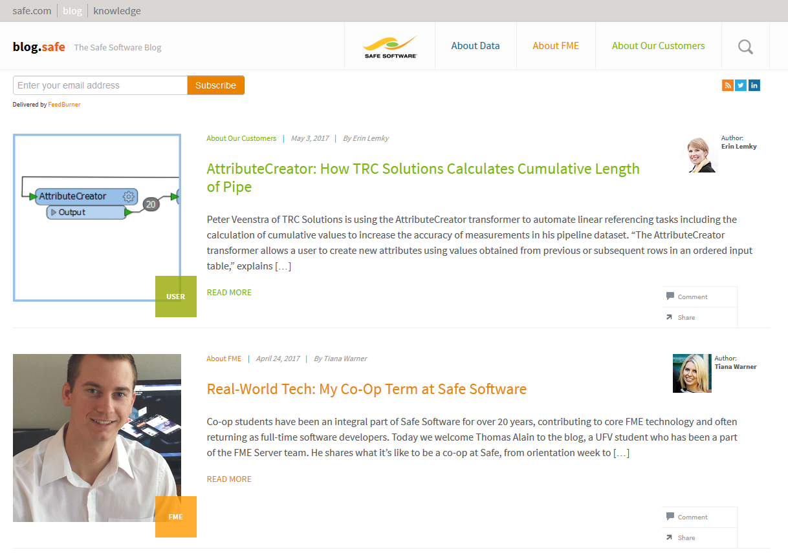

# Product Information and Resources #

## Safe Software Web Site ##
The **[Safe Software web site](https://www.safe.com/ "Safe Software web site")** is the official information source for all things FME. It includes information on FME products, Safe Software services, FME solutions, FME support and Safe Software itself.

## Safe Support Team ##
Behind FME are passionate, fun, and knowledgeable experts, ready to help you succeed, with **[a support team](https://support.safe.com/knowledgeSubmitCase "FME Support Team page")** philosophy built on the principle of knowledge transfer.

## Your Local Partner ##
Safe Software has partners and resellers around the world to provide expertise and services in your region and your language.

You can find a list of official partners on the [Safe Software web site](http://www.safe.com/partners/ "FME Partners Page").

## Safe Software Blog ##
The **[Safe Software blog](http://blog.safe.com/ "Safe Software Blog")** provides technical information about FME, articles about customers' use cases, and general thoughts on spatial data interoperability.

## FME Manuals and Documentation ##
For FME Server documentation, look on our web site under the **[FME Server Knowledge Center section](https://support.safe.com/KnowledgeDocumentation#GroupB)**

For FME Desktop use the Help function in FME Workbench to access help and other documentation. Alternatively, look on our web site under the **[FME Desktop Knowledge Center section](https://support.safe.com/KnowledgeDocumentation#GroupA)**.

