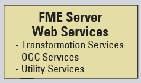

# FME Server Architecture #

FME Server consists of a number of different components.

The architecture of FME Server is a client-server model that looks something like this:

## FME Server Components ##

Don’t worry about trying to understand the whole structure, just be aware of the main components of FME Server:

- FME Engines: To carry out data transformation processing
- Server Core: To queue jobs, handle scheduling, and manage load balancing
- Web Services: To handle networking capabilities

### FME Engines ###

FME Engines process job requests by running FME Workspaces. This is the same core engine, carrying out the same processing, that is used by FME Desktop. An FME Server installation can possess multiple engines.

Each FME Engine processes a single request (job) at a time.

FME Server processing can be scaled by connecting additional FME Engines to the Server Core. These FME Engines can run on the same computer and the Core or on separate computers within a distributed FME Server environment.  

### Server Core ###

The FME Server Core manages scheduling, repository contents (workspaces, custom formats, custom transformers, data), and handles notification requests.

 

The FME Server Core contains a Software Load Balancer (SLB) that distributes jobs to FME Engines.

### Web Services ###

Much of the FME Server networking capabilities are handled using what we call "Web Services." These Web Services are software whose interface provides communication between server and clients.

FME Server has a number of services:

- Data Download
- Data Streaming
- Job Submitter
- KML Network Link
- Notification
- Data Upload
- Token Security
- REST

Some services (for example, Data Download) are “transformation” services that carry out data transformation, whereas others (for example, Data Upload) are non-transforming "utility" services.

### Server Queue ###

The FME Server Queue manages Job Queues and dispatches jobs to specific FME Engines as needed. Job Priority can also be set in the Job Queue. 

