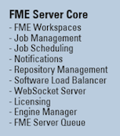

## FME Server Components ##

FME Server is made up of several different components that work together to make it function. As an FME Server Author, you don't need to have a deep understanding of its full architecture. (If you are interested, the <a href="https://www.safe.com/training/live-online/">FME Server Administration Training course</a> takes a deep dive into architecting FME Server).

There are a few components of FME Server that are important for you as an author to be aware of, so we're going to cover those now:

- FME Engines: Carry out data transformation processing
- Server Core: Queue jobs, handle scheduling, and manage load balancing
- Web Services: Handle requests made to FME Server

## FME Engines ##

FME Engines process job requests by running FME Workspaces. This is the same core engine, carrying out the same processing, that is used by FME Desktop. An FME Server installation can possess multiple engines.

Each FME Engine processes a single request (job) at a time.

FME Server processing can be scaled by connecting additional FME Engines to the Server Core. These FME Engines can run on the same computer as the Core or on separate computers within a distributed FME Server environment.  

## Server Core ##

The FME Server Core manages scheduling, repository contents (workspaces, custom formats, custom transformers, data), and handles automations.

The FME Server Core contains a Software Load Balancer (SLB) that distributes jobs to FME Engines.

## Web Services ##

Much of the FME Server networking capabilities are handled using what we call "Web Services." These Web Services are software whose interface provides communication between server and clients.

FME Server has a number of services:

- Data Download
- Data Streaming
- Job Submitter
- KML Network Link
- Notification
- Data Upload
- Token Security
- REST

Some services (for example, Data Download) are “transformation” services that carry out data transformation, whereas others (for example, Data Upload) are non-transforming "utility" services.
