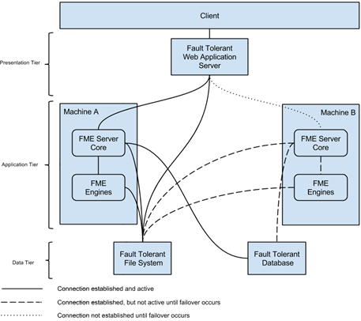

# Deploying FME Server

FME Server can be deployed in a number of configurations.

---

<!--Person X Says Section-->

<table style="border-spacing: 0px">
<tr>
<td style="vertical-align:middle;background-color:darkorange;border: 2px solid darkorange">
<i class="fa fa-quote-left fa-lg fa-pull-left fa-fw" style="color:white;padding-right: 12px;vertical-align:text-top"></i>
Ms Analyst says...
</td>
</tr>

<tr>
<td style="border: 1px solid darkorange">

This section is intended to provide a very basic overview of the deployment options for FME Server. If you are interested in learning more about how to deploy FME Server,  take a look at the FME Server Administrator Training Course as this is covered in much greater detail there.

</td>
</tr>
</table>

---

## Platforms  ##

FME Server can be deployed in a variety of ways:

- **Local Infrastructure (Physical Hardware)** - This is the traditional configuration where you purchase FME Server and install it on your own hardware systems.

- **Infrastructure as a Service (Virtual Hardware)** - This is where you purchase FME Server and install it on virtual hardware that is provided as a service by a company such as Amazon.

- **Platform as a Service (FME Cloud)** - This is where FME Server is delivered pre-installed on an Amazon virtual computer, with the whole platform provided by Safe Software on a pay-as-you-go basis.

---

<!--New Section-->

<table style="border-spacing: 0px">
<tr>
<td style="vertical-align:middle;background-color:darkorange;border: 2px solid darkorange">
<i class="fa fa-bolt fa-lg fa-pull-left fa-fw" style="color:white;padding-right: 12px;vertical-align:text-top"></i>
NEW
</td>
</tr>

<tr>
<td style="border: 1px solid darkorange">

FME Server on Docker is now out of tech preview for FME Server 2018. This provides a way to quickly deploy FME Server on any platform that supports Docker.

</td>
</tr>
</table>

---

## Distributed Systems ##

A distributed system is one in which the different components of a system are located on separate, networked, computers.

For example, in a distributed environment FME Engines can run on a computer or several computers that are separate from the FME Server host. The FME Server Database and Web Application Server can also be installed separately.

