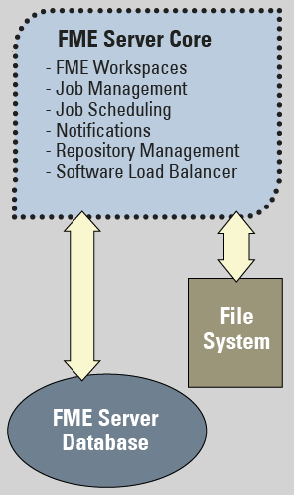

# FME Workspaces and FME Server

FME Server has a model-driven architecture because its processes are expressed as models. In FME, these models are better known as **workspaces**.

Workspaces are created – we call it “authored” – using FME Desktop. In particular, the **FME Workbench** application is used. FME Workbench is a client of FME Server, and so they form a client-server pair. However, both share the same core engine and process data in the same way.

---

<!--Person X Says Section-->

<table style="border-spacing: 0px">
  <tr>
    <td style="vertical-align:middle;background-color:darkorange;border: 2px solid darkorange">
      <i class="fa fa-quote-left fa-lg fa-pull-left fa-fw" style="color:white;padding-right: 12px;vertical-align:text-top"></i>
      FME Lizard says...
    </td>
  </tr>
  <tr>
    <td style="border: 1px solid darkorange">
      
         Let's make sure you get the terminology right. FME Desktop is the desktop program that includes the FME Workbench, FME Data Inspector, and FME Quick Translator applications. Workspace authoring occurs in the application called FME “Workbench,” but the process defined in the canvas window of FME Workbench is called a “Workspace.” The terms are so similar that they are easily confused.
      
    </td>
  </tr>
</table>

---

Because FME Workbench is a client of FME Server, it may be used to transfer authored workspaces to and from FME Server. We call this transfer **publishing**.

FME Workbench has the ability to:

- Author a translation workspace
- Publish a workspace (transfer it to FME Server)
- Republish a workspace (upload a previously published workspace)
- Download a workspace (retrieve it from FME Server)

The ability to transfer a workspace back to FME Workbench means workspaces can be downloaded for editing and maintenance, then published back to FME Server.

---

## Repositories ##

Workspaces are stored on FME Server in devices called **repositories**. Each FME Server may have multiple repositories, but any workspace can only belong to one of them, without creating a duplicated workspace.

A repository consists of two parts:

1) The .fmw files from any workspaces that have been published to FME Server are stored in the file-based part of the repository.

2) Metadata related to the workspace is held separately in the FME Server Database. This metadata includes information about the contents of the workspace; for example, source and destination datasets, workspace feature types, and published parameters.

Repositories are managed by the FME Core. They can be accessed (by authors and administrators) through the FME Server Web Interface.

---

<table style="border-spacing: 0px">
<tr>
<td style="vertical-align:middle;background-color:darkorange;border: 2px solid darkorange">
<i class="fa fa-quote-left fa-lg fa-pull-left fa-fw" style="color:white;padding-right: 12px;vertical-align:text-top"></i>
FME Lizard says…
</td>
</tr>

<tr>
<td style="border: 1px solid darkorange">

Security in FME Server is very important, and never more so than for repositories.
  You can think of each repository as being like a folder on a file-system, with the same ability to grant access rights to individuals and groups. So, for each repository you create, be sure to check the security permissions. If you don’t, then end-users may not get access to the repository!

</td>
</tr>
</table>
