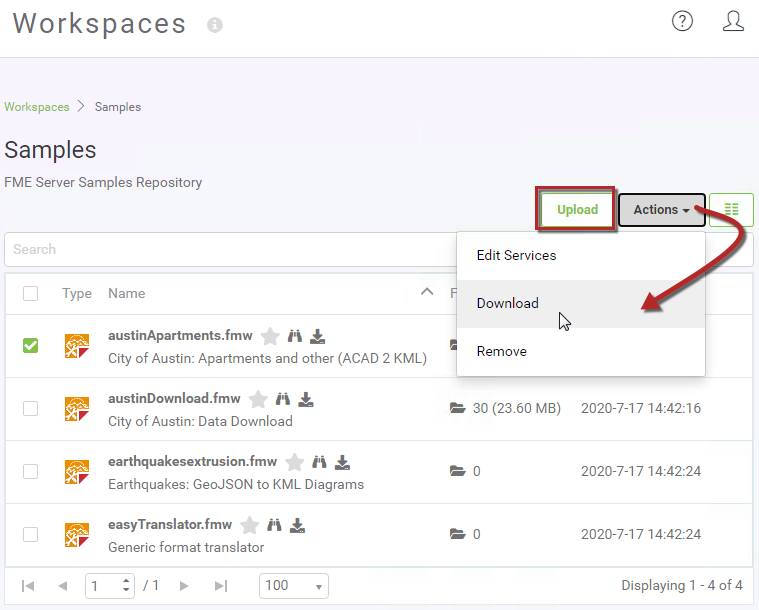

## Transferring Workspaces ##

The functionality for publishing or downloading workspaces is accessed in FME Workbench either through the menubar:

...or the toolbar:

Workspaces can also be uploaded and downloaded directly through FME Server on the Workspaces page:

---

### Connecting to FME Server ###

The Publish to FME Server tool in FME Workbench opens a simple wizard interface, the first dialog of which defines a connection to FME Server.

Adding a web connection opens a dialog with fields in which to define connection credentials. These connection details are saved so that they can be reused in the future simply by picking from the drop-down list:

---

### Repository Selection ###

The next dialog defines the repository in which to store the workspace:

Either an existing repository can be used, or a new one created. The workspace name can also be edited, even making it different to what it is saved as locally.

---

### Connections Upload ###

This dialog only appears when there are databases and/or web connections that need to be uploaded with the workspace.

This workspace contains both a database connection and a web connection that need to be uploaded to function on FME Server. Note that the Dropbox *OAuth* web connection needs the service to be added to FME Server, and will also require additional authentication before FME Server will be able to use it.

The database connection requires no further authentication, but care must be taken not to accidentally overwrite an existing database connection with the same name that might already be defined on FME Server.

---

### Workspace Registration ###

The final dialog defines which service(s) the workspace is to be registered against. A workspace may be registered for use with any number of these services.

The Job Submitter service allows FME Server to run a workspace as-is. This is the closest to running a workspace in FME Workbench. All inputs and outputs are defined in the workspace, so data is simply written out and not streamed or delivered in any other manner.

Job submission is ideal for testing workspaces, writing to databases, and for running large-scale and batch translations that make use of the server process queue.

---

## Republishing a Workspace ##

Once a workspace has been published, the republish tool becomes active. Further updates to the workspace (within the same FME Workbench session) can then be uploaded with a single click.

The same parameters are used as before. If changes need to be made to these parameters, then the full publishing wizard should be used.

---

## Downloading a Workspace ##

Workbench can also download a workspace held in an FME Server repository. This is usually done in order to make edits to the workspace. Note that downloaded workspaces are copies of the original, which remains in the FME Server repository.

The downloading wizard begins with the same connection dialog as the publishing wizard. From there, the second – and final – dialog page is a repository and workspace selection tool:

The user is then prompted for a location to save the workspace. The default (on Windows) is &lt;User&gt;\Documents\FME\Workspaces. The workspace – and any resources – are then downloaded and saved to that location.

Once downloaded, the workspace is automatically opened within FME Workbench for editing.

---

<table style="border-spacing: 0px">
<tr>
<td style="vertical-align:middle;background-color:darkorange;border: 2px solid darkorange">
<i class="fa fa-quote-left fa-lg fa-pull-left fa-fw" style="color:white;padding-right: 12px;vertical-align:text-top"></i>
FME Lizard says…
</td>
</tr>

<tr>
<td style="border: 1px solid darkorange">

Besides workspaces, it’s also possible to publish/download FME custom transformers and custom formats to and from an FME Server repository.

</td>
</tr>
</table>
