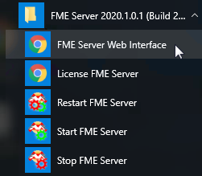
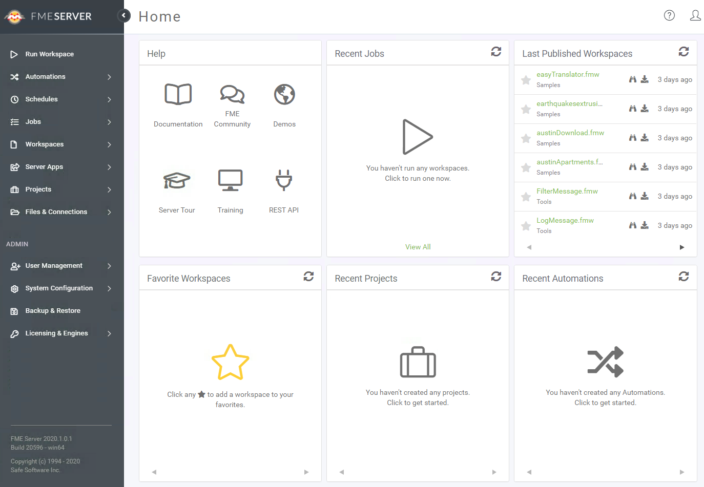
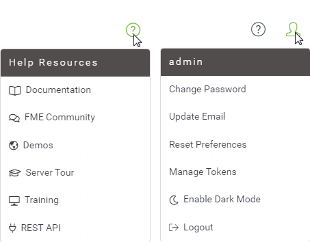

# Introduction to the FME Server Web Interface

Although translations are authored in FME Workbench, the core tools of FME Server are accessed through a web-based interface.

The web interface is accessed through the URL **http://&lt;servername&gt;:&lt;port&gt;/fmeserver** (the port may be optional) or through the start menu:

The web interface for FME Server looks like this:

The main part of the interface displays page information. The landing page, for example, has shortcuts to lists of recent jobs, projects, automations, and favorite workspaces. What is displayed on an individual user's home page is customizable.

The left-hand side of the interface is the side menu. Selecting a menu item changes the content of the page to match the menu item chosen. Additionally, the menu will change depending on the privileges the user has.

## Web Interface Menu ##

In general, FME Server functionality is accessed through the web interface menu. There are two main sections in this menu:

The first section relates to the **use** of FME Server. It has - among others - options for running a workspace, accessing repositories, setting up schedules, and reviewing job history.

The next section of the menu relates to the **administration** of FME Server. It has - among others - options for managing engines, setting up security, and creating system backups.

---

<!--New Section-->

<table style="border-spacing: 0px">
<tr>
<td style="vertical-align:middle;background-color:darkorange;border: 2px solid darkorange">
<i class="fa fa-bolt fa-lg fa-pull-left fa-fw" style="color:white;padding-right: 12px;vertical-align:text-top"></i>
NEW
</td>
</tr>

<tr>
<td style="border: 1px solid darkorange">

In 2020.0, we have condensed the side menu. Resources can now be found under Files & Connections, and Repositories can now be found under Workspaces > Manage Workspaces.

</td>
</tr>
</table>

---

There are a couple of additional menus located in the top-right part of the interface:

The first provides access to help tools for authors, users, administrators, and developers. And the second provides options for managing your user account options.

---

<!--New Section-->

<table style="border-spacing: 0px">
<tr>
<td style="vertical-align:middle;background-color:darkorange;border: 2px solid darkorange">
<i class="fa fa-bolt fa-lg fa-pull-left fa-fw" style="color:white;padding-right: 12px;vertical-align:text-top"></i>
NEW
</td>
</tr>

<tr>
<td style="border: 1px solid darkorange">

We want you to get the most out of FME Server, so we've added more ways for you to learn FME Server. Under the Help menu, check out FME Server in action with a <a href="https://playground.fmeserver.com/demos/"> demo</a>, or take a quick <a href="https://www.safe.com/fme/fme-server/tour/2020.0/?utm_source=fme-server&utm_medium=referral&utm_campaign=product-tour">tour</a>, or even ask a specific question in our <a href="https://knowledge.safe.com/index.html">community</a>

</td>
</tr>
</table>

---
