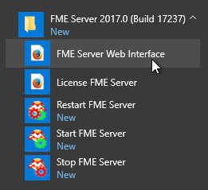
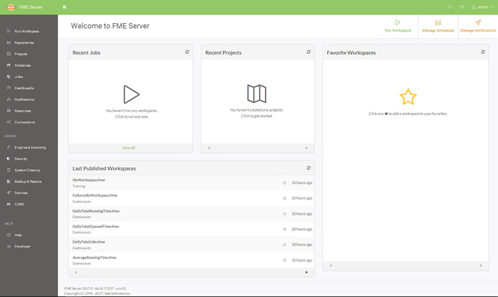
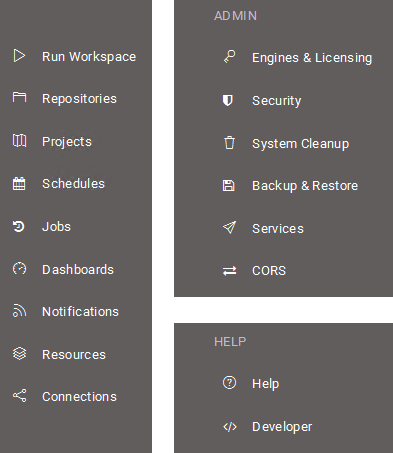

# Introduction to the FME Server Web Interface

Although translations are authored in FME Workbench, the core tools of FME Server are accessed through a web-based interface.

The web interface is accessed through the URL **&lt;servername&gt;:&lt;port&gt;/fmeserver** (the port may be optional) or through the start menu:

The web interface for FME Server looks like this:

The main part of the interface displays a page of content that contains information, reports, parameters, and other components. The landing page, for example, has shortcuts to lists of recent jobs, recent projects, and favorite workspace.

The left hand side of the interface contains a set of menus. Selecting a menu item changes the content of the page to match the menu item chosen.

[comment]: <> (ADD DARK MODE INTO NEW SECTION HERE)
---

<!--New Section-->

<table style="border-spacing: 0px">
<tr>
<td style="vertical-align:middle;background-color:darkorange;border: 2px solid darkorange">
<i class="fa fa-bolt fa-lg fa-pull-left fa-fw" style="color:white;padding-right: 12px;vertical-align:text-top"></i>
NEW
</td>
</tr>

<tr>
<td style="border: 1px solid darkorange">

The web interface has had a style refresh for 2018. One big changes is the introduction of a Dark Mode for the interface. You can find the option to turn it off or on in the top right under your User Options menu.

</td>
</tr>
</table>

---

## Web Interface Menu ##

In general, FME Server functionality is accessed through the web interface menu. There are three sections of the menu:

The first section of the menu relates to the **use** of FME Server. It has - among others - options for running a workspace, accessing repositories, setting up schedules, and reviewing job history.

The next section of the menu relates to the **administration** of FME Server. It has - among others - options for managing engines, setting up security, and creating system backups.

There is an additional menu located in the top-right part of the interface. It provides access to help tools for authors, users, administrators, and developers. It also a shortcut to view any workspaces you have favorited and allows access to your user account options.

[comment]: <> (NEW SECTION HERE MAYBE TO MENTION THE PASSWORD RESET OPTION? NOT SURE WHERE IT BEST FITS. PERHAPS ADD A NEW SECTION WITH INFORMATION ABOUT USER ACCOUNT SETTINGS AND REPLACE THE ABOVE PARAGRAPH (AND GET RID OF THE GETTING STARTED BIT BELOW TOO).)

## Getting Started ##

Getting started with the FME Server web interface requires familiarity with three key pages:

- Engines and Licensing
- Run Workspace
- Jobs  
