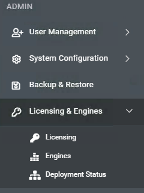
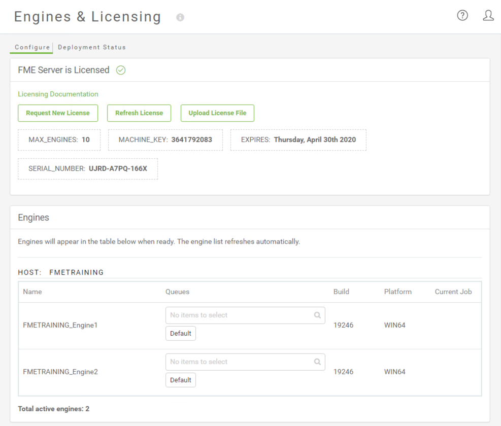
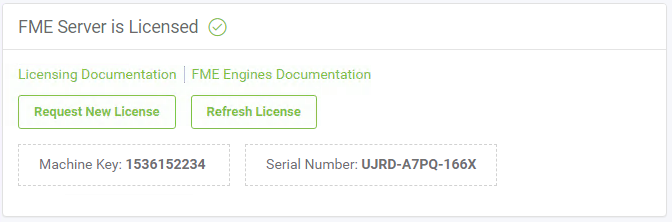
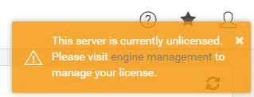
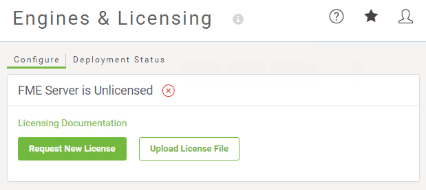
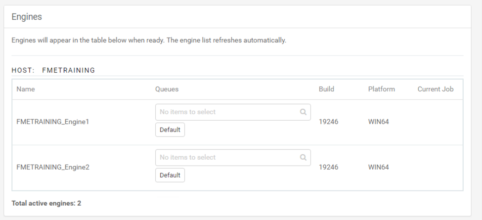
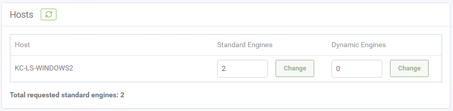
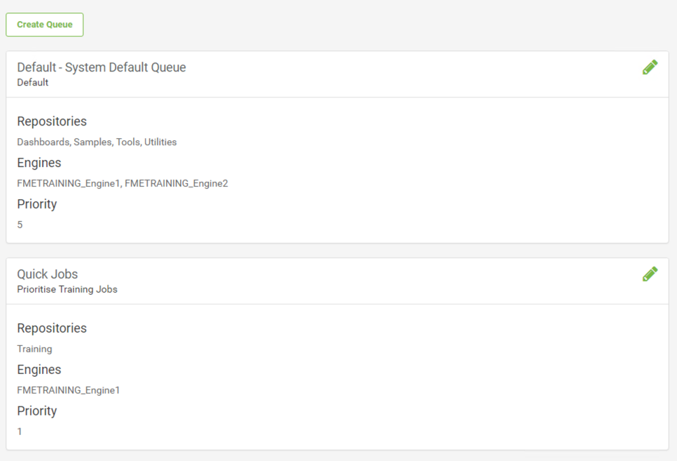

## Engines and Licensing ##

The first step in getting started on FME Server is to choose the menu option for Engines and Licensing:

This opens the Engines & Licensing page, where you can ensure FME Server is running correctly, is licensed, and has active engines:

### Licensing ###

The upper section of this page relates to licensing. The labels show how many engines are licensed when the license expires, and what the machine key and serial number are. The buttons allow you to refresh the license, request a new one, or upload a license file.

---

<!--Warning Section--> 

<table style="border-spacing: 0px">
<tr>
<td style="vertical-align:middle;background-color:darkorange;border: 2px solid darkorange">
<i class="fa fa-exclamation-triangle fa-lg fa-pull-left fa-fw" style="color:white;padding-right: 12px;vertical-align:text-top"></i>
WARNING
</td>
</tr>

<tr>
<td style="border: 1px solid darkorange">

The FME Server Administrator should have already set up the licensing before you log in for the first time. If you see either of the following two images when you log into FME Server, contact your FME Server Administator. More details about how to licensing your FME Server can be found in the <a href="https://safe-software.gitbooks.io/fme-server-administration-training-2018/content/ServerAdmin1Installation/1.07.Licensing.html">Server Administator course manual</a>: 

 

</td>
</tr>
</table>

---

### Engines ###

The middle section shows the engines that are currently started, the queues that are assigned to them, their FME build number, operating system, and what job they are processing (if any). The platform (operating system) is important because a distributed FME Server setup can have engines running on a variety of operating systems at the same time.

### Hosts ###

Below the Engines section is the Host Section which shows what engines are running on each host, and allows you to easily change the number of engines running, up to the maximum number of engines provided by the current license:

---

If your FME Server is licensed and has engines running that are assigned to the correct host, then you are ready to run a published workspace.

---

### Job Queues ###

This section of the Engines & Licensing page, Job Queues, provides a way to reserve FME Engines for processing jobs from specific repositories. For example – you could have an FME Engine dedicated for processing quick tasks so that slower jobs will not cause a backlog. Similarly, you might reserve an FME Engine that sits on a more powerful machine for processing LiDAR data translations. Job Queues are also where you can set the Job Priority. 

