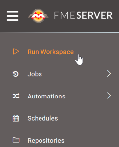
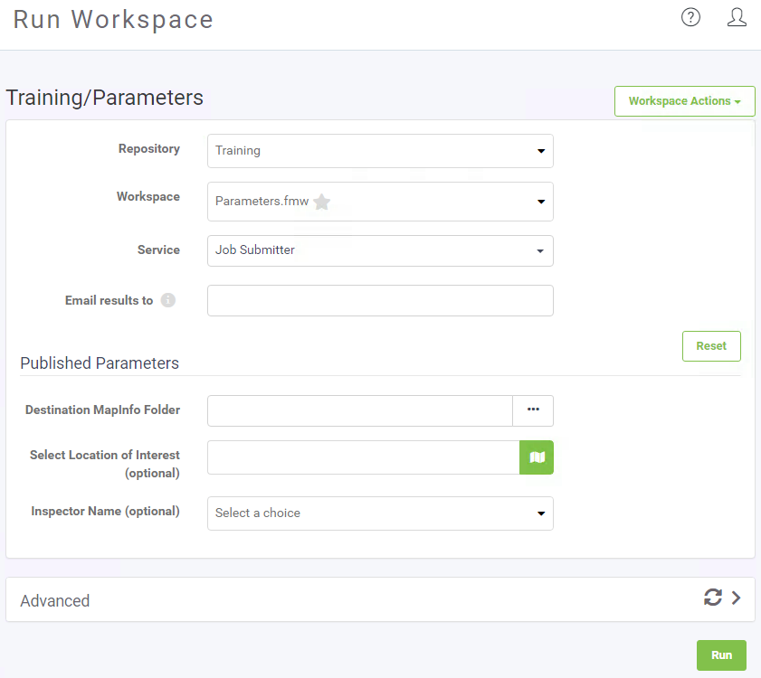
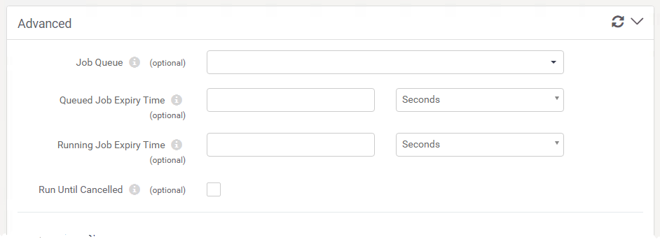

## Running a Workspace ##

Let's start our tour of the FME Server web interface at the Run Workspace page. You can access it from the corresponding menu option:

This opens the Run Workspace page, where you can choose a repository, workspace, and service to run a translation:

When you select a workspace that contains Published Parameters, those parameters will be available to be set before running the translation.

### Advanced Parameters ###

The Run Workspace page in FME Server also has an additional section under Advanced. Clicking the arrow to the right of Advanced will expand the advanced parameters menu. These are FME Server specific parameters that fine-tune how the workspace will be run.

**Job Queue**

Job Queues provide a way to send FME Server jobs to specific Engines or to control the priority of job requests. This parameter allows you to select a predefined Queue to which this job should be sent when it is run. Job Queues can be created by an FME Server Administrator from the Engines & Licensing page.

**Queued Job Expiry Time**

This sets the maximum amount of time a job can wait in the Queued state before being run. If a job waits longer than this amount of time in the Queue, it will not be run. This option is useful for time-sensitive jobs that you do not want to run after the specified time is exceeded.

**Running Job Expiry Time**

This sets the maximum amount of time a job can stay in the running state. When this time is exceeded, the job will be cancelled automatically.

**Run Until Cancelled**

If checked, the job will run continuously even after a server shutdown or crash, until it is explicitly cancelled.

### Running a Job ###

When you are satisfied with the parameters, click the green Run button at the bottom of the page to run the translation. A progress dialog will appear indicating whether your workspace is Running or Queued. From this dialog you can cancel the job or view the details:

Once the workspace (job) has finished running, a completion message will appear letting you know whether the translation was successful or if it failed. Depending on the Service you ran the workspace with, you will also see other details such as a download link:

---

<!--Person X Says Section-->

<table style="border-spacing: 0px">
<tr>
<td style="vertical-align:middle;background-color:darkorange;border: 2px solid darkorange">
<i class="fa fa-quote-left fa-lg fa-pull-left fa-fw" style="color:white;padding-right: 12px;vertical-align:text-top"></i>
FME Lizard says...
</td>
</tr>

<tr>
<td style="border: 1px solid darkorange">

Note that there are other ways to find and run a workspace. Recently published workspaces and workspaces "starred" as a favourite can be easily found on the interface landing page.
  Additionally, it's possible to browse for a workspace to run by going through the Repositories page (click Repositories on the menu), which is more like a file browser than a simple selection tool.

</td>
</tr>
</table>
