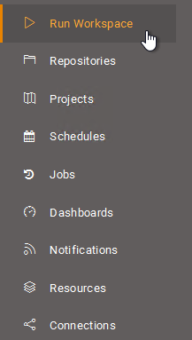
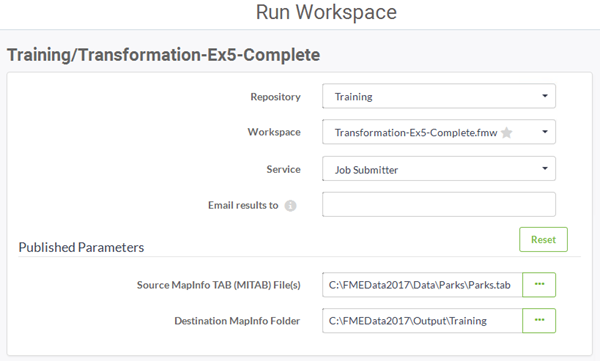
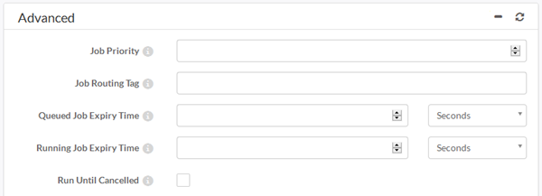
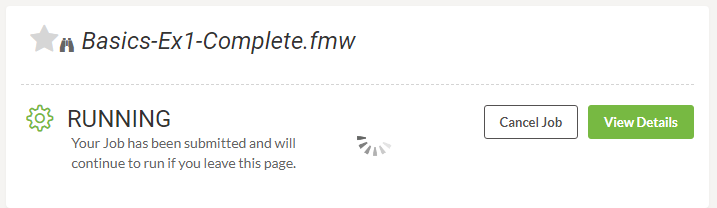
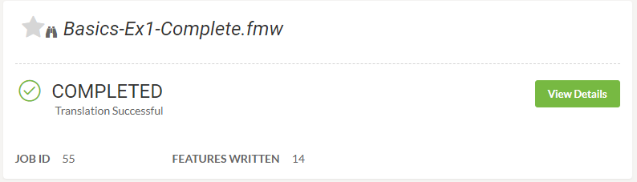

## Run Workspace ##

The second step in getting started on FME Server is to choose the menu option for Run Workspace:

This opens the Run Workspace page, where you can pick a respository, workspace, and service, to run a translation:

Having selected a workspace all of the published parameters are shown so that they can be set before the translation is run.

An advanced set of parameters gives control over the job that runs the workspace:

Clicking the run button starts the translation:

Having run, the interface will report the success of the translation:

---

<!--Person X Says Section-->

<table style="border-spacing: 0px">
<tr>
<td style="vertical-align:middle;background-color:darkorange;border: 2px solid darkorange">
<i class="fa fa-quote-left fa-lg fa-pull-left fa-fw" style="color:white;padding-right: 12px;vertical-align:text-top"></i>
Police Chief Webb-Mapp says...
</td>
</tr>

<tr>
<td style="border: 1px solid darkorange">

Note that there are other ways to find and run a workspace. Recently published workspaces and workspaces "starred" as a favourite can be easily found on the interface landing page.
  Additionally it's possible to browse for a workspace to run by going through the Repositories page (click Repositories on the menu), which is more like a file browser than a simple selection tool.

</td>
</tr>
</table>
