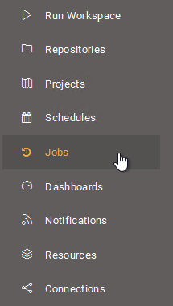
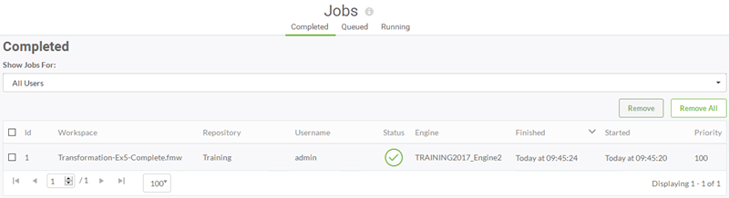
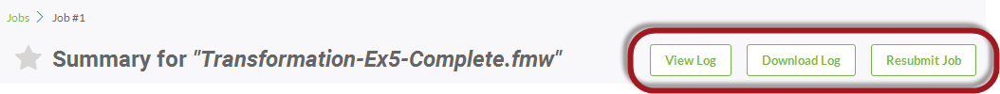
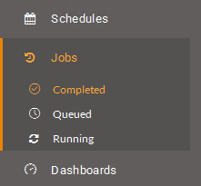

## Jobs ##

The final step in getting started on FME Server is to choose the menu option for Jobs:

This opens the Jobs page, where you can see the status of jobs, whether Completed, Queued, or Running:

This allows you to check that the translation you just ran finished successfully. You can also find jobs that are currently running, jobs that are queued to run, or any jobs that have completed running. 

---

<!--Tip Section--> 

<table style="border-spacing: 0px">
<tr>
<td style="vertical-align:middle;background-color:darkorange;border: 2px solid darkorange">
<i class="fa fa-info-circle fa-lg fa-pull-left fa-fw" style="color:white;padding-right: 12px;vertical-align:text-top"></i>
TIP
</td>
</tr>

<tr>
<td style="border: 1px solid darkorange">

The drop-down menu that allows you to select which user's jobs to display is especially useful when the job history runs to thousands of workspaces from multiple users.

</td>
</tr>
</table>

---

### Completed Jobs ###

Clicking on a completed job opens up a page showing information about that job; such as Job ID, Job Priority, Time Started, and Features Written. 

A series of buttons allow you to view the FME log for the translation, download the log, or even resubmit the job with a single click:

 

This allows you to confirm that the workspace functioned correctly, with the same level of detail as you could find within FME Desktop.

---

### Queued and Running Jobs ###

Queued and Running jobs can be listed so that you can see what jobs the Server is currently handling. Again you can filter the jobs by a particular username.

One particularly useful feature is that these pages can be used to cancel jobs if they are no longer required.

---

<!--Tip Section--> 

<table style="border-spacing: 0px">
<tr>
<td style="vertical-align:middle;background-color:darkorange;border: 2px solid darkorange">
<i class="fa fa-info-circle fa-lg fa-pull-left fa-fw" style="color:white;padding-right: 12px;vertical-align:text-top"></i>
TIP
</td>
</tr>

<tr>
<td style="border: 1px solid darkorange">

The jobs entry - like others on the main menu - expands when clicked to show submenus that can be shortcuts to specific parts of the Jobs page:
  

</td>
</tr>
</table>
 