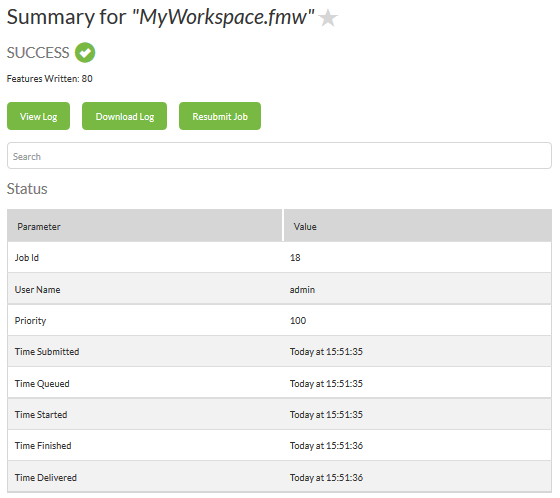

## Jobs ##

The jobs and job history panel is used to find jobs that are currently running, that are queued to run, or that have completed running. It is accessed through the Jobs tool on the menu:

---

<!--Updated Section--> 

<table style="border-spacing: 0px">
<tr>
<td style="vertical-align:middle;background-color:darkorange;border: 2px solid darkorange">
<i class="fa fa-bolt fa-lg fa-pull-left fa-fw" style="color:white;padding-right: 12px;vertical-align:text-top"></i>
.1 UPDATE
</td>
</tr>

<tr>
<td style="border: 1px solid darkorange">

Notice that this menu has gained a new option - Web Connections - in FME2016.1.

</td>
</tr>
</table>

---

The job page lists all of the jobs - here, the ones that have already been completed:

A drop-down menu allows you to select which user's jobs to display.

---

<!--New Section--> 

<table style="border-spacing: 0px">
<tr>
<td style="vertical-align:middle;background-color:darkorange;border: 2px solid darkorange">
<i class="fa fa-bolt fa-lg fa-pull-left fa-fw" style="color:white;padding-right: 12px;vertical-align:text-top"></i>
NEW
</td>
</tr>

<tr>
<td style="border: 1px solid darkorange">

The ability to show jobs for a particular user is new for FME 2016. It's especially useful when the job history runs to thousands of workspaces from multiple users.

</td>
</tr>
</table>

---

Queued or running jobs can be cancelled. Completed jobs can be examined in more detail by clicking on them. This brings up a series of status and request information windows, plus a button to allow you to examine the FME log file:

