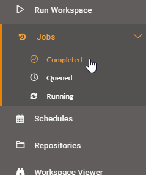
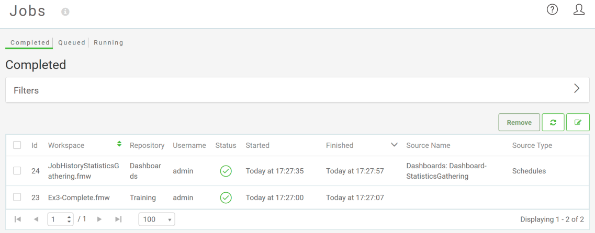

## Jobs ##

The final step in getting started on FME Server is to choose the menu option for Jobs and select Completed, Queued, or Running jobs to view:

This opens the Jobs page, where you can see the status of jobs, whether Completed, Queued, or Running:

This allows you to check that the translation you just ran finished successfully. You can also find jobs that are currently running, jobs that are queued to run, or any jobs that have completed running. The drop-down menu that allows you to select which user's jobs to display is especially useful when the job history runs to thousands of workspaces from multiple users. There is also an option to filter by job status so, for example, you can quickly find all jobs that resulted in a failure message.

---

<!--Tip Section-->

<table style="border-spacing: 0px">
<tr>
<td style="vertical-align:middle;background-color:darkorange;border: 2px solid darkorange">
<i class="fa fa-info-circle fa-lg fa-pull-left fa-fw" style="color:white;padding-right: 12px;vertical-align:text-top"></i>
NEW for 2018.1
</td>
</tr>

<tr>
<td style="border: 1px solid darkorange">

For 2018.1 more completed job filtering options have been added. The filters are now contained in an expandable menu called Filters. You can now filter by Users, Status, Engine, Repository and Workspace. To remove the filters click on the Reset Filters button or leave the Jobs page. For Queued and Running jobs you can still only filter by User:

</td>
</tr>
</table>

---

### Completed Jobs ###

Clicking on a completed job opens up a page showing information about that job; such as Job ID, Job Priority, Time Started, Features Written and which user ran the job. You can also view and search the job log. 

A series of buttons allow you to download the FME log for the translation, resubmit the job with a single click, view the workspace and download the workspace:

This allows you to confirm that the workspace functioned correctly, with the same level of detail as you could find within FME Desktop.

---

### Queued and Running Jobs ###

Queued and Running jobs can be listed so that you can see what jobs the Server is currently handling. Again you can filter the jobs by a particular username.

One particularly useful feature is that these pages can be used to cancel jobs if they are no longer required. 

---

<!--Tip Section-->

<table style="border-spacing: 0px">
<tr>
<td style="vertical-align:middle;background-color:darkorange;border: 2px solid darkorange">
<i class="fa fa-info-circle fa-lg fa-pull-left fa-fw" style="color:white;padding-right: 12px;vertical-align:text-top"></i>
TIP
</td>
</tr>

<tr>
<td style="border: 1px solid darkorange">

If your jobs are being queued regularly, talk to your FME Server Administator about different options like Job Queues, decicated engines or scheduling larger tasks to run outside of regular office hours. 

</td>
</tr>
</table>
