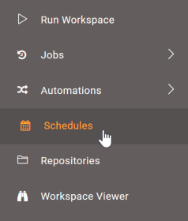
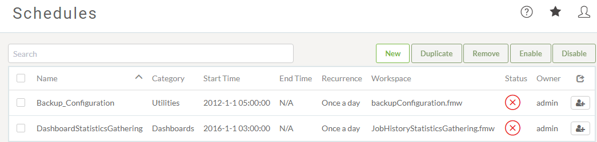
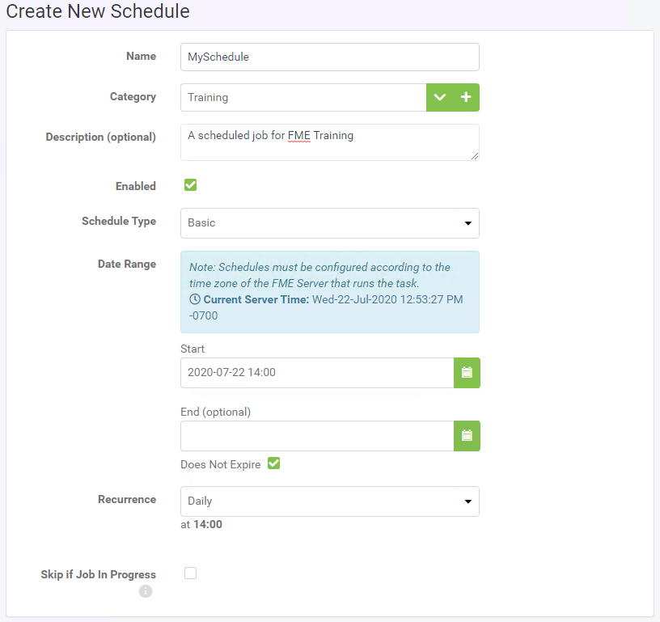
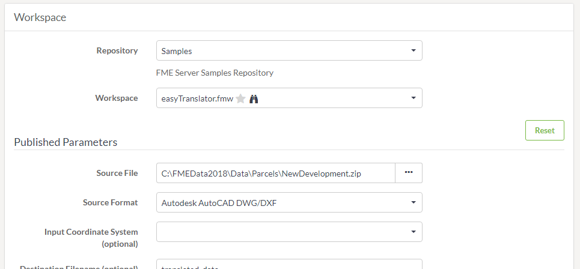

# Scheduling

Scheduled translations are the best way to start a workspace at a particular time or date. It is also important to use schedules to automate tasks but running a workspace multiple times at a defined interval.

## What is Scheduling? ##

Scheduling is the ability to configure FME Server to run a workspace in a repository at a specific time in the future. The schedule can cause the workspace to run once or on a repeating basis.

## Managing Scheduled Tasks ##

Scheduled tasks are set up in the web interface. They can be accessed through a button on the main menu:

The interface supports all the capabilities you would expect, including the ability to create, remove, copy, and enable and disable tasks:

---
<!--New Section-->

<table style="border-spacing: 0px">
<tr>
<td style="vertical-align:middle;background-color:darkorange;border: 2px solid darkorange">
<i class="fa fa-bolt fa-lg fa-pull-left fa-fw" style="color:white;padding-right: 12px;vertical-align:text-top"></i>
NEW
</td>
</tr>

<tr>
<td style="border: 1px solid darkorange">

Notice the Trigger button in the right corner pictured above? That's a brand new feature in FME Server 2019. It provides a one off trigger to check your schedule is configured to run correctly, without having to wait for the set start time.  

</td>
</tr>
</table>

---

## Creating a Scheduled Task ##

There are a number of parameters that can be set when creating a scheduled task.

The first group of parameters includes options for naming and describing the schedule as well as setting up the actual schedule. Here the workspace will be set to run once a day starting on the 12th of September at 2:00 am.

Notice that each schedule can be assigned to a particular category.

---
<!--New Section-->

<table style="border-spacing: 0px">
<tr>
<td style="vertical-align:middle;background-color:darkorange;border: 2px solid darkorange">
<i class="fa fa-bolt fa-lg fa-pull-left fa-fw" style="color:white;padding-right: 12px;vertical-align:text-top"></i>
NEW 2019.1
</td>
</tr>

<tr>
<td style="border: 1px solid darkorange">

The parameter labelled Skip if Job in Progress was added in FME 2019.1. This provides the ability to prevent the next scheduled run of a job from being submitted if the previous run is still incomplete.

</td>
</tr>
</table>

---

The next few parameters concentrate on the workspace to be run.

Once a workspace is selected, there will be a short pause while FME retrieves information about the workspace. It will then expose any published parameters that exist in the workspace:

There are also optional parameters for notification topics to trigger on completion of the scheduled task. These could be used to inform an administrator of the success or failure of the translation.

Finally, there are advanced options to control job queue, and job expiry (for jobs that are time-sensitive and would be no longer useful if held back past a particular time by higher priority tasks).

Once the parameters are set for a scheduled task, it is added to the main Schedules interface where it can be easily enabled or disabled.

---

<!--New Section-->

<table style="border-spacing: 0px">
<tr>
<td style="vertical-align:middle;background-color:darkorange;border: 2px solid darkorange">
<i class="fa fa-bolt fa-lg fa-pull-left fa-fw" style="color:white;padding-right: 12px;vertical-align:text-top"></i>
NEW
</td>
</tr>

<tr>
<td style="border: 1px solid darkorange">

In FME Server 2019, there are now two ways to schedule jobs. Scheduling from this Schedules page is one way to do this, but you can now also create a scheduled process within Automations (New Feature!).
  Creating a schedule through this page lets you set up a single workspace to run at a specified interval. This is ideal for simple scenarios.
  Creating a schedule inside an Automation lets you trigger multiple workspaces to run at once and provides many more tools for controlling exactly what will happen when that schedule kicks off. We'll look at this in more detail later in this course.

</td>
</tr>
</table>

---
