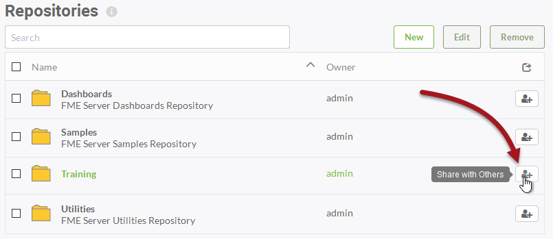
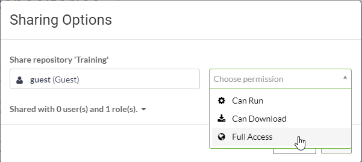

# Sharing #

FME Server security is based on whether you own a component or have been given access to it. A component might be a set of functionality or an object like a repository.

When you create something you have full permission for that component. Even if you don't have permission to manage security on your FME Server, you do have the ability to share a component with another user.

## Sharing a Repository ##

Choose the menu option for Repositories in the Server web interface and you are presented with a list of repositories on the system.

If you are the owner of a repository then you have the ability to click the button to *Share with Others*:

This opens a pop-up dialog in which to select a user and choose the level of permission that you wish to give to them:

FME Security is also based on users and roles. Roles are analogous to a group of users. When sharing a component, the "user" field can be an individual user, or it can be applied to a particular role; for example you can give the ability to run workspaces in a repository to anyone in the *fmeuser* role.

---

<!--Person X Says Section-->

<table style="border-spacing: 0px">
<tr>
<td style="vertical-align:middle;background-color:darkorange;border: 2px solid darkorange">
<i class="fa fa-quote-left fa-lg fa-pull-left fa-fw" style="color:white;padding-right: 12px;vertical-align:text-top"></i>
Police Chief Webb-Mapp says...
</td>
</tr>

<tr>
<td style="border: 1px solid darkorange">

This is a very important capability. As an author you might publish a workspace intended for use by multiple users inside (and outside) an organization. However, the workspace is of little use if those users don't have access to it.
  The Share with Others tool allows you to open up access to your workspace, without you needing the advanced permissions required for full security control.
  Besides repositories, other components of FME Server can also be shared with other users. Keep watch within the user interface, and throughout this manual, for other sharing opportunities.

</td>
</tr>
</table>
