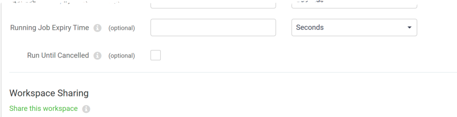
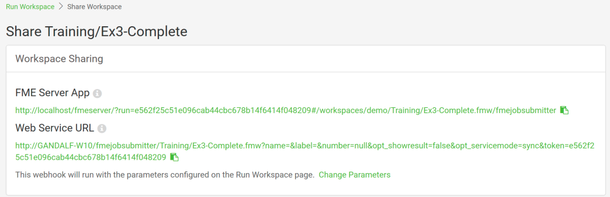
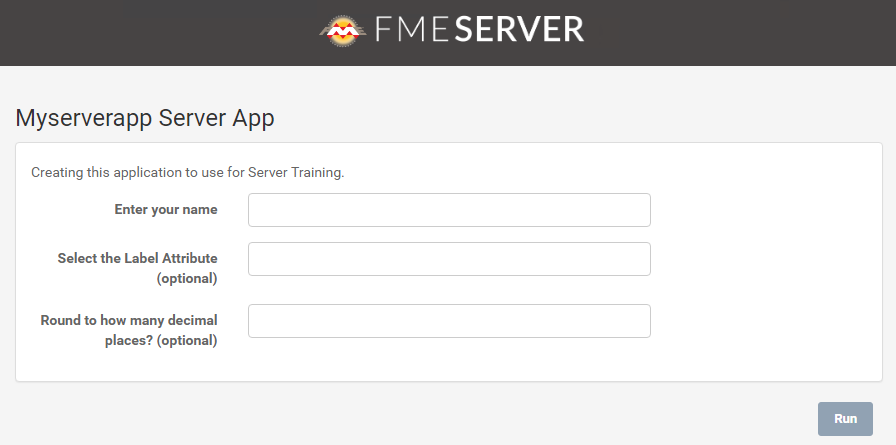

### Workspace Sharing ###

Sharing a repository is a great option for sharing workspaces with other users who also have access to FME Server, but what if you want to allow anyone to be able to submit a job without needing to have an account on FME Server?

A new option in FME Server 2019 is the ability to share a workspace. The option for this can be found under the Advanced parameters section of the Run workspace page under Workspace Sharing:

This will help you to create a URL that you can share with any other users to allow them to run the workspace without having to log into FME Server. When you click on Share this workspace, you will be presented with a set of related options:

A Token will be created to be used to handle authenticating with FME Server so the user will not need to log in. You can name the token that is created and add a description for it. You can also select an Expiration date and time. When the token expires, the shared workspace will no longer work.

After clicking OK, an FME Server App and Web Service URL will be created for the workspace:

The FME Server App link will open up a simplified Run Workspace page:

This URL is a webhook that includes parameters and the command to run the workspace immediately. This URL will run the workspace using the current parameter values without bringing a user to the "Run Workspace" page.

This webhook is a useful tool for building your own web applications that access FME Server services because you can copy the HTTP request and embed it on your own website or a 3rd party application. You could also embed the URL into an email, or paste the URL directly into a web browser.
